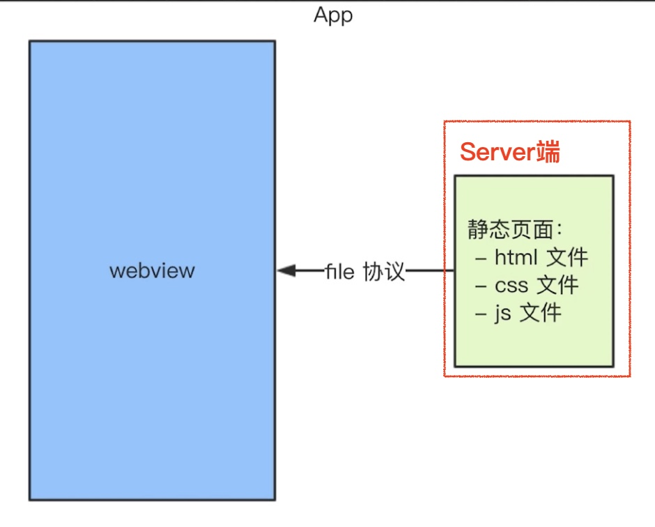

## APP混合开发

1. hybrid是什么？为啥要用？
   1. hybrid是前端和客户端的混合开发，配合完成
      1. 混合了 Native原生技术 & web技术进行开发的移动应用
   2. hybrid的核心：快速**迭代更新**，体验流畅，媲美原生；无需 app审核
      1. app上线需要审核，因为涉及到隐私，比如调用摄影头，通讯录，定位
      2. 体验要求高，变化频繁，用 hybrid；减少开发和沟通成本，双端用一套代码
   3. Native APP 原生开发体验要求极致，变化不频繁
2. hybrid & H5的区别？
   1. 优点
      1. 体验更好，可快速迭代；无需 app审核
      2. 单次的运营活动，用 H5，适合运营性
   2. 缺点
      1. 开发成本高，联调，测试，bug排除比较麻烦
      2. 运维成本好
   3. hybrid 产品稳定性好，体验要求高
3. 前端 & 客户端通信 js-bridge
4. 主流的混合开发方案 HybridAPP
   1. 基于 webview UI，js-bridge
      1. schema 协议通信
   2. 基于 Native UI，reactNative， weex
      1. 通过 js-bridge将 js解析成虚拟节点树，传递到 native端，使用原生渲染
   3. 小程序方案，支付宝，微信小程序
      1. 隔离 js逻辑层和 UI渲染层


## hybrid实现原理 

1. `file://` 协议
2. webview 客户端的容器
3. 前端做好静态页面（html， css，js），将文件交给客户端
4. 客户端拿到静态页面，以文件方式存储在 app中
5. 客户端在一个 webview中，用 `file://协议`加载静态页面




### file协议

1. 双击文件打开就是 file协议
2. file协议：本地文件，加载快，没有网络可以访问
3. https协议：网络加载，慢


### webview

1. 用于加载 H5页面，一个小型的浏览器内核
2. app中的一个组件
3. js-bridge


### hybrid上线更新流程

1. app发布后，静态文件如何实时更新获取内容？
   1. 要点：服务端版本和 zip包维护，更新 zip包之前先对比版本号，下载覆盖
2. 静态资源分版本，有版本号，如：20191205007
3. 将静态资源压缩成 zip包，上传到服务器上
4. 客户端每次启动，都去服务器上检查**静态资源压缩包**版本号
   1. 如果服务端版本号大于客户端版本号，就去下载最新的 zip包
   2. 下载，解压缩，将APP先有文件覆盖显示


### hybrid 如何获取新闻内容

1. 新闻详情页适合 hybrid，前端如何获取新闻内容
2. 不能用 ajax，第一：跨域，第二：慢
3. hybrid客户端提前获取新闻内容，然后JS拿到内容后渲染


## 通信原理

1. 通信的基本形式
   1. 调用能力
   2. 传递参数
   3. 监听回调
2. schema协议
   1. 内置上线，本地加载更快，更安全


### schema 协议

1. URL SCHEME是一种类似于url的链接一种页面内跳转协议
   1. 为了方便app直接互相调用设计的，形式和普通的 url 近似
   2. 主要区别是 protocol 和 host 一般是自定义的
   3. 通过自定义Scheme协议，可以跳转到app中的任何页面，h5可以跳转app原生页面
   4. app可以通过Scheme跳转到另一个app页面
      可以通过h5页面跳转app原生页面
2. 将 schema.js 封装的代码打包，内置到客户端
3. 客户端每次启动 webview，都默认执行 invoke.js
   1. 本地加载更快，不需要网络请求；黑客看不到 schema协议，更安全
4. 拦截 URL SCHEME 的流程
   1. Web 端通过某种方式（例如 iframe.src）发送 URL Scheme 请求
   2. 之后 Native 拦截到请求并根据 URL SCHEME（包括所带的参数）进行相关操作
   3. schema缺点：
      1. 使用 iframe.src 发送 URL SCHEME 会有 url 长度的隐患
         1.  iOS 上采用了使用 Ajax 发送同域请求的方式，并将参数放到 head 或 body 里
      2. 创建请求，需要一定的耗时，比注入 API 的方式调用同样的功能，耗时会较长
      3. 为什么选择 iframe.src 不选择 locaiton.href ？
         1. 如果通过 location.href 连续调用 Native，很容易丢失一些调用

```jsx
// 微信 schema协议
weixin://dl/scan
weixin://dl/moments
```


JSBridge 接口实现 schema.js 封装

```jsx
function invoke(action, data={}, callback=function(){}) {
  // 拼接 schema协议
  let schema = 'myapp://utils/' + action
  let key
  schema += '?a=a' // 拼接参数
  
  for (key in data) {
    if (data.hasOwnProperty(key)) {
      schema += '&' + key + '=' + data[key]
    }
  }
  
  // 处理 callback
  let callbackName = ''
  if (typeof callback === 'string') {
    callbackName = callback
  }
  else {
    callbackName = action + Date.now() // 不重复的字符串
    window[callbackName] = callback
  }
  schema += '&callback=' + callbackName
  
  // 触发 schema
  let iframe = document.createElement('iframe')
  const body = document.body
  iframe.style.display = 'none'
  iframe.src = schema // 触发 schema
  
  setTimeout(() => {
    body.removeChild(iframe)
    iframe = null
  }, 0)
}

// 暴露到全局变量
window.invoke = {
  share: (data, callback) => {
    invoke('share', data, callback)
  },
  scan: (data, callback) => {
    invoke('scan', data, callback)
  },
  login: (data, callback) => {
    invoke('login', data, callback)
  }
}

// 页面调用 schema
document.getElementById('btn').addEventListener('click', () => {
  window.invoke.scan({}, function() {})
  
  window.invoke.share({
    title: 'title',
    content: 'content'
  }, function(result) {
    if (result.errno) {
    	return result.message // 出错
    }
  })
})

```


