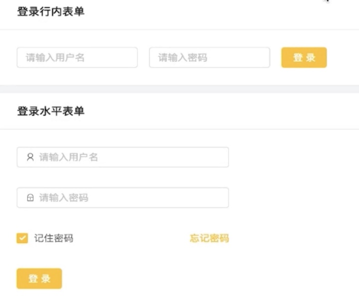

# antd-form

antd form 初始值 initalValue 只在组件实例化的时候生效一次
如果要改变 initalValue的值，要通过
	this.form.setFieldValue() 来设置 

在 form 中我们不需要使用 getFieldDecorator 和 Form.create 这两个方法

1. initialValues 设置默认值，不能被 setState动态更新
2. setFieldsValue 更新响应的值
3. 你**不再需要，也不应该**用 `onChange` 来做数据收集同步；用 Form 的 `onValuesChange`
   1. 但还是可以继续监听 `onChange` 事件

```jsx
<Form
  onValuesChange={valueChange}>
</Form>
```


## 表单验证

1. required: true 会显示红色的※号


```jsx
rules: [
  { required: true, message: '用户名不能为空'},
  { min: 5, max: 10, message: '长度不在范围内' },
  { pattern: new RegExp('^\\w+S', 'g'), message: '用户名必须是字母或数字'}
]
```


## 3.x Form


### 行内表单



```jsx
import React from "react";
import { Card, Form, Input, Button } from "antd";

const myForm = props => {
  return (
    <Card title="登录行内表单">
      <Form layout="inline">
        <Form.Item>
          <Input placeholder="请输入用户名"/>
        </Form.Item>
        <Form.Item>
          <Input placeholder="请输入密码" />
        </Form.Item>
        <Form.Item>
          <Button type="primary">登录</Button>
        </Form.Item>
      </Form>
    </Card>
  )
}
```


### getFieldDecorator

1. 第二个参数是要渲染的组件
2. 第一个参数树表单 name属性和初始值，验证属性

```jsx
{
  getFieldDecorator('interest', {
    initialValue: ['2','5']
  })(<Input />)
}

// 
<Form.Item label="爱好" {...formItemLayout}>
  {
    getFieldDecorator('interest', {
      initialValue: ['2','5']
    })(
      <Select mode="multiple">
        <Option value="1">买包包</Option>
        <Option value="2">踢足球</Option>
      </Select>
    )
  }
</Form.Item>
```


### 登录表单

1. getFieldDecorator 设置校验属性
2. 表单验证 this.props.form.validateFields(callback)
   1. 获取表单的值 this.props.form.getFieldsValue()

```jsx
import React from "react";
import { Card, Form, Input, Button, message, Icon, Checkbox } from "antd";

class FormLogin extends React.PureComponent{
  handleSubmit = () => {
    const { form } = this.props
    let userInfo = form.getFieldsValue()
    form.validateFields((err,values)=>{
      if(err) return message.success('表单验证失败')
      message.success(`${userInfo.userName} 登录成功`)
    })
  }

  render(){
    const { getFieldDecorator } = this.props.form;
    return (
      <Card title="登录水平表单">
        <Form style={{width:300}}>
          <Form.Item>
            {
              getFieldDecorator('userName',{
                initialValue:'',
                rules:[
                  {required:true, message:'用户名不能为空'},
                  {min:5,max:10, message:'长度不在范围内'},
                  // 正则验证
                  {pattern:new RegExp('^\\w+$','g'), message:'用户名必须为字母或者数字'}
                ]
              })(
                <Input prefix={<Icon type="user"/>} placeholder="请输入用户名" />
              )
            }
          </Form.Item>
          <Form.Item>
            {
              getFieldDecorator('userPwd', {
                initialValue: '',
                rules: []
              })(
                <Input prefix={<Icon type="lock" />} type="password" placeholder="请输入密码" />
              )
            }
          </Form.Item>
          <Form.Item>
            {
              getFieldDecorator('remember', {
                valuePropName:'checked',
                initialValue: true
              })(<Checkbox>记住密码</Checkbox>)
            }
            <a style={{float:'right'}}>忘记密码</a>
          </Form.Item>
          <Form.Item>
            <Button type="primary" onClick={this.handleSubmit}>登录</Button>
          </Form.Item>
        </Form>
      </Card>
    )
  }
}
export default Form.create()(FormLogin)
```


### 注册表单

```jsx
import React from 'react'
import { Card,Form,Button,Input,Checkbox,Radio,
        DatePicker,TimePicker,Select,Switch,
        Upload,Icon,message, InputNumber} from 'antd'
import dayjs from 'dayjs';

class FormRegister extends React.Component{
  state={}

handleSubmit = ()=>{
  let userInfo = this.props.form.getFieldsValue();
  console.log(JSON.stringify(userInfo))
  message.success(`欢迎：${userInfo.userName}`)
}

getBase64 = (img, callback)=>{
  const reader = new FileReader();
  reader.addEventListener('load', () => callback(reader.result));
  reader.readAsDataURL(img);
}

handleChange = (info) => {
  if (info.file.status === 'uploading') {
    this.setState({ loading: true });
    return;
  }
  if (info.file.status === 'done') {
    // Get this url from response in real world.
    this.getBase64(info.file.originFileObj, imageUrl => this.setState({
      userImg:imageUrl,
      loading: false,
    }));
  }
}

render(){
  const { getFieldDecorator } = this.props.form;
  const formItemLayout = {
    labelCol:{
      xs:24,
      sm:4
    },
    wrapperCol:{
      xs:24,
      sm:12
    }
  }
  const offsetLayout = {
    wrapperCol:{
      xs:24,
      sm:{
        span:12,
        offset:4
      }
    }
  }
  const rowObject = {
    minRows: 4, maxRows: 6
  }
  return (
    <div>
      <Card title="注册表单">
        <Form layout="horizontal">
          <Form.Item label="用户名" {...formItemLayout}>
            {
              getFieldDecorator('userName', {
                initialValue: '',
                rules: [
                  {
                    required: true,
                    message: '用户名不能为空'
                  }
                ]
              })(
                <Input placeholder="请输入用户名" />
              )
            }
          </Form.Item>
          <Form.Item label="密码" {...formItemLayout}>
            {
              getFieldDecorator('userPwd', {
                initialValue: ''
              })(
                <Input type="password" placeholder="请输入密码" />
              )
            }
          </Form.Item>
          <Form.Item label="性别" {...formItemLayout}>
            {
              getFieldDecorator('sex', {
                initialValue: '1'
              })(
                <Radio.Group>
                  <Radio value="1">男</Radio>
                  <Radio value="2">女</Radio>
                </Radio.Group>
              )
            }
          </Form.Item>
          <Form.Item label="年龄" {...formItemLayout}>
            {
              getFieldDecorator('age', {
                initialValue: 18
              })(
                <InputNumber  />
              )
            }
          </Form.Item>
          <Form.Item label="当前状态" {...formItemLayout}>
            {
              getFieldDecorator('state', {
                initialValue: '2'
              })(
                <Select>
                  <Select.Option value="1">风华浪子</Select.Option>
                  <Select.Option value="2">北大才子一枚</Select.Option>
                  <Select.Option value="3">创业者</Select.Option>
                </Select>
              )
            }
          </Form.Item>
          <Form.Item label="爱好" {...formItemLayout}>
            {
              getFieldDecorator('interest', {
                initialValue: ['2','5']
              })(
                <Select mode="multiple">
                  <Select.Option value="1">游泳</Select.Option>
                  <Select.Option value="2">打篮球</Select.Option>
                  <Select.Option value="3">踢足球</Select.Option>
                </Select>
              )
            }
          </Form.Item>
          <Form.Item label="是否已婚" {...formItemLayout}>
            {
              getFieldDecorator('isMarried', {
                valuePropName:'checked',
                initialValue: true
              })(
                <Switch/>
              )
            }
          </Form.Item>
          <Form.Item label="生日" {...formItemLayout}>
            {
              getFieldDecorator('birthday',{
                initialValue:dayjs('2018-08-08')
              })(
                <DatePicker
                  showTime
                  format="YYYY-MM-DD HH:mm:ss"
                  />
              )
            }
          </Form.Item>
          <Form.Item label="联系地址" {...formItemLayout}>
            {
              getFieldDecorator('address',{
                initialValue:'北京市海淀区奥林匹克公园'
              })(
                <Input.TextArea autosize={rowObject} />
              )
            }
          </Form.Item>
          <Form.Item label="早起时间" {...formItemLayout}>
            {
              getFieldDecorator('time')(
                <TimePicker/>
              )
            }
          </Form.Item>
          <Form.Item label="头像" {...formItemLayout}>
            {
              getFieldDecorator('userImg')(
                <Upload
                  listType="picture-card"
                  showUploadList={false}
                  action="//jsonplaceholder.typicode.com/posts/"
                  onChange={this.handleChange}
                  >
                  {this.state.userImg?:<Icon type="plus"/>}
                </Upload>
              )
            }
          </Form.Item>
          <Form.Item {...offsetLayout}>
            {
              getFieldDecorator('userImg')(
                <Checkbox>我已阅读过<a href="#">并同意协议</a></Checkbox>
              )
            }
          </Form.Item>
          <Form.Item {...offsetLayout}>
            <Button type="primary" onClick={this.handleSubmit}>注册</Button>
          </Form.Item>
        </Form>
      </Card>
    </div>
  );
}
}
export default Form.create()(FormRegister);
```


### 搜索表单

```jsx
import React, { Component } from 'react'
import { Form, Input, Button, message, Icon, Checkbox } from 'antd'

class SearchMore extends Component {
  state = { visible: false }
  render () {
    const { getFieldDecorator } = this.props.form
    return (
      <Form
        layout='horizontal'
        style={{width: 500}}
        onSubmit={this.fnSubmit}>
        <Form.Item>
          {
            getFieldDecorator('username', {
              initicalValue: '姓名',
              rules: [
                { required: true, message: '用户名不能为空'},
                { min: 5, max: 10, message: '长度不在范围内' },
                { pattern: new RegExp('^\\w+S', 'g'), message: '用户名必须是字母或数字'}
              ]
            })(<Input prefix={<Icon type='user'/>} placeholder='请输入用户名'/>)
          }
        </Form.Item>
      </Form>
    )
  }

  fnSubmit = () => {}
}
export default SearchMore
```


### SearchForm

```jsx
import React, { Component } from 'react'
import { Form, Input, Select, Checkbox, DatePicker, Button } from 'antd'
const { Option } = Select

const initOption = data => {
  if (!Array.isArray(data) || !data.length) return data
  
  return data.map(item => <Option value={item.id} key={item.id}>{item.name}</Option>)
}

const data = [
  {
    type: 'Select',
    label: '选择城市',
    labelWidth: '100',
    field: 'city',
    initialValue: '',
    children: [
      { name: 'lucy', id: 1 }
    ],
    rules: []
  }
]

class SearchForm extends Component {
  initForm = () => {
    const { getFieldDecorator } = this.props.form
    const data = this.props.data
    const FormItem = []
    
    // 如果不是数组，直接返回
    if (!Array.isArray(data) || !data.length) return data
    
    data.forEach((item, i) => {
      let { type='input', label, labelWidth='90px', field,
        initialValue='', placeholder='', htmlType='text',
        children= [], } = item
      console.log('type', field)
      
      switch(type.toLocaleLowerCase()) {
        case 'select':
          const SELECT = (
            <Form.Item label={label} key={field}>
              {
                getFieldDecorator([field], {
                  initialValue
                })(
                  <Select
                    type='text'
                    placeholder={placeholder}
                    style={{width: labelWidth}}
                  >
                    { initOption(children) }
                  </Select>
                )
              }
            </Form.Item>
          )
          FormItem.push(SELECT)
          break;
          
        default:
          const INPUT = (
            <Form.Item label={label} key={field}>
              {
                getFieldDecorator(field, {
                  initialValue
                })(
                  <Input
                    type={htmlType}
                    placeholder={placeholder}
                    style={{width: labelWidth}}
                  />
                )
              }
            </Form.Item>
          )
          FormItem.push(INPUT)
      }
    })
    return FormItem
  }
  
  render () {
    return (
      <Form layout='inline'>
        { this.initForm() }
        <Button.Group>
          <Button type='primary' onClick={this.fnSearch}>搜索</Button>
          <Button type='danger' onClick={this.fnCancel}>取消</Button>
        </Button.Group>
      </Form>
    )
  }
  
  fnSearch = () => {
    console.log('fnsearch')
  }
  
  fnCancel = () => {
    console.log('cancel')
  }
}

export default Form.create({})(SearchForm)
```

