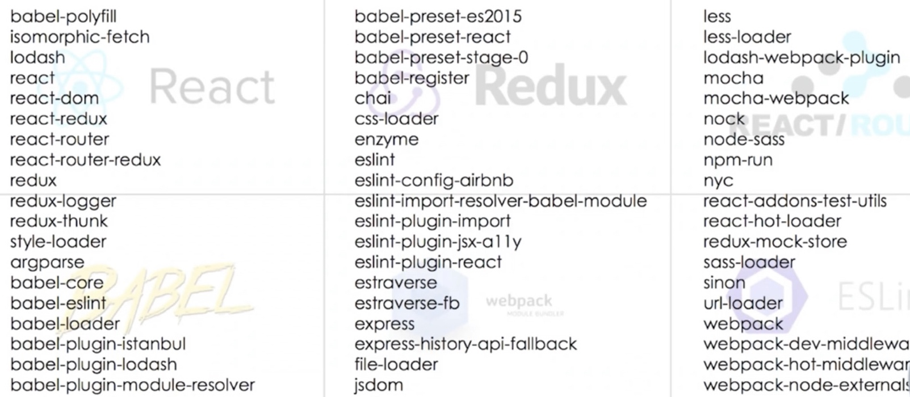

# react创建项目

1. create-react-app
2. codesandbox，在线编辑器
3. rekit
4. 为什么需要打包？
   1. 编译 es6语法特性，编译 jsx
   2. 整合资源，例如图片，less & scss
   3. 优化代码体积
5. 打包注意事项！
   1. 设置 nodejs环境为 production `process.env.NONDE_ENV === 'production'`
   2. 禁用开发时，专用代码，例如 logger
   3. 设置应用跟路径
   4. package.json/ homepage: 'cdn 路径'


## 1 create-react-app

1. babel
2. webpack.config.js
3. testing
4. eslint


```bash
# npm init -y

npx create-react-app my-app
cd my-app
yarn start & npm start

yarn build
yarn test
yarn eject

yarn create react-app my-app # yarn 创建项目

npm list -g --depth 0 # 查看全局安装包
yarn global list --depth=0 # yarn 全局包
```


为什么需要打包工具？




## 单文件


1. 要引入 react & react-dom

```jsx
<script src="https://unpkg.com/react@16/umd/react.production.min.js"></script>
<script src="https://unpkg.com/react-dom@16/umd/react-dom.production.min.js"></script>
```

