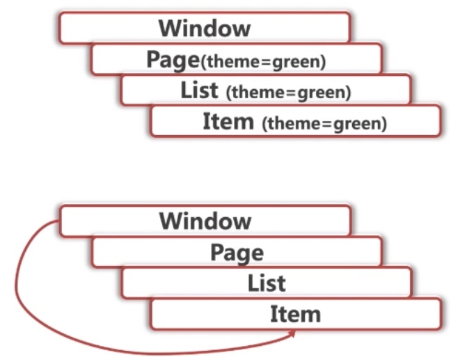

# ReactHooks的影响

1. class 思维到 hooks 编程思维的转变
2. 精通 Hooks 作为新的组件开发方式
3. hooks 只有 class类组件和函数组件；hooks函数组件不能100% 代替类组件
4. 为研发新业务，提供底层的复用性，维护性保证
   1. 业务架构，大前端业务体系架构
   2. 工程架构，提高技术能力；进一步升级为架构师


### react新特性

2. jsx
2. setState
3. Fragment
4. Async Rendering
5. **Context** 上下文
   1. contextType
6. Hooks
7. Concurrent Rendering
8. lazy & Suspense
   1. Error Boundaries
9. memo
10. Fiber
11. Hooks


### class组件的缺点

1. 难以复用的状态逻辑
   1. 组件之间缺少复用机制
   2. 渲染属性和高阶组件导致层级冗余
2. 难以把控的生命周期
   1. 类组件趋向复杂难以维护
   2. 生命周期函数混杂不相关逻辑；相关的逻辑分散在不同的生命周期中
3. 混乱的副作用
   1. this指向问题，class类成员函数不保证 this指向
   2. 内联组件过度创建新句柄
   3. 函数组件无 this问题
4. 解决：精通 react hooks作为未来新的组件开发方式


### hooks 的优势

1. 优化类组件的三大问题
2. 函数组件没有 this 问题
3. 自定义 hooks 方便复用状态逻辑
4. 副作用的关注点分离


### 副作用

1. ajax请求
2. 数据库操作
3. 组件中访问原生 DOM
4. 本地持久化缓存
5. 绑定和解绑事件
6. 数据渲染视图之外的，都可以看做是副作用
7. 副作用 https://www.jianshu.com/p/dffa57f8dfcf


### 副作用的调用时机

1. mount之后 componentDidMount

2. update之后 componentDidUpdate

3. unmount之前 componentWillUnmount

4. useEffect解决副作用，覆盖以上全部情况

   1. 绑定事件
   2. 网络请求
   3. 访问 DOM
   4. 每个 useEffect只处理一个副作用，关注点分离

   


## hooks 使用原则

1. 只有在顶层使用 hooks
   1. 不能再循环语句，条件判断语句，或嵌套函数中使用 hooks
   2. 在React 函数的最顶层调用
2. 只有react 函数才能调用 hooks
   1. 在 React 的函数组件中调用 Hook，**不要在普通的 JavaScript 函数中调用 Hook**
   2. 在自定义 Hook 中调用其他 Hook
3. Hook 本质就是 JavaScript 函数，但是在使用它时需要遵循两条规则
   1. https://zh-hans.reactjs.org/docs/hooks-rules.html


### hooks检查插件

1. npm install eslint-plugin-react-hooks -D
2. package.json 里面配置 react-hooks/rules-of-hooks

```jsx
"eslintConfig": {
	"extends": "react-app",
  "plugins": [
    "react-hooks"
  ],
  "rules": {
    "react-hooks/rules-of-hooks": "error", // 检查 Hook 的规则
    "react-hooks/exhaustive-deps": "warn" // 检查 effect 的依赖
  }
},
```


## react-hooks

1. 所有的 hooks函数，必须一 use* 开头，react内置的函数

   1. hooks api都利用了全局唯一性来推断信息

2. useState ：解决多层组件数据传递，处理状态

3. useEffect ：解决生命周期函数，解决副作用；render渲染函数之后执行

4. useContext
   
1. 不要滥用 useContext，会破坏组件的独立性
   
5. memo ：组件的渲染是否重复执行，性能优化用；render渲染函数之前执行
   1. useMemo & useCallback
   2. 函数向子组件传递，用 useCallback

6. useRef ：DOM引用

   1. useRef 默认值不能传入函数

7. lazy & Subpense 延迟按需加载

8. 自定义 hooks；use

   

hooks是函数，没有以下方法

```jsx
constructor
this.setState
componentDidMount
render
```


## useState

1. useState 可以传入一个函数，初始化
   1. useState 调用必须规规矩矩的来
   2. 默认值，至于偶第一次传入的才有效果
   3. 有了 setCount，就不要用 this.setState了
2. **调用 hooks 必须是 react组件**，不能是函数
   1. **必须在顶层调用**
   2. **不能在 循环和条件块里**；forEach, if/else

```jsx
function App () {
  // 有多个：按照运行的次序，
  const [count, setCount] = useState(10)
  
  // const data = props.defaultCount || 0 每次都会执行
  // 传入函数延迟初始化默认值，只会运行一次
  // const [count, setCount] = useState(() => props.defaultCount || 0)
  
  return (
    <button
      type='button'
      onClick={() => {setCount(count + 2)}}
    >click 【{count}】</button>
  )
}
```

3. useState为什么返回 count，而不是其他组件的count

1. useState不知道自己返回的 count，只需要知道返回一个变量就行了，
2. 是开发者命名为 count变量的；开发者赋予了 变量的语义性；

5. useState修返回的是 count，不是别的组件的 state数据
   1. 因为 js是单线程的，useState在被调用时，只能在唯一个组件的上下文中

6. 如果有多个 useState，是按照第一次运行的顺序返回


## useEffect副作用

1. useEffect  执行的是副作用

   2. useEffect 不同的事情分开放，分开声明 useEffect

   2. 不关心生命周期函数，统一在 render渲染后调用
2. 第二个参数可选，是数组，在数组每一项都不变得情况下，才不会渲染

   1. 阻止 useEffect再次渲染
3. 第二个参数 useEffect的精髓
   1. 不传递第二个参数，每次都运行
   2. 传入空数组，只运行一次
   3. 找到依赖的参数，避免重复计算；数组的每一项都不变，useEffect才不会执行
      1. 渲染取决于数组的对比
      2. undefined, [], 非空数组
      3. 幂等行为，用到哪些变量就把变量声明在数组中

```jsx
function App () {
  // 有多个useEffect,按照运行的次序，
  const [count, setCount] = useState(0)
  const [size, setSize] = useState(() => ({
    width: document.documentElement.clientWidth,
    height: document.documentElement.clientHeight
  }))
  
  const onResize = () => {
    const client = document.documentElement
    setSize({
      width: client.clientWidth,
      height: client.clientHeight
    })
  }
  
  // useEffect统一在渲染后调用，不关心生命周期函数
  useEffect(() => {
    document.title = count
  })
  
  // 绑定事件和解绑事件，在 hooks中的写法
  useEffect(() => {
    // 没有 this
    window.addEventListener('resize', onResize, false)
    
    return () => {
      // 解绑逻辑，回调函数在组件卸载，和组件渲染时触发
      window.removeEventListener('resize', onResize, false)
    }
  }, [])
  
  return (
    <div>
      <button
        type='button'
        onClick={() => {setCount(count + 10)}}
      >click 【{count}】</button>
      <h2><mark>width: {size.width} * height: {size.height}</mark></h2>
    </div>
  )
}
```


1. 副作用：都是围绕组件的渲染和重新渲染

   1. 精准控制第二个参数，防止组件或事件重复渲染
   2. `useEffect(() => {}, [])`
   3. 回调函数在组件卸载，和组件渲染时触发


```jsx
function App () {
	useEffect(() => {
		// componentDidMount
		return () => {
			// componentWillUnmount
		}
	})

	let renderCounter = useRef(0)
	renderCounter.current + 1

	useEffect(() => {
		if (renderCounter > 1) {
			// componentDidUpdate // 副作用
		}
	})
}
```


## memo

1. useMemo & memo 性能优化使用
   1. 运行时，性能优化利器
2. 判断依赖是否发生改变，减少重复计算
   1. useMemo 不传入第二个参数，每次都会执行
   2. 需要有返回值，返回值可以参与渲染
3. memo实现指定组件进行渲染
   1. 无状态组件不能继承 PureComponent，用 memo包起来，实现同样的效果
4. PureComponent 实现了 shouldComponentUpdate的浅比较，来阻止子组件的渲染
   1. PureComponent 只能对比简单数据不能对比符合数据类型
   2. 如果是对象，要用一个新对象替换掉；因为对象的地址指向都一样
   3. this.getUser.bind(this) 每次都绑定，不推荐使用，在 constructor里面统一绑定
      1. 用箭头函数
5. memo包裹无状态组件实现同样的效果
   1. 拆分的越细的组件，使用 memo的就越多
6. 思考题：PureComponent & memo是如何判断数据是否相等？是 == ？还是 === 全等

```jsx
// 无状态组件，不能继承 PureComponent
// memo 包括无状态组件，来达到同样的效果，拆分的越细的组件，使用 memo 的次数越多
const Child = memo(function Child(props) {
  console.log('Foo render')
  return <div>{ props.person.age }</div>
})
```


## useMemo

1. useMemo需要有返回值，返回值直接参与渲染，render函数渲染期间完成
2. useEffect render函数之后执行
3. 第二个参数 useMemo的精髓
   1. 不传递第二个参数，每次都运行
   2. 传入空数组，只运行一次
   3. useMemo找到依赖的参数，避免不必要的计算


### useCallback

1. 如果返回的是函数，直接用 useCallback来返回这个函数

```jsx
useMemo(() => fn)  等价于 useCallback(fn)
```


### getDerivedStateFromProps

```jsx
// react 写法
class Counter extends Component {
  state = {
    overflow: false
  }

  static getDerivedStateFromProps (props, state) {
    if (props.count >= 10) {
      return { overflow: true }
    }
  }
}


// hooks 写法
function Counter(props) {
  const [overflow, setOverflow] = useState(false)

  if (props.count >= 10) {
    setOverflow(true)
  }	
}
```


### prev & props

```jsx
function Counter() {
	const [count, setCount] = useState(0)
	const [update, setUpdate] = useState(0)

	function forceUpdate () {
		setUpdate(update => update + 1)
	}

	const prevCountRef = useRef()

	useEffect(() => {
		prevCountRef.current = count
	})

	const prevCount = prevCountRef.current

	return <h1>新值：{count}, before: {prevCount}</h1>
}
```


## context

1. 跨层级组件数据传递；数据在组件树中不必一级一级的手动传递
   1. 值有变化，还能自动渲染 Consumer下的元素；跨域层级让组件渲染
2. createContext(defaultValue?) 创建 Context
   1. 派生出 Provider 生产者 & Consumer 消费者
   2. 默认值使用场景： Consumer向上找不到 Provider时，使用 defaultValue
3. 类似于全局变量，可以声明多个；一个页面只要就一个 context就行
   1. 因为是全局的，尽量少用；影响组件的独立性
4. Consumer 里面不能直接渲染其他组件，必须声明一个函数；函数唯一的参数就是 Context的值

```jsx
import React, {Component, createContext} from 'react'

// 默认值的场景，找不到 Provider 的值时候，不会被大规模使用
const { Consumer, Provider} = createContext(30)
```





### ContextType

1. 静态属性 ContextType，访问跨层级组件的数据
2. 子组件在运行时，可以获取到新的属性，在 render函数之前获取
3. 有了 ContextType，可以放弃 Consumer
4. 使用 ContextType要比 Consumer简单的多，推荐使用 ContextType，减少 Consumer使用

```jsx
import React, {Component, createContext} from 'react'
const MyContext = createContext(30)

class App extends Component {
  state = { value: 100 }
  render () {
    const { value } = this.state
    return (
      // Provider 是必须的，如果没有 Provider value只能获取默认值
      <MyContext.Provider value={value}>
        <button
          type='button'
          onClick={() => this.setState(() => ({ value: value+1}))}
        >点击增加</button>
        <Child />
      </MyContext.Provider>
    )
  }
}

class Child extends Component {
  // contextType 静态变量
  static contextType = MyContext
  
  render () {
    const value = this.context
    return <h1>Battery: {value} </h1>
  }
}
```


## useContext

1. 函数组件用 useContext
2. class类组件用 static contextType
3. hooks组件中可以使用 Consumer，但不能使用 contextType；用 useContext

```jsx
import React, {
  Component,
  useState,
  createContext,
  useContext
} from 'react'
const CountContext = createContext()

function App () {
  const [count, setCount] = useState(0)
  return (
    <div>
      <button type='button'
        onClick={() => {setCount(count + 2)}}>click 【{count}】</button>

      <CountContext.Provider value={count}>
        <Pie />
        <Bar />
        <Radar />
      </CountContext.Provider>
    </div>
  )
}

// Consumer 基础的 context写法
class Pie extends Component {
  render () {
    return (
      <CountContext.Consumer>
        { count => <h2>Consumer: <mark>{count}</mark></h2> }
      </CountContext.Consumer>
    )
  }
}

// contextType 更优雅的写法，适用于类组件
class Bar extends Component {
  // 静态值，有了 contextType 就不需要 Consumer
  static contextType = CountContext
  render () {
    const count = this.context
    return <h2>contextType: <mark>{count}</mark></h2>
  }
}

// useContext简介用法；useContext 的参数就是 CountContext
function Radar () {
  const count = useContext(CountContext)
  return <h2>useContext: <mark>{count}</mark></h2>
}
export default App
```


## lazy & Suspense

1. 实现组件延迟加载
   1. 组件的异步加载
   2. 弹窗组件的异步加载
2. ErrorBoundary，处理组件加载错误；捕获任何错误
   1. 把捕获错误提取出来为一个单独的组件
   2. componentDidCatch 捕获错误
   3. **ErrorBoundary可以捕获错误，如何在错误后，重新加载一次**
3. static getDerivedStateFromError
4. lazy()的返回就是一个 react组件，
   1. lazy封装的是组件的导入行为，而不是组件本身


### import 代码拆分

webpack code split

import 动态导入模块，webpack就会做一次代码拆分，打包成一个独立的文件，默认不加载，用到才加载

```jsx
import('./about.js').then()
```


## useRef

1. useRef 不能被函数组件使用
2. 函数组件不能100% 代替类组件


### useRef() 使用场景

1. 获取子组件或 DOM节点的句柄

2. 同步渲染不同周期所共享的的数据
   * 渲染周期之间共享数据的存储
   * 定时器
   * 拖拽
   * 事件，鼠标移动
   * 第三方组件，echarts.js, d3.js


## hooks应用总结


### class类组件的生命周期函数如何映射到 Hooks？

1. hooks无法实现的生命周期函数
   1. componentDIdCatch
   2. getSnapshotBeforeUpdate
   3. getDerivedStateFromError

```jsx
function App () {
	useEffect(() => {
    // componentDidMount
    return () => {
      // componentWillUnmount
    }
  }, [])
  
  let renderCounter = useRef(0)
  renderCounter.current++
  
  useEffect(() => {
    if (renderCounter > 2) {
      // componentDidUpdate
    }
  })
}
```


### 类实例成员变量如何映射到 Hooks？


```jsx
// react 写法
class App {
	const it = 0
}

// hooks 写法
function App () {
	const it = useRef(0)
}
```


### Hooks中如何获取历史 props 和 state？


```jsx
function App () {
  const [count, setCount] = useState(0)
  const preCountRef = useRef() // 上一次的 count值
  
  useEffect(() => {
    prevCountRef.current = count
  })
  
  const preCount = preCountRef.current
  reuturn <h1>Now: {count}, Before: {prevCount}</h1>
}
```


### 如何强制更新一个 Hooks 组件？

1. forceUpdate

```jsx
function App () {
  const [count, setCount] = useState(0)
  const [update, setUpdate] = useState(10)
  function forceUpdate() { // 更新数据，间接更新组件
    setUpdate(update => update + 2)
  }
  
  const preCountRef = useRef() // 上一次的 count值
  
  useEffect(() => {
    prevCountRef.current = count
  })
  
  const preCount = preCountRef.current
  reuturn <h1>Now: {count}, Before: {prevCount}</h1>
}
```


