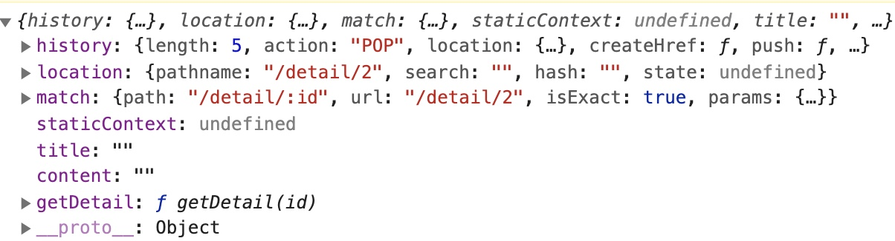
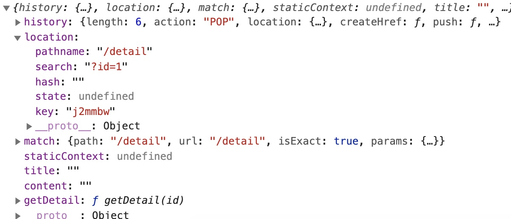

# react-router路由

1. 安装 react-router-dom，react-router-dom封装了 react-touer，不用安装 react-router

   1. 不需要路由配置，一切皆组件；Router也是一个组件
   2. react-router提供了一些 router的核心api： Router，Route，Switch等

2. react-router-dom提供了BrowserRouter，HashRouter，Route，Link，NavLink，Switch

   


## react-router-dom


### BrowserRouter

1. BrowserRouter
2. HashRouter，路由模式，同vue-router
   1. hash `https://lulongwen.com/#user`
   2. history，需要 server端支持 `https://lulongwen.com/user`
3. Route
   1. path, exact, component,
   2. render
4. Redirect 重定向
5. Switch
6. 路由配置，同 vue-router
   1. 动态路由
   2. 路由懒加载

```jsx
import React from 'react'
import {
  BrowserRouter as Router,
  Route,
  Redirect,
  Switch
} from 'react-router-dom'

const RouterConfig = () => (
<Router>
  <App>
    <Switch> // Switch匹配到一个，就不会往下执行，没有 switch会穿透下去
      <Route path='/login' component={Login} />
      <Route path='/register' component={Register} />
      // render 路由
      <Route path='/' render={() =>
        <Admin>
          <Switch>
            <Route path='/home' component={Home} />
            <Route path='/ui/buttons' component={Buttons} />
            <Route component={Error404}/>
            <Redirect to='/home'/>
          </Switch>
        </Admin>
      } />
    
    	<Route path='/common' render={() =>
        <Common>
          <Route
            exact
            path='common/order/detail:orderId'
            component={OrderDetail}/>
        </Common>
       } />
    </Switch>
  </App>
</Router>
)
export default RouterConfig

// 路由重定向
<Redirect to="/admin/home" />
```


### router 传参

```jsx
<Route path='/user/:id' />
// 取值：this.props.match.params.id
```


### Link & Navlink

1. Link
   1. 公共组件必须放在 Router的内部，不然呢？报错 Link outside a Router
2. Navlink

```jsx
import { Link } from 'react-router-dom'
const Header = () => (
	<nav>
    <a><Link to="/">Home</Link></a>
    <a><Link to="/user">User</Link></a>
  </nav>
)

// Link object，一个基本的 location对象
<Link to={{pathname: '/user/23', search: '', hash: '', key: '', state: {}}}>User</Link>
```

3. state带参数跳转


### withRouter

```jsx
class Todo extends React.Component{}
Todo = withRouter(Todo)
```


## react-router总结

1. 什么是路由？
   
   1. 路由：根据URL的不同，显示不同的页面
   
2. 什么是按需加载？如何在 react中实现按需加载

3. 使用 webpack 的 import API

4. 使用 react-loadable 实现 react 的异步加载

5. React Router 动态路由机制
   1. 区分受保护的路由和公开路由
   2. 访问未授权的路由，重定向到登录页面
   
   
   
6. 在根组件中要有一个路由容器，配置的路由要放到内部

7. Router组件只能包含一个根节点

   1. A <Router> may have only one child element

8. 路由匹配是从上到下匹配的，匹配到就渲染

9. exact 可以实现精确匹配

10. Switch组件表示匹配到一个后停止匹配

11. Redirect 可以实现路径的重定

12. 所有通过route标签渲染出的页面属性上都会有几个属性

13. withRouter 携带路由，withRouter是一个函数

   14. 可以把原有的Back组件进行包装在返回一个新组件

   15. 返回的新组件上 就具备着这些路由属性

   16. history match location

   17. 把路由文件单独处理出来不要和业务组件混合在一起


## router 3种渲染方式

1. component
2. render
3. children


## 路由懒加载

1. lazy & Suspense
2. 配合 import 函数，把代码打包成多个chunk


### Suspense

```jsx
import React, { Suspense, lazy } from 'react'
// BrowserRouter as Router
import {Switch, Route, HashRouter as Router} from 'react-router-dom'

const Home = lazy(() => import('./routes/home'))
const List = lazy(() => import('./routes/list')
import About from './routes/about'

const RouterComponent = () => {
  return (<Router>
    <Suspense fallback={<div>loading...</div>}>
      <Switch>
        <Route exact path="/" component={Home} />
        <Route path="/list/:id" component={List} />
        // <Route path="/about/:id"><About /></Route> // 不是懒加载
        <Route path="*"><NotFound /></Route>
      </Switch>
    </Suspense>
  </Router>)
}
export default RouterComponent
```


### react-loadable

1. 用 `React.Suspense` 替换 `react-loadable`

```jsx
import React from 'react'
import Loadable from 'react-loadable'

const LoadableComponent = Loadable({
  loader: () => import('./Detail.js'),
  loading() {
  	return <div>正在加载...</div>
  }
})
// /Detail/loadable.js 导出 无状态组件
export default () => <LoadableComponent />

// App.js
import Detail from './views/Detail/loadable.js'
<Route path="/detail/:id" exact component={Detail}  />
  
// Detail.js match获取参数，要加上withRouter，不然呢？报错
import {withRouter} from 'react-router-dom'
export default (mapState, mapDispatch)(withRouter(Detail))
```


## 动态路由

```jsx
import React from 'react'
import { Link, useParams } from 'react-router-dom'
function List () {
  const {id} = useParams
  console.log('params id', id)
  return (<div><Link to="/">首页</Link></div>)
}
```


## 路由跳转

```jsx
import React from 'react'
import { useHistory } from 'react-router-dom'
function List () {
  const history = useHistory()
  function fnClick () {
    history.push('/')
  }

  return (<div><Button type="primary" onClick={fnClick}>首页</Button></div>)
}
```


## 路由参数及子路由

1. match.params
2. withRouter
3. PrivateRouter
4. Prompt组件阻止跳转
5. redirect重定向

```jsx
const Detail = lazy(() => import('../Detail/Detail'))
// 动态路由路由传参，match获取参数
<Route exact path='/detail/:id' component={Detail}></Route>

componentDidMount () {
  const { getDetail, match: {params} } = this.props
  getDetail(params.id)
}


// 2 url传参获取参数，location获取参数; location.search
<Route exact path='/detail' component={Detail}></Route>

<Link to={'/detail?id=' + item.get('id')}>
  

// 去除URL hash 的 # 和参数
window.location.hash.replace(/#|\?.*$/, '')
```


### match.params

1. match参数列表，动态路由获取参数
2. 推荐用动态路由传参




2. match详细参数


### location.search

1. location.search获取 字符串参数，要自己处理数据




## 手写 HashRouter，Router等组件


