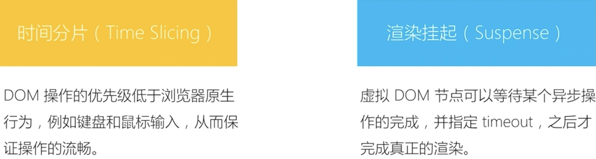

# React性能优化

1. 性能永远是第一需求：时刻考虑代码的性能问题
2. 一个组件的js的代码不要超过 300行
3. 渲染列表时加 key
4. 合理使用 SCU，shouldComponentUpdate
   1. PureComponent
   2. memo
5. 合理使用 immutable.js
6. webpack构建优化
7. 使用 SSR


### 常见的性能问题场景

1. 键盘的输入，input的 onChange
2. 滚动；鼠标的移动，拖拽
   1. 解决：函数的节流和防抖
3. 自定义事件，DOM事件及时销毁
4. 减少函数 bind this 次数
5. 合理的使用 shouldComponentUpdate & PureComponent & memo
6. 注重可重构的代码，代码保持可重构
7. 代码的潜在性能问题；组件拆分的粒度，粒度拆分的越小越好
8. 渲染列表，必须用 key，而且 key不能是 index 和random
   1. vdom的 diff算法通过 tag和 key来判断，是不是 sameNode相同的节点
9. react 性能优化参考资料
   1. 珠峰 react优化 http://www.zhufengpeixun.cn/2020/html/76.react_optimize.html


## 网络优化

1. 合理使用异步组件，**自动化按需加载**：Suspense & lazy； react-loadable
2. 图片懒加载
3. 资源压缩，资源合并等前端通用的懒加载
4. 缓存


## 事件优化

1. 事件句柄的变化，也会导致子组件的重复渲染

2. handleClick，让 onClick，onChange的句柄不发生变化


## Fragment空标签

1. `<></>` 空标签，类似 vue的 template，不会在 DOM中增加额外节点
2. 精简 DOM结构，避免向 DOM 添加额外的节点

```jsx
<></> 代替 <React.Fragment></React.Fragment>
```


### react 异步渲染




#### 时间分片

1. 虚拟DOM的 diff操作可以分片进行
2. react的 API：unstale_deferredUpdates
3. chrome的API：requestIdleCallback
   1. 在浏览器的空闲时段内调用的函数排队
   2. 在主事件循环上执行后台和低优先级工作，而不会影响延迟关键事件，如动画和输入响应
   3. https://developer.mozilla.org/zh-CN/docs/Web/API/Window/requestIdleCallback
   4. https://reactjs.org/docs/design-principles.html#beyond-the-dom
4. requestAnimationFrame

```jsx
window.requestIdleCallback(callback[, options])
```


#### 渲染挂起

1. 内置组件 timeout
2. unstable_deferUpdate


### reselect 避免重复计算

1. 自动缓存的数据处理流程，类似 vue的 computed
2. 应用场景：
   1. 输入框改变，触发table重新渲染，但是table数据并没有变化
   2. 购物车

```jsx
import { reselect } from "reselect"

const getItems = state => state.items;
const getById = state => state.byId;

const tbodyCache = reselect(getItems, getById, (items, byId) => {
  console.log("reselect: get table data");
  if (!items) return [];
  return items.map(id => byId[id]);
})
```


### 使用工具定位性能问题

1. react-devt-tools
   1. Highlight Updates
2. chrome
   1. Performance - CPU 6x showdown


## 集成第三方 JS 库

1. 使用 ref 获取 原生的 DOM
2. 手动将组件更新到 DOM 节点
3. 组件销毁时，删除原生节点

```jsx
componentDidUpdate(prevProps, prevState) {
		if (this.state.data !== prevSatate.data) this.init()
	}
```


## 版本升级问题


## react常见问题

1. import 放在最上面，const 上面
   1. import 语句应该放在最前面，至少要放到const定义变量的前面
   2. `Import in body of module; reorder to top import/first`
2. 删除`<React.StrictMode>`标签
   1. `findDOMNode is deprecated in StrictMode. findDOMNode was passed an instance of CSS`
3. 只能有一个根元素

   1. `React.Children.only expected to receive a single React element child`
4. this.handleAdd.bind(this)，this.handleAdd 方法没找到
   1. `TypeError: Cannot read property 'bind' of undefined`
5. 事件 onClick没有花括号
   1. `onClick="openSmallDesktopAboutusForm()"` 错误的语法
   2. `<button onClick={this.handleAdd}>点击</button>` 正确的语法
   3. Expected `onClick` listener to be a function, instead got a value of `string` type
6. react-router-dom 4.3.1 报错
   1. 是": "^4.3.1"依赖的问题，将^去掉，不然会安装4.3.4版本
   2. 删除 package-lock.json，`npm i react-router-dom `
   3. `Cannot read property 'Consumer' of undefined `
   4. "export '__RouterContext' was not found in 'react-router'
7. Remove untracked files, stash or commit any changes, and try again.
   1. git地址有问题，解决方法
   2. 先 git add .
   3. git commit -m "init README.md"
   4. yarn eject
   5. 最快的方法：直接删除 git文件夹；用到 git时，再 git init创建 git
8. index.js:2177 Warning: [antd: LocaleProvider] `LocaleProvider` is deprecated. Please use `locale` with `ConfigProvider` instead: http://u.ant.design/locale
9. Missing locale data for locale: "undefined". Using default locale: "en" as fallback.
10. [antd: Menu] `inlineCollapsed` not control Menu under Sider. Should set `collapsed` on Sider instead.
11. index.js:2177 Warning: [antd: Switch] `value` is not validate prop, do you mean `checked`?
12. Invariant failed: You should not use <NavLink> outside a <Router>
    1. Header的组件木有写在BrowserRouter 里导致


### history报错

Warning: Please use `require("history").createHashHistory` instead of `require("history/createHashHistory")`. Support for the latter will be removed in the next major release.

1. 找到node_modules中的dva包 node_modules/dva/lib/index.js
2. 修改 21行的 history引入方式
3. 重启 npm start
4. 缺点：npm 重新 安装还有警告

```jsx
// var _createHashHistory = _interopRequireDefault(require("history/createHashHistory"));
var _createHashHistory = _interopRequireDefault(require("history").createHashHistory);
```

5. 还要警告的话，修改 /src/index.js

```jsx
const createBrowserHistory = require('history').createBrowserHistory
const app = dva({
    history: createBrowserHistory()
})
```


### 生命周期警告

1. dva-cli创建的项目会有这个警告
2.  componentWillMount has been renamed, and is not recommended for use. 

   1. 删除 package.json文件，重新 npm安装 react & react-router-dom
   2. 修改项目中package.json文件中
   3. 如果发现还是报warning，就删除`package-lock.json`文件，删除node_modules文件夹，重新 npm install

```jsx
// dva-cli 默认安装的
"dependencies": {
    "react": "^16.2.0",
	"react-dom": "^16.2.0"
}

// 重新安装
npm i react react-dom dva

// 更新后的 package.json
"dependencies": {
    "antd": "^4.3.4",
    "babel-plugin-import": "^1.13.0",
    "dva": "^2.4.1",
    "react": "^16.13.1",
    "react-dom": "^16.13.1"
}
```


### table

Each child in a list should have a unique "key" prop. See https://fb.me/react-warning-keys for more information.

1. 基本都是在循环生成多个组件的时候，没有给组件加上key引起的
2. 因为dom进行diff对比 没有key值，所以报错警告
3. 循环生成多个组件中，必须要加上key值（唯一值）
4. 如果数据没有 key属性，就使用 `rowKey`，来指定数据列的主键
5. React中有两个比较特殊的参数：ref 和 key，不会被传递到组件

```jsx
<Table
  rowKey={ (el, i) => i }
	rowKey={(record, index) => index} />
```


### modal

1. Modal默认挂载节点为document.body
2. 指定挂载元素

```jsx
getContainer={()=> document.getElementsByClassName('fatherClassName')[0]}
```


## 