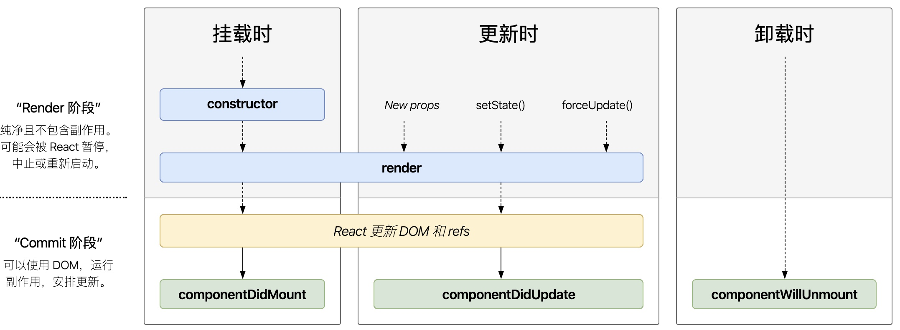
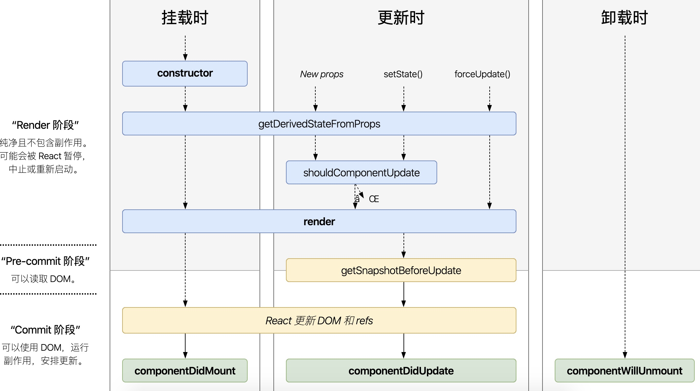

# 组件生命周期

1. 挂载时
   1. componentDidMount 只执行一次
2. 更新时
   1. componentDidUpdate
   2. shouldComponentUpdate
3. 卸载时
   1. componentWillUnmount
4. https://projects.wojtekmaj.pl/react-lifecycle-methods-diagram
5. 父子组件生命周期和 Vue一样；生命周期函数：在某一时刻，组件会自动调用执行的函数
   6. constructor 里面做初始化，组件被创建的时候，自动调用
   7. render() 函数就是一个生命周期函数

```jsx
constructor - render - componentDidMount
componentDidUpdate - componentWillUnmount

// state & props - update
shouldComponentUpdate // true & false
```


### constructor

1. 用于初始化内部状态，很少使用
2. 唯一可以直接修改 state的地方
   1. this.state.name = ok
   2. 直接 this.state. ，不需要 this.setState


### shouldComponentUpdate

1. 决定 virtual DOM是否需要重绘
2. 一般有 PureComponent 自定实现
3. 典型场景：SCU 性能优化


### componentDIdMount

1. ui渲染完成后调用，DOM渲染完成
2. 只执行一次
3. 典型场景：获取外部资源，常用于 ajax请求


### componentDidUpdate

1. 每次UI更新时被调用
2. 典型场景：页面需要根据 props 变化重新获取数据
3. 捕获每次更新
4. 一个 react组件，内部 state，或外部 props变化都会渲染，始终是整体渲染


### componentWillUnmount 

1. 组件移除时被调用
2. 典型场景：页面销毁，释放资源
3. 销毁定时器，window绑定的事件


## react生命周期

1. 单组件生命周期
   1. constructor最优先执行
2. 父子组件生命周期
3. SCU shouldComponentUpdate




## 新增生命周期

1. `getDerivedStateFromProps` 从props中获取state，将传入的props映射到state上面
   1. 代替 componentWillReceiveProps
   2. 静态函数，使用前要加上 static
2. `getSnapshotBeforeUpdate`
3. `static`




### getDerivedStateFromProps

1. 如果props传入的内容不需要影响到你的state，那么就需要返回一个null
2. 返回值是必须的，尽量将其写到函数的末尾
3. getDerivedStateFromProps应用场景
   1. 当 state需要从 props初始化时使用；从props中获取 state属性，代替 `componentWillReceiveProps`
   2. 尽量不要用：维护两者状态的一直性，会增加复杂度
   3. 每次 render函数之前调用
   4. 典型的应用场景：**表单控件获取默认值**
4. getDerivedStateFromProps 不推荐你使用


```jsx
static getDerivedStateFromProps(nextProps, prevState) {
  const {type} = nextProps
  // 当传入的type发生变化的时候，更新state
  if (type !== prevState.type) {
    return { type }
  }
  // 否则，对于state不进行任何操作
  return null
}
```


### getSnapshotBeforeUpdate

1. 在页面 render之前调用，state已更新
2. 典型场景：获取render之前的 DOM状态

```jsx
// 实时显示滚动条

class ScrollList extends React.PureComponnent {
  componenntWillUnmount () {
    widnow.clearInterval(this.timer)
  }
  
  getSnapshotBeforeUpdate () {
    // render之前的 DOM状态
    return this.rootNode.scrollHeight
  }
  
  componentDidUpdate (prevProps, prevState, prevScrollHeight) {
    const scrollTop = this.rootNode.scrollTop
    const height = this.rootNode.scrollHeight
    if (scrollTop < 5) return
    this.rootNode.scrollTop = scrollTop + (height - prevScrollHeight)
  }
  
  rennder () {
    return (
    )
  }
}
```


## 父子组件生命周期

1. 父组件想渲染完成，就必须等待子组件渲染完成
2. 组件 constructor, componentDidMount 只会执行一次；但 render函数会执行多次
3. 父组件渲染，子组件也会重新渲染；**虽然子组件没有变化，子组件才是优化点**


## 组件渲染和更新过程

1. jsx 如何渲染到页面

2. setState之后如何更新页面

3. 更新的2个阶段

   1. reconcliliation 执行js diff算法

   2. commit 将 diff结果渲染成 DOM


### 组件渲染过程

1. props & state
2. render() = vnode
3. patch(elem, vnode)


### 组件更新过程

1. setState(newState) = dirtyCompoennt；有可能是子组件
2. render() = 生成 newVnode
3. patch(vnode, newVnode)


## react-fiber

1. 组件渲染可能的性能问题
   1. 单线程，当组件足够复杂，组件更新时，计算和渲染压力都很大
   2. 同时有 DOM操作，如动画，拖拽，将会卡顿
2. 解决方法：fiber
   1. 将 reconciliation阶段进行任务拆分为多个子任务
   2. DOM需要渲染时，暂停，空闲时恢复
   3. commit 无法拆分
3. fiber底层事件加入了优先级概念，利用事件循环的碎片时间；执行一些高优先级的用户交互，例如拖拽，滚动，提高js的用户体验
4. react fiber 在进行渲染的时候阻塞页面的其他交互行为


```jsx
window.requestIdleCallback // DOM 在浏览器的空闲时段内对要调用的函数进行排队
```


### 废弃生命周期

1. comonentWillMount()
   1. 被 constructor和 componentDidMount所取代
2. componentWillUpdate()
   1. willMount 
3. componentWillReceiveProps()
   1. 不能阻止是否重新渲染， 唯一可以调用setState
   2. 可能会被乱用，而且页面第一次加载时不会执行


### ajax应该放在哪个生命周期

1. 同 vue，mounted
2. componentDidMount
3. render 函数会反复执行，不能执行 ajax


### shouldComponentUpdate

1. 父组件更新导致子树更新时, 子组件树中的组件会经历一个优化阶段，称之为 SCU
2. 旧的Context在`SCU`为`ture`时, 不会重新渲染子节点
3. 新的Context在碰到`Context.Provider`的时，会将所有的子节点为`Context.Consumer`之间的节点标记为需要更新
4. SCU优化性能，配合“不可变值” `immutable.js` 一起使用，否则会出错


### SCU优化性能

1. 父子组件，如果父组件更新，所有子组件会强制更新
2. **SCU必须配合，不可变值一**起使用，有性能问题再用 SCU
   1. immutable.js不可变值，彻底拥抱”不可变值“
3. shouldComponentUpldate默认返回 ` return true`，默认重新渲染所有子组件
4. 性能优化对 react来说，更加重要

5. PureComponent
   1. SCU种实现了浅比较，state和 props的浅比较

6. React.memo 
   1. memo，函数式组件中的 PureComponent


```jsx
shouldComponentUpldate (nextProps, nextState) {
  // 渲染
  if (nextState.count !== this.state.count || nextProps.length !== this.props.length){
    return true
  } 
  return false// 不渲染
}

componentDidUpdate () {
  console.log('component is update')
}

// 深度对比2 个对象的 bug
shouldComponentUpldate (nextProps, nextState) {
  // isEqual 一次性递归到底
  if (_.isEqual(nextState.count, this.state.count)){
    return false // 2个对象相等，不渲染
  } 
  return true // 2个对象不相等，渲染
}
```


### render执行2次

1. strict mode通过两次调用 constructor和render函数,来检测不符合预期的side effects
   1. 严格模式会触发两次render
   2. 在production环境下不会这样,所以不用担心
   3. 严格模式的重复调用 https://zh-hans.reactjs.org/docs/strict-mode.html#gatsby-focus-wrapper
2. 执行2次的方法
   1. class 组件的 `constructor`，`render` 以及 `shouldComponentUpdate` 方法
   2. class 组件的生命周期方法 `getDerivedStateFromProps`
   3. 函数组件体
   4. 状态更新函数 (即 `setState` 的第一个参数）
   5. 函数组件通过使用 `useState`，`useMemo` 或者 `useReducer`

```jsx
ReactDOM.render( // 组件里的render()会执行两次
  <React.StrictMode>
    <App />
  </React.StrictMode>,
  document.getElementById(‘root‘)
)
```


