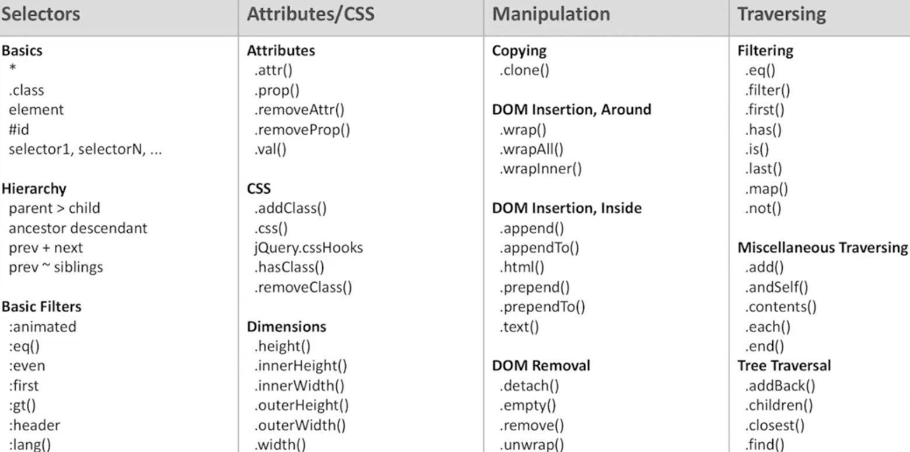
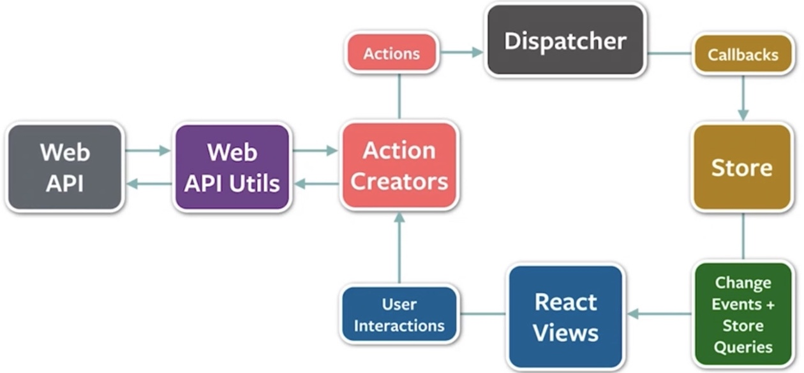
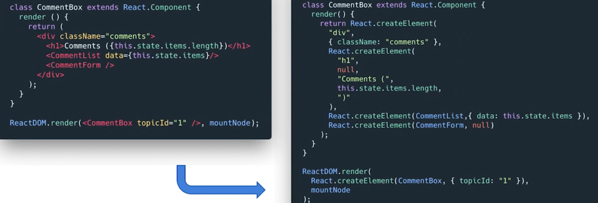
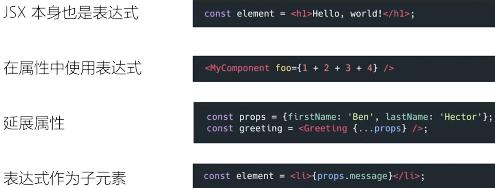
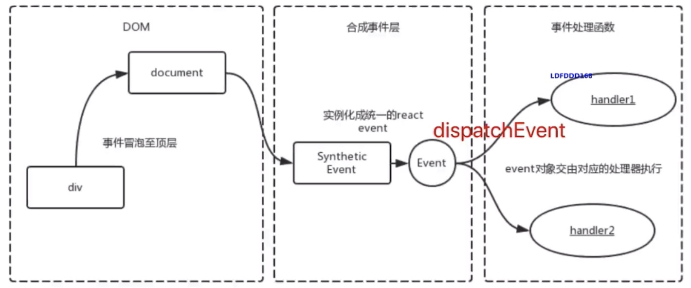

# react核心知识点

1. 包含 React常用的API和性能优化，大厂对标源码原理的考察；造轮子 kpi
2. React 结合 Vue学习，大厂用 react概率高些；大厂对 react开发要求高
   1. redux 数据层框架
   2. react UI层框架
3. 官方文档是个新华字典，给会用的人查阅，文档全面冗长，不是入门教程，要记住重点
4. 创建项目 `npx create-react-app`
5. facebook 2013年开源的函数式编程，前端框架
6. react开发调试工具
   1. react developer tools
   2. Redux DevTools


## React设计理念

1. Fiber
2. 单向数据流，视图层框架；可以与其他框架并存
3. 函数式编程，声明式开发
4. 组件化
5. vdom & diff算法
6. jsx小本质
7. 合成事件 event
8. setState & batchUpdate
9. 组件渲染过程，生命周期
10. 前端路由


### react出现的背景及特性

1. 传统的 UI操作关注太多的细节，例如：jquery那么多 操作 DOM的 API

   1. 

2. 应用程序状态分散在各处，难以追踪和维护

3. react解决了UI细节问题，数据模型问题如何解决？

   1. flux：单向数据流

   2. redux & mobx；flux架构的衍生项目

   3. 

      

   4. 


### react很简单

1. 1个核心概念：组件；始终整体刷新页面，无需关注细节
2. 4个必须 api：了解的非常少的 api就可以上手开发
3. 单项数据流：flux 单向数据流
4. 完善的错误提示


## 函数式编程

1. 纯函数：给个固定的输入，就一定会有固定的输出，而且不会有任何副作用
2. 不可变值；返回一个新值，不修改原来的值
   1. state不允许改变


### 什么是纯函数

1. 返回一个新值，没有副作用（不会偷偷的修改其他值）
2. 重点：不可变的值，如：arr2 = arr.slice()


### immutablejs

1. immutable.js不可变值，基于共享数据，不是深拷贝，速度好
2. 有学习和迁移成本，按需使用

```jsx
const map = Immutable.Map({a: 100, b: 200})
const map2 = map.set('b', 12)
map.get('b') // 200
map2.get('b') // 12
```


## vdom & diff

1. state 数据
2. jsx模板
3. 数据 + 模板，生成 vdom，虚拟DOM就是一个JS对象，用来描述真实的DOM结构
   1. 之所以能够提升性能，是 JS对象之间的对比，不是真实DOM之间的对比
   2. 对比的方式就是 diff 算法
4. vdom渲染成真实的 DOM显示
5. state & props发生改变，数据 + 模板生成新的 vdom
6. 新的 vdom和旧的 vdom js对象做对比，找出改变的地方
7. 只替换改变的节点，重新渲染 DOM


### vue-vdom

1. h函数，返回 vnode数据结构
2. patch更新函数
   1. 只比较同一级，不跨级比较
   2. tag不相同，直接删除重建，不再深度对比
   3. tag 和key相同，就是相同的节点，不再深度对比

```jsx
{
  tag:'div',
  props: {
    className: 'box',
    id:'container'
  },
  children: [
    {
      tag: 'p',
      children: 'this is text'
    },
    {
      tag: 'ul',
      props: {},
      children: [
        { tag: li, children: 'a' }
      ]
    }
  ]
}
```


### diff

1. 广度优先的分层比较，算法复杂度 O(n)
2. 从根节点开始比较，节点要有唯一标识 key
3. 同级对比，不跨级对比；如果节点不一样，直接删除，重新创建
4. key值不能是 index，或 random


vdom的2个假设

1. 组件的 DOM结构是相对稳定的，很少发生跨层移动
2. 类型想同的兄弟节点，可以被唯一的标识


### virtual dom及 key属性的作用


## jsx语法

1. 变量，表达式
2. className，style
3. 子元素和组件
4. 必须要有一个根元素，`Fragment` 空标签，占位符
5. `dangerouslySetInnerHTML={{ __html: item }}` 显示 html标签
6. `<label htmlFor="idname">` htmlFor

```jsx
// 表达式
const exprElem = <p>{this.state.flag ? 'yes' : 'no'}</p>

// class
const classElem = <p className="title">设置 css class</p>

// style
const styleData = { fontSize: '30px',  color: 'blue' }
<p style={styleData}>设置 style</p>

const styleElem = <p style={{ fontSize: '30px',  color: 'blue' }}>设置 style</p>

// 输出 html
const rawHtml = '<span>富文本内容<i>斜体</i><b>加粗</b></span>'
const rawHtmlData = {
  __html: rawHtml // 注意，必须是这种格式
}
const rawHtmlElem = <div>
  <p dangerouslySetInnerHTML={rawHtmlData}></p> // 输出 html
  <p>{rawHtml}</p> // 输出 字符串
</div>
      
<label htmlFor="inputName">姓名：</label> {/* 用 htmlFor 代替 for */}
<input id="inputName" value={this.state.name} onChange={this.onInputChange}/>

// 事件
<p onClick={this.clickHandler}>
  
// jsx的本质 createElement，类似 Vue reader函数
React.createElement('div', null, [child1, child2, child3])
React.createElement('div', {...}, child1, child2, child3)
```


### jsx的本质是什么

1.  jsx的本质：**不是模板引擎，而是语法糖**
   1. 在 js中可以书写 html标签
   2. jsx本质：动态创建组件的语法糖: `React.createElement()`
2. React.createElement，即 h函数，执行返回 vnode
   1. 第一个参数，可能是组件，也可能是 html标签
   2. 组件，首字母必须大写；html标签小写；react规范
   3. jsx 编译 babel https://www.babeljs.cn/repl
3. jsx 等价于 vue的 template
   1. vue `with() {}` 编译模板
   2. Fragment 占位符，类似 template
   3. 子元素会传递给 props.children，类似 vue的 slot
      1. children可 render的节点：组件 node，原生 node，字符串
4. jsx的优点
   1. 声明式的创建界面的，更直观
   2. 代码动态创建界面，灵活性
   3. 无需学习新的模板语言

```jsx
const name = 'lucy'
const element = <h1>good, {name}</h1>
// 编译成：如果没有属性: 写成 null，有属性: 写成 {}
const element = React.createElement('h1', null, 'good,', name)
      
```




### 自定义组件以 大写字母开头

1. react认为小写的 tag是原生的 dom节点，如 div
2. jsx约定：大写字母开头为自定义组件
3. jsx标记，可以直接使用属性语法，例如 <menu.item {...props} /> // 传递一组值
4. 

```jsx
const url = 'https://www.lulongwen.com/user'
const panel = <p
  className="panel"
  title="panel-ttile"
  style={{ fontSize: '30px',  color: 'blue' }}>
  	
</p>
      
// 编译结果
var url = 'https://www.lulongwen.com/user';
var panel = React.createElement("p", {
  style: {
    fontSize: '30px',
    color: 'blue'
  },
  className: "panel",
  title: "panel-ttile"
}, /*#__PURE__*/React.createElement("img", {
  src: url,
  alt: "image"
}))
```


### if条件判断

1. if/else
2. 三元表达式， a ? b : c
3. 逻辑运算符 &&， ||

```jsx
if (this.state.theme === 'black') { // if else
  return blackBtn
} else {
  return whiteBtn
}

// 三元运算符
return <div>
  { this.state.theme === 'black' ? blackBtn : whiteBtn }
</div>

// &&
return <div>
  { this.state.theme === 'black' && blackBtn }
</div>
```


## 列表渲染 key

1. map 遍历


### 为啥列表渲染要用 key

1. 同 Vue，必须用 key， 且不能是 index & random
2. diff算法中，通过 tag & key来判断是否是 sameVnode
3. 减少渲染次数，提高渲染性能
4. 必须用 key， 且不能是 index & random

```jsx
import React from 'react'

class List extends React.Component {
  constructor(props) {
    super(props)
    this.state = {
      list: [{id: 'id-1',title: '标题1' },{id: 'id-2',title: '标题2' }]
    }
  }
  
  render() {
    return <ul>
      { /* vue v-for */
        this.state.list.map(
          (item, index) => {
            // key必填，和 Vue的 key类似，不能是 index 或 random
            return (<li key={item.id}>
                index {index}; title {item.title}
            </li>)
          }
        )
      }
    </ul>
  }
}
export default ListDemo
```


## Event事件

1. 所有事件都是 挂载到 document上；

   1. 合成事件最终都会冒泡到 document上
   2. document会合成 react event，SyntheticEvent，然后 dispatch派发

2. event不是原生的，是 SyntheticEvent合成事件对象，回调无法异步访问

3. 和 Vue 事件是原生事件，和DOM事件也不一样

   

bind this，传递自定义参数 & event参数




```jsx
import React from 'react'

class Event extends React.Component {
  constructor(props) {
    super(props)
    
    // 1 修改方法的 this 指向，只执行一次 bind
    this.clickHandler = this.clickHandler.bind(this)
  }

  render () {
    // 报错，解决 constructor里面 bind(this)
    return <p onClick={this.clickHandler}></p>
    //每次都要 bind，返回一个新函数 <p onClick={this.clickHandler.bind(this)}></p>
    
    // 传递参数 - 用 bind(this, a, b)
    return <ul>{this.state.list.map((item, index) => {
      return <li
       key={item.id}
       onClick={this.clickHandler4.bind(this, item.id, item.title)}>
          index {index}; title {item.title}</li>
    })}</ul>
  }

  clickHandler() { // console.log(this) // this 默认 undefined
    this.setState({
      name: 'lucy'
    })
  }
  
  clickHandler = event => { // 箭头函数代替 bind
    event.preventDefault() // 阻止默认行为
    event.stopPropagation() // 阻止冒泡
    
    this.setState({
      name: 'lucy'
    })
  }
  
  // 传递参数
  fnClick(id, title, event) {
    console.log(id, title)
    console.log('event', event) // 最后追加一个参数，即可接收 event
  }
  
}
```


### event合成事件

1. event不是原生的 event，是 react封装的 SyntheticEvent 合成事件
   1. event 是 SyntheticEvent ，模拟出来 DOM 事件所有能力，无法异步访问
      1. SyntheticEvent浏览器原生事件跨浏览器的封装
      2. `SyntheticEvent` 是池化的. 这意味着 `SyntheticEvent` 对象将会被重用，并且所有的属性都会在事件回调被调用后被 nullified。 这是因为性能的原因。 不能异步的访问事件
      3. debounce函数防抖报错：经过 `debounce` 包装后的回调函数，变成了一个异步事件，在池化后被 nullified 了。
   2. 所有的事件，都被挂载到 document 上
   3. 和DOM 事件不一样，和 Vue 事件也不一样
2. 异步访问事件属性，你需在事件上调用 `event.persist()`
3. nativeEvent 原生事件 `event.nativeEvent` 是原生事件对象
4. `event.__proto__.constructor` 是 SyntheticEvent  合成事件
5. vue的 **event是原生的，事件被挂载到当前元素**，和 DOM事件一样

```jsx
import React from 'react'

class Event extends React.Component {
  constructor(props) {
    super(props)
  }
  
  clickHandler = event => { // 箭头函数代替 bind
    event.preventDefault() // 阻止默认行为
    event.stopPropagation() // 阻止冒泡
    
    event.target // 当前元素触发，目标元素
    event.currentTarget // 指向当前元素，假象，
    
    event.nativeEvent.target // 当前元素触发，目标元素
    event.nativeEvent.currentTarget // 指向 document
    
    
    this.setState({
      name: 'lucy'
    })
  }
}
```


### 为啥要用合成事件

1. 更好的兼容性和跨平台
2. 全部挂载到 document上，减少内存消耗，避免频繁绑定和解绑
3. 方便事件的统一管理，如事务机制


### SyntheticEvent事件池

1. 无法以异步方式访问该事件，`SyntheticEvent` 对象是通过合并得到的，
2. 在事件回调被调用后，`SyntheticEvent` 对象将被重用并且所有属性都将被取消。 出于性能原因，无法以异步访问


### react和DOM事件的区别

1. 所有事件都挂载到 document上
2. event不是原生的事件，是 SyntheticEvent合成的事件对象
3. dispatchEvent
4. nativeEvent是原生事件


## setState流程

1. 不可变值

   1. 不能修改state的原始值，新值不能修改旧值
   2. shouldComponentUpdate里面会有问题
   3. 不能直接对 this.state.obj 进行属性设置，违反不可变值
2. 同步 & 异步更新

   1. 对象是异步的 `this.setSate({value: ev.target.value})`
      1. 默认是异步的，直接使用是异步的
   2. **setState回调函数获取最新值**；函数是同步的 
      1. `const value = ev.target.value; this.setState(() => ({value}))`
      2. `this.setState((prevState) => ({list: [...prevState.list, value]}`
   3. 放在setTimeout里面时同步的
   4. 自定义DOM事件，setState是同步的
3. 可能会被合并

   1. setState异步更新，**传入对象会被合并**，setState设置100次，只会执行一次
   2. **传入函数**，reutrn一个对象；setState设置100次，执行100次
   3. 动画用 setState有 bug
4. 参考批量更新原理
   1. https://oychao.github.io/2017/09/25/react/16_transaction/
   2. https://juejin.im/post/5e54eb72e51d4526cf47fa56
   3. https://www.cnblogs.com/jasonlzy/p/8046118.html

```jsx
// 传入对象，会被合并，类似 Object.assign,只执行一次；setState设置 100次只会执行一次
this.setState({
  count: this.state.count + 10
})
this.setState({
  count: this.state.count + 20
})

// 传入函数，不会被合并；setState设置100次，执行100次；函数无法合并
this.setState((prevState, props) => {
  return {
    count: prevState.count + 1
  }
})
this.setState((prevState, props) => {
  return {
    count: prevState.count + 1
  }
})
```


4. state细节

   1. state要在 constructor里面定义
   2. hooks函数式组件，默认没有 state

```jsx
import React from 'react'
class State extends React.Component {
  constructor(props) {
    super(props)

    this.state = { // state 要在构造函数中定义
      count: 0,
      list: [10, 20],
      timer: null
    }
  }
  render() {
    return <div>
      <p>{this.state.count}</p>
      <button onClick={this.fnAdd}>累加</button>
    </div>
  }
  
  fnAdd = () => {
    // this.state.list.push(300) 错误的用法，不可变值，纯函数
    this.setState({
      list: [...this.state.list, 200]
    }, () => {
      // 通过 回调函数获取最新的值，vue nextTick
      console.log(this.state.count) // 回调函数中拿到最新的 state
    })
    
    console.log(this.state.list) // 异步的，拿不到最新值
  }
  
  // setTimeout中 setState是同步的
  this.state.timer = setTimout(() => {
    this.setState({
      count: this.state.count + 1
    })
  }, 0)

	componentDidMount () {
    // beforeDestroy要销毁
    document.body.addEventListener('click', this.bodyClick)
  }
	componentWillUnmount () {
    document.body.removeEventListener('click', this.bodyClick)
    clearTimout(this.state.timer)
  }

	bodyClick = () => {
    this.setState({
      count: this.state.count + 1
    })
    console.log(this.state.count) // 自定义DOM事件，setState是同步的
  }
}
```


### setState同步异步场景

1. 异步，默认是异步
2. 同步
3. 合并

```jsx
class Parent extends React.Component {
  constructor (props) {
    super(props)
    this.state = { count: 0 }
  }

  componentDidMount () {
    this.setState({ count: this.state.count + 1 })
    console.log(1, this.state.count) // 异步，输出 0

    this.setState({ count: this.state.count + 1 })
    console.log(2, this.state.count)  // 异步，输出 0

    this.setState({ count: this.state.count + 1 })

    setTimeout(() => {
      this.setState({ count: this.state.count + 1 })
      console.log(3, this.state.count)  // 同步，输出 2
    }, 0)

    setTimeout(() => {
      this.setState({ count: this.state.count + 1 })
      console.log(4, this.state.count)  // 同步，输出 3
    }, 0)
  }

  render () {
    return <h1>值：{this.state.count}</h1>
  }
}
```


### dirtyCompnent

1. pendding

同步更新

```jsx
class List extends React.Component {
  constructor(props) {}
  render() {}
  
  fnUpdate = () => {
    setTimeout(() => {
      this.setState({
        count: this.sate.count + 1
      })
      console.log('sync', this.state.count)
    })
  }
}
```


异步更新

```jsx
class List extends React.Component {
  constructor(props) {}
  render() {}
  
  fnUpdate = () => {
  	this.setState({
      count: this.sate.count + 1
    }, () => {
      // 回调函数中，获取最新值
      console.log('callback value', this.state.count)
    })
    // 异步的，拿不到最新值
    console.log('async', this.state.count)
  }
}
```


### batchUpldate

1. 同步的，setTimeout, DOM 事件
2. 异步的，普通使用
3. 合并的，对象合并；函数不合并
4. setState无所谓同步或异步，看是否能命中 batchUpdate机制
5. 判断 isBatchingUpdates 变量是 true还是 false


#### 那些能匹配 batchUpdate机制

1. 生命周期函数
2. react中注册的事件，和他调用的函数
3. react可以管理的入口


#### 那些不能匹配batchUpdate机制 同步的更新

1. setTimeout & setInterval
2. 自定义 DOM事件
3. react管理不到的入口


### transcation事务机制


```jsx
class List extends React.Component {
  constructor(props) {}
  render() {}
  
  fnUpdate = () => {
    // 1 start isBatchUpdates = true
    
    // 2 其他操作
    
    // 3 end isBatchingUpdates = false
    
  	this.setState({
      count: this.sate.count + 1
    }, () => {
      // 回调函数中，获取最新值
      console.log('callback value', this.state.count)
    })
    // 异步的，拿不到最新值
    console.log('async', this.state.count)
  }
}
```


#### transcation原理

```jsx
const perform = (fn, wrapper) => {
  wrapper.forEach(item => {
    item.initialize()
  })
  fn()
  wrapper.forEach(item => {
    item.close()
  })
}

perform(() => {
  console.log('saying ---')
}, [
  { // wrapper1
    initialize () {
      console.log('hello')
    },
    close () {
      console.log('bye bye')
    }
  },
  { // wrapper2
    initialize () {
      console.log('见到你👌')
    },
    close () {
      console.log('下次再见')
    }
  }
])
```


```jsx
/**
 * <pre>
 *                       wrappers (injected at creation time)
 *                                      +        +
 *                                      |        |
 *                    +-----------------|--------|--------------+
 *                    |                 v        |              |
 *                    |      +---------------+   |              |
 *                    |   +--|    wrapper1   |---|----+         |
 *                    |   |  +---------------+   v    |         |
 *                    |   |          +-------------+  |         |
 *                    |   |     +----|   wrapper2  |--------+   |
 *                    |   |     |    +-------------+  |     |   |
 *                    |   |     |                     |     |   |
 *                    |   v     v                     v     v   | wrapper
 *                    | +---+ +---+   +---------+   +---+ +---+ | invariants
 * perform(anyMethod) | |   | |   |   |         |   |   | |   | | maintained
 * +----------------->|-|---|-|---|-->|anyMethod|---|---|-|---|-|-------->
 *                    | |   | |   |   |         |   |   | |   | |
 *                    | |   | |   |   |         |   |   | |   | |
 *                    | |   | |   |   |         |   |   | |   | |
 *                    | +---+ +---+   +---------+   +---+ +---+ |
 *                    |  initialize                    close    |
 *                    +-----------------------------------------+
 * </pre>
 */
```


## react & vue的区别

1. react使用 jsx，vue使用 html的template模板
2. react函数式编程；vue声明式编程
3. vue & react一样重要，都要学精
4. vue & react相同点
   1. 都支持组件化
   2. 都有 vdom操作dom
   3. 都是数据驱动视图
5. react 精于渲染；可控性强；react的新概念，方法，理论
6. vue工具完善，易于学习


## react资源

1. react 案例 https://6n20nrzlxz.codesandbox.io/#/comment-box
2. 基于React+Redux+React-router构建可扩展Web应用
3. CodeMirror 打造属于自己的在线代码编辑器


### react-ui对比

1. **Ant Design 企业级的应用场景**，优先选择 antd
2. Material UI google扁平化风格
3. Semantic UI


### react布局实现

1. 原生 CSS 实现，比如 flex

2. 使用 CSS Grid 实现，比如：bootstrap
3. 使用组件库，比如：antd


### 选择UI库的考虑因素

1. 组件库是否齐全
2. 样式风格是否符合业务需求
3. API设计是否便捷和灵活
4. 技术支持是否完善
5. 生态圈 & 开发迭代是否活跃


### react代码规范

1. 

```bash
npm i husky lint-staged -D
npm i prettier -D
```


