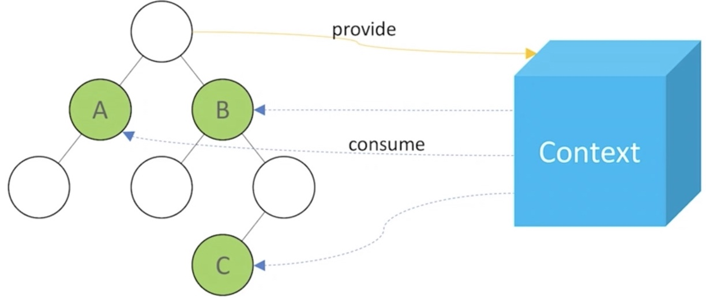
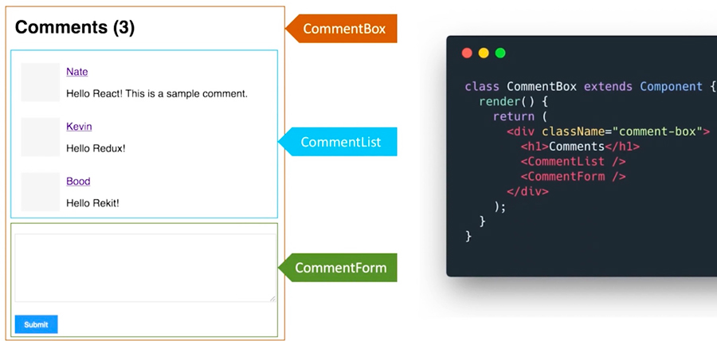

# react组件化

1. ui组件，专门负责渲染
2. 容器组件
3. 无状态组件，性能高
4. 受控组件 & 非受控组件
5. 异步组件
6. hoc高阶组件


## 理解 react组件

1. react组件一般不提供方法，而是某种状态机
   1. props + state = view
2. react组件可以理解为：一个组件就是一个纯函数
3. 组件数据流：单向数据流绑定
4. **首字母大写就是组件，小写就是 html标签**
5. 复合组件
6. 子组件的 children属性
7. 添加自定义组件
8. 给组件添加样式
9. 属性校验
10. setState同步 & 异步


### constructor & super

1. super是关键字，指代父类的实例；
2. 子类必须在 constructor方法中调用 super方法；否则，新建实例会报错；因为子类没有自己的this对象
3. 继承父类 this对象，然后对其加工，如果不调用 super方法，子类得不到 this对象
4. 如果在构造函数里面使用 this.props，super(props) 里面必须传递 props


### props

1. props 数据传递
   1. 父组件向子组件通过 属性方式传值，子组件接收值`this.props.属性`
   2. 子组件不能直接修改父组件的数据
2. props 传递函数
   1. 父组件 `<TodoItem index={index} deleteItem={this.fnDelete.bind(this)}>`
   2. 子组件 `this.props.deleteItem(this.props.index)`
3. props 类型检查 prop-types
4. 状态提升，数据要放在父组件管理


### prop-types 参数校验

1. `yarn add prop-types`
2. `Todo.propTypes = {name: PropTypes.string,isRequired}`
3. `Todo.defaultProps ={name: 'title'} `
4. arrayOf 数组的组成部分
5. onOfType
6. defaultProps 默认参数
7. https://zh-hans.reactjs.org/docs/typechecking-with-proptypes.html#gatsby-focus-wrapper

```jsx
import React from 'react'
import PropTypes from 'prop-types'

// input框
class Input extends React.Component {
  constructor(props) {
    super(props)
    this.state = {title: ''}
  }
  render() {
    return <div>
      <input value={this.state.title} onChange={this.onTitleChange}/>
      <button onClick={this.onSubmit}>提交</button>
    </div>
  }
  onTitleChange = (e) => {
    this.setState({
        title: e.target.value
    })
  }
  onSubmit = () => {
    const { submitTitle } = this.props
    submitTitle(this.state.title) // 'abc'

    this.setState({
        title: ''
    })
  }
}
// props input类型检查
Input.propTypes = {
  submitTitle: PropTypes.func.isRequired
}
Input.defaultProps = {
  submitTitle: 'default title'
}

// list列表
class List extends React.Component {
  constructor(props) {
      super(props)
  }
  render() {
    const { list } = this.props

    return <ul>{list.map((item, index) => {
      return <li key={item.id}>
          <span>{item.title}</span>
      </li>
    })}</ul>
  }
}
// props list类型检查
List.propTypes = {
  list: PropTypes.arrayOf(PropTypes.object).isRequired
}


class Footer extends React.Component {
  constructor(props) {
      super(props)
  }
  render() {
    return <p>
        {this.props.text}
        {this.props.length}
    </p>
  }
  componentDidUpdate() {
      console.log('footer did update')
  }
  shouldComponentUpdate(nextProps, nextState) {
    if (nextProps.text !== this.props.text
        || nextProps.length !== this.props.length) {
        return true // 可以渲染
    }
    return false // 不重复渲染
  }
  // React 默认：父组件有更新，子组件则无条件也更新！！！
  // 性能优化对于 React 更加重要！
  // SCU 一定要每次都用吗？—— 需要的时候才优化
}


class TodoList extends React.Component {
  constructor(props) {
    super(props)
    this.state = { // 状态（数据）提升
      list: [
        { id: 'id-1',title: '标题1' },
      ],
      footerInfo: '底部文字'
    }
  }
  render() {
    return <div>
        <Input submitTitle={this.onSubmitTitle}/>
        <List list={this.state.list}/>
        <Footer text={this.state.footerInfo} length={this.state.list.length}/>
    </div>
  }
  onSubmitTitle = (title) => {
    this.setState({
      list: this.state.list.concat({
          id: `id-${Date.now()}`,
          title
      })
    })
  }
}
```


#### props & state & render函数

1. 当组件的 state或 props发生改变，render函数就会重新执行渲染
2. 子组件接收的 props发生改变，会重新渲染
3. 父组件的 state改变，会立即执行 render函数
4. 当父组件的 render函数执行时，子组件的render都会重新执行


## class类组件


## hooks函数组件

1. class只接收一个 props，没有state和其他逻辑，就可以用函数组件
2. 纯函数，输入 props，输出 jsx
3. 没有实例，生命周期，state
4. 不能扩展其他方法

```jsx
function List (props) { // 函数式组件
  const {list} = this.props
  return <ul> {
      list.map((item, i) => {
        return <li key={item.id}>{item.title}</li>
      })
    }
  </ul>
}

class List extends React.Component { // class组件
  constructor(props) {
    super(props)
  }
  render () {
    const {list} = this.props
    return <ul> {
      list.map((item, i) => {
        return <li key={item.id}>{item.title}</li>
      })
    }
  	</ul>
  }
}
```


### 函数组件和 class组件的区别

1. 纯函数，**输入 props**，输出 jsx
2. 没有实例，没有生命周期，没有 state
3. 不能扩展其他方法
4. class组件有生命周期


## 组件设计模式

1. 高阶组件
2. 函数作为子组件


### PureComponent

1. 实现了浅比较 shouldComponentUpdate
2. 优化性能
3. 要结合“不可变的值”使用
4. 纯组件 React 会自动使用 shadowEqual 对比属性来判断组件是否需要更新 
   1. shouldComponentUpdate React 会使用该方法来判断是否更新该组件

```jsx
import React from 'react'
import PropTypes from 'prop-types'

class List extends React.PureComponent {
  constructor(props) {
    super(props)
  }
  render() {
    const { list } = this.props

    return <ul>{list.map((item, index) => {
        return <li key={item.id}>
          <span>{item.title}</span>
        </li>
      })}</ul>
  }
  // 隐式的添加了 SCU的浅比较
  // shouldComponentUpdate() {// 浅比较}
}
List.propTypes = {
  list: PropTypes.arrayOf(PropTypes.object).isRequired
}
```


#### memo

memo，函数式组件中的 PureComponent

PureComponent class组件

```jsx
function Todo (props) {
  // props
}
function isEqual (prevProps, nextProps) {
  // 如果 nextProps传入的 render方法的返回结果与
  // 将 prevProps传入的 render方法返回结果一直，就返回 true，否则 false
}
export default React.memo(Todo, isEqual)
```


### UI组件

1. 从 props接收数据，专门负责渲染

```jsx
class TodoUI extends Component {
  render () {
    const { value, list, fnSubmit, fnChange, deleteItem, keyUp } = this.props
    return (
      <Fragment>
        <header>
          <input
            className='input'
            onKeyUp={keyUp}
            onChange={fnChange}
            value={value}
            type="text" />
          <button onClick={fnSubmit}>提交</button>
        </header>

        <TodoItem data={list} deleteItem={ index => deleteItem(index) }/>
      </Fragment>
    )
  }
}
```


### 容器组件

1. 负责页面逻辑

```jsx
import TodoUI from './TodoUI'

render () {
  const { value, list, fnSubmit, fnChange, deleteItem } = this.state
  return <TodoUI
           fnChange={fnChange}
           fnSubmit={fnSubmit}
           deleteItem={deleteItem}
           value={value}
           list={list}/>
}
export default TodoUI
```


### 无状态组件

1. 没有render函数，是个函数，性能比UI组件好
2. UI组件如果只有render函数，就用无状态组件代替

```jsx
const TodoUI = props => {
  const { value, list, fnSubmit, fnChange, deleteItem, keyUp } = props
  return (
    <Fragment>
      <header>
        <input
          className='input'
          onKeyUp={keyUp}
          onChange={fnChange}
          value={value}
          type="text" />
        <button onClick={fnSubmit}>提交</button>
      </header>
      
      <TodoItem data={list} deleteItem={ index => deleteItem(index) }/>
    </Fragment>
  )
}
export default TodoUI
```


### 异步组件

1. import(), React.lazy(), React.Suspense
2. fallback 加载完成前做的事

```jsx
const Todo = React.lazy(() => import('./todo'))

render() {
  return <div>
  	<React.Suspense fallback={<div>Loading...</div>}>
      <Todo></Todo>	
    </React.Suspense>
  </div>
}
```


#### 何时用异步组件

1. 同 Vue，加载大组件，组件拆分
2. 路由的懒加载
3. lazy & Suspense实现


### 受控组件

1. 受控组件，表单value的值受 state的控制，常用于表单
   2.  input的value值必须是，设置在constructor构造函数的state中的值
2. 通过onChange触发事件来改变state中保存的value值，这样形成一个循环的回路
   1. 优先使用受控组件
   2. 必须操作DOM，就是用非受控组件
   3. 


#### 什么是受控组件

1. 表单的值，要受到 state的控制
2. 需要手动监听 onChange的值，更新 state
3. 对比非受控组件，响应式数据 v-model就是

```jsx
import React from 'react'

class Form extends React.Component {
  constructor(props) {
    super(props)
    this.state = {
      user: 'admin',
      name: 'lucy',
      city: 'beijing',
      flag: true,
      gender: 'male'
    }
  }
  
  render () {
    return <div>
      <p>{this.state.name}</p>
      <label htmlFor="inputName">姓名：</label> {/* 用 htmlFor 代替 for */}
      <input id="inputName" value={this.state.name} onChange={this.onInputChange}/>
      
      <textarea value={this.state.info} onChange={this.onTextareaChange}/>
      
      <select value={this.state.city} onChange={this.onSelectChange}>
        <option value="beijing">北京</option>
        <option value="shanghai">上海</option>
        <option value="shenzhen">深圳</option>
      </select>
      
      <input
        type="checkbox"
        checked={this.state.flag}
        onChange={this.onCheckboxChange}/>
      
      male <input
       type="radio" name="gender" 
       value="male" checked={this.state.gender === 'male'} 
       onChange={this.onRadioChange}/>
      female <input 
       type="radio" name="gender" 
       value="female" checked={this.state.gender === 'female'} 
       onChange={this.onRadioChange}/>
    </div>
  }
  
  onInputChange = ev=> {
    this.setState({
      name: ev.target.value
    })
	}
  
  onCheckboxChange = () => {
    this.setState({
      flag: !this.state.flag
    })
  }
}
```


### 非受控组件

1. 不需要设置它的state属性，而通过ref来操作真实的DOM
   1. input的值，不受 state的控制
2. ref，手动操作DOM，`this.valueRef.current`
3. defaultValue & defaultChecked
4. 非受控组件使用场景
   1. setState实现不了，必须用DOM操作，就用非受控组件
   2. 文件上传 `input type="file">`
   3. 富文本编辑器，需要传入DOM元素

```jsx
class App extends React.Component {
  constructor(props) {
    super(props)
    this.state = {
      name: '',
      status: false
    }
    this.valueRef = React.createRef() // 创建 ref
    this.fileRef = React.createRef()
  }
  
  render () {
    return <div>
      // 用 ref，就要用 defaultValue 而不是 value
    	<input defaultValue={this.state.name} ref={this.valueRef}/>
      <button onClick={this.alertName}>alert name</button>
      
      <input type="file" ref={this.fileRef}/>
      <input type="checkbox" defaultChecked={this.state.status} />
    </div>
  }
  
  alertName = () => {
    const el = this.valueRef.current // 通过 ref 获取 DOM 节点
    console.log(el.value)
  }
}
```


### ref

1. ref获取真实的DOM，有坑，尽量少用 ref
   1. `this.ul.querySelectorAll('div').length` 获取的length少一个，因为 setState默认是异步的
   2. 在 setState的回调函数里面调用

```jsx
<input
  className='input'
  onKeyUp={this.keyUp}
  onChange={this.fnChange}
  value={value}
  ref={ input => {this.input = input}}
  type="text" />

fnChange = ev => {
  // ref this.input 获取到DOM
  console.log('ev', ev.target.value, this.input)
  this.setState({
    value: ev.target.value
  })
}
```


### HOC高阶组件

1. 公共组件的抽离，封装；

2. 高阶组件：对已有组件的封装：接收组件作为残念年数，返回新的组件

3. Higher Order Component，不是一种功能，是一种设计模式；类似于工厂的模式

   1. Vue如何实现高阶组件

4. 组件复用的其他两种形式：

   1. 高阶组件和函数作为子组件

   

#### Hoc多个组件的公共逻辑复用

1. 高阶组件 HOC
2. Render Props
3. mixin已被 React废弃

```jsx
const HocFactory = (Component) => {
  class Hoc extends React.Component {
    render () {
       // 定义多个组件的公共逻辑，返回拼装结果；Vue传值 $props & v-bind:
      return <Component {...this.props} />
    }
  }
  return Hoc // 接收一个组件，返回一个新组件
}
const my1 = HocFactory(wrapComponent1)
const my2 = HocFactory(wrapComponent2)


// react-redux connect 就是高阶组件
import { connect } from 'react-redux'
const TodoList = connect(
	mapStateToProps,
  mapDispatchToProps
)(Todo)
export default TodoList
```


### 高阶组件案例

```jsx
import React from 'react'

const withMouse = Component => {
  class Factory extends React.Component {
    constructor(props) {
      super(props)
      this.state = { x: 0, y: 0 }
    }
    
    render () {
      reutrn (<div
        onMouseMove={this.fnMuse}
        style={{height: '300px'}}>
        // 传递所有的 props
        <Component {...this.props} mouse={this.state}></Component>
        // render props reutrn (<div>{this.props.render(this.state)}</div>)
      </div>)
    }
    fnMouse = event => {
      this.setState({
        x: event.clientX,
        y: event.clientY
      })
    }
  }
  return Factory
}

const App = props => {
  const name = props.name
  const {x, y} = props.mouse // 接收 mouse 属性
  return <div>
    <h1>The mouse position is ({x}, {y})</h1>
    <p>{name}</p>
  </div>
}
export default withMouse(App) // 返回高阶函数

// 使用 <MyTodo name="100"/>
```


### 函数作为子组件

1. 组件 render的内容，由使用者来决定


## 组件之间通信

1. 父子组件 props，属性传值
   1. 子组件修改父组件数据，调用父组件传递的方法
2. 自定义事件
3. Redux 
4. Context 跨层级组件通信


### Context是什么？

1. Context上下文；父组件，向下所有子组件传递数据
   1. 公共信息配置，语言，主题；传递给每个组件
   2. 生产者 Provider & 消费者 Consume
2. 用 props太繁琐，用 redux小题大做
3. 复杂的数据传递用 Redux
4. `ThemeContext.Provider` & `ThemeContext.Consumer`生产者和消费者；把内容给包裹起来
   1. 根节点 Provider 提供数据：把上下文数据保存在外部状态中，不需要 props一层层的传递
   2. 子节点内 Consume获取数据：class组件内使用  this.context获取 Provider的值



```jsx
import React from 'react'
const ThemeContext = React.createContext('light') // 创建 Context 填入默认值，或变量

// 函数式组件使用 Consumer，底层组件
function ThemeLink (props) {
    // const theme = this.context // 报错。函数式组件没有实例，没有 this
    return (
    <ThemeContext.Consumer>
        { value => <p {...props}>link's theme is {value}</p> }
    </ThemeContext.Consumer>
    )
}

// class 组件
class ThemedButton extends React.Component {
  // 指定 contextType 读取当前的 theme context，也可以用 ThemedButton.contextType = ThemeContext
  // static contextType = ThemeContext 
  render() {
    // React 会往上找到最近的 theme Provider，然后使用它的值
    const theme = this.context
    return (
    <div>
        <p>button's theme is {theme}</p>
    </div>
    )
  }
}
ThemedButton.contextType = ThemeContext // 指定 contextType 读取当前的 theme context

// 中间的组件再也不必指明往下传递 theme
function Toolbar(props) {
  return (
    <div>
      <ThemedButton />
      <ThemeLink />
    </div>
  )
}

// 父组件 ThemeContext.Provider传递数据
class App extends React.Component {
  constructor(props) {
    super(props)
    this.state = { theme: 'light' }
  }
  render() {
    return (
      // 如果没有设置 value，就使用默认值
    <ThemeContext.Provider value={this.state.theme}>
      <Toolbar />
      <button onClick={this.changeTheme}>change theme</button>
    </ThemeContext.Provider>
    )
  }
  changeTheme = () => {
    this.setState({
      theme: this.state.theme === 'light' ? 'dark' : 'light'
    })
  }
}
```


## Render Props

1. render props核心：通过一个函数将 class组件的 state作为 props传递给 纯函数组件
2. HOC 最终要返回一个高阶函数
3. HOC 模式简单，但会增加组件层级
4. Render Props 代码简洁，学习成本高，按需使用

```jsx
class Factory extends React.Component {
  constructor () {
    this.state = {} // state 多个组件的公共逻辑
  }
  
  render () { // 修改 state
    reutrn (<div>{this.props.render(this.state)}</div>)
    // Hoc
    // <Component {...this.props} mouse={this.state}></Component>
  }
}

// render props，render是一个函数组件
const App = (props) => (
  <Factory render={ props => <p>{props.a} {props.b}</p> } />
)
export default App
```


render props 案例

```jsx
import React from 'react'
import PropTypes from 'prop-types'

class Mouse extends React.Component {
	constructor (props) {
    super(props)
    this.state = {x: 0, y: 0}
  }

  render () {
    return (<div style={{height: '500px'}} onMouseMove={this.fnMove}>
      // 将当前 state属性作为参数传递给 props，传递给 render函数组件
    	{this.props.render(this.state)}  
    </div>)
  }
  fnMove = (event) {
    this.setState({
      x: event.clientX,
      y: event.clientY
    })
  }
}
Mouse.propTypes = {
  render: PropTypes.func.isRequired // render属性必填，且必须是个函数
}

const App = props => (<div style={{height: '500px'}}>
    <h1>{props.name}</h1>
    // render是个函数组件
    <Mouse render={ ({x,y}) => <p>this mouse point x: {x}, y: {y}</p> } />
</div>)

// 定义了 Mouse组件，只有获取 x，Mouse
// Mouse组件怎么渲染，App决定了，通过 render props告诉 Mouse
export default App

// 使用
<App name="lucy" />
```


### Portals 根节点渲染

1. 传送门，让子节点渲染到父组件之外的 `React.createPortal(child,container)`
   1. 组件默认按照层级嵌套渲染
   2. `this.props.children` 类似 Vue的 slot
2. Portals引用场景
   1. BFC限制子组件显示，overflow:hidden
   2. 父组件 z-index值太小
   3. fixed需要放在 body第一层

```jsx
import ReactDOM from 'react-dom'

render () {
  // 使用 Protals渲染到 body上，fixed元素放在 body上，更好的浏览器兼容
  return ReactDOM.createPortal(
    <div className="modal">{this.props.children}</div>,
    document.body // 挂载的 DOM节点
  )
}
```


## 细分组件

1. 将 UI组织成组件树的形式，以组件方式构建UI
2. 创建静态 UI
3. 考虑组件的状态组成
4. 考虑组件的交互方式




### 组件设计原则

1. 单一职责原则；每个组件只做一件事
2. 如果组件变得复杂，那么应该拆分成小组件


### 数据状态管理

1. DRY原则：能计算得到的状态，就不要单独存储
2. 组件尽量无状态，所需数据通过 props获取
   1. 组件所有的状态都来自外部
   2. react组件不会提供方法，传递的状态是什么，就渲染什么


## 组件 jsx语法


