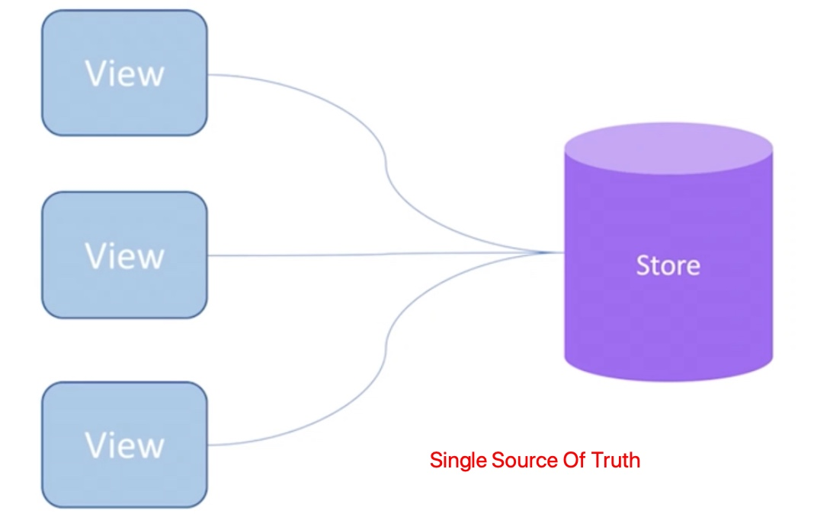

# redux

1. redux是：状态容器和数据流管理工具
   1. 基于 flex设计的数据状态管理框架；用流程来约束数据的更新
   2. 数据流：修改数据的方法，以什么样的方式来改变数据
2. 单项数据流模型，相比 Vuex，学习成本高
   1. 单向数据流，从父组件到子组件；兄弟组件无法共享数据
   2. 单向数据流，子组件不能修改父组件的数据
3. 全局只有一个唯一的 store，当 store有变化，页面就会自动刷新
   1. store管理所有全局的状态
   2. 把 store放在了所有的组件之外，所有的组件都和 store通信
   3. redux难点还在于：数据流的设计；如何组织数据之间的关系
4. 不可变值，纯函数，redux提供了可预测化的状态管理
5. 中间件
   1. redux-thunk
   2. redux-saga
   3. redux-promise
6. react-redux
   1. provider
   2. connect
   3. mapStateToprops
   4. mapDispatchToProps
7. redux中文文档 https://www.redux.org.cn/
   1. react 视图层库 & redux 数据层库
   2. redux = reducer + flux
8. reselect-自动缓存数据的数据流

```jsx
yarn add redux-saga
yarn add redux react-redux
yarn add immutable

yarn add redux-devtools-extension --save-dev
```


### redux 3大原则

1. 单一数据源

   1. 应用的所有数据都放在同一个对象上，进行管理
   2. 数据只有一份

2. 状态不可变

   1. 修改数据前后，数据源不再是同一个对象
   2. mmutable.js 不可改变的对象
   3. 实现状态的保存，时间旅行的功能

3. 纯函数修改

   1. 没有副作用，幂等的;不能异步请求

      


## redux单项数据流

1. store - state
2. reducer
3. action异步
4. dispatch(action)
5. reducer - newState
6. subscribe 触发通知
7. 根组件里 src/index.js，Provider 作为项目的根组件，绑定 store 属性

```jsx
view - dispatch(action) - reducer - state - view

diapatch - middleware

getState()
createStore

dispatch
subscribe

applyMiddleware
combineReducer
compose
bindActionCreators

state 
	全局唯一数据源；只读对象，必须通过 reducer修改

reducer
	纯函数：对 state的业务处理，记账本

action
	对象：用于描述事件行为，改变 state
  返回函数，异步，引入redux-thunk
```


### redux命名空间

1. store/reducers.js 存放过多数据，导致不可维护
2. 把一个 reducers 拆分为很多的reducer.js,放在对应的组件目录
3. 最终在 store/reduers.js 中 做个 reducer整合


```jsx
/views
	/Header
		/store
			/index.js 
			/action.js
			/constants.js
			/reducer.js
  	/Header.js

/store
	/index.js
	/reducers.js


// store/index.js
import {
  createStore,
  compose,
  applyMiddleware
} from 'redux'
import thunk from 'redux-thunk'
import reducer from './reducer'

// redux-devtools
const composeEnhancers = window.__REDUX_DEVTOOLS_EXTENSION_COMPOSE__ || compose
const enhance = composeEnhancers(applyMiddleware(thunk))
const store = createStore(reducer, enhance)
export default store


// store/reducers.js
// import { combineReducers } from 'redux'
// immutable的数据，把 state变成 immutable对象
import { combineReducers } from 'redux-immutable'

import { headerReducer } from '../components/Header/store'
import { homeReducer } from '../views/Home/store'
import { detailReducer } from '../views/Detail/store'
import { loginReducer } from '../views/Login/store'

// 命名空间整合 reducer
const reducer = combineReducers({
  header: headerReducer,
  home: homeReducer,
  detail: detailReducer,
  login: loginReducer
})

export default reducer
```


### redux数据流流程

1. redux把所有的数据都放到了 store里面
2. 每个组件都要从 store里面去获取数据
   1. component 借书人
   2. action 借书人说的话
   3. store图书管理员
   4. reducers 图书记录本
      1. 图书管理员没办吧记住所有的书，
      2. 查阅 reducer，reducer告诉管理员书放在那里
      3. 找到这本书，给组件

```jsx
import { createStore } from "redux"
const store = createStore()
export default store // 1 创建个默认的 store，啥也做不了，要把 reducer清单一起传进来

// 2 创建 store，要先去创建 reducer
import { createStore } from "redux"
import reducer from "./reducer"
const store = createStore(reducer)
export default store // store.js


// reducer.js
const defaultState = {
  value: '200',
  list: [{id: 1, title: 'ok'}, {id: 2, title: 'good'}]
}
// state是上次的数据，action是用户传递的那句话
export default (state = defaultState, action) => {
  return state
}


// redux-dev-tools
const store = createStore(
  reducer,
  window.__REDUX_DEVTOOLS_EXTENSION__ && window.__REDUX_DEVTOOLS_EXTENSION__()
)

```


redux-devtools-extension

https://github.com/zalmoxisus/redux-devtools-extension


```jsx
action 派发到 store
store派发到 reducer里面

createStore()
store.dispatch()
store.getState()
store.subscribe()
```


### redux特点

1. store必须是唯一的；只有 store才能改变自己的值
2. reducer必须是个纯函数
   1. 纯函数：给定固定的输入，就一定会有固定的输出；而且不会有任何副作用
   2. 如果值是 new Date() 就不是纯函数
   3. ajax异步请求，setTimeout定时器也不是纯函数
   4. 对接收的参数进行修改就是有副作用
3. component 想要改变 store的数据，必须先创建 action，然后 store.dispatch(action)
4. Single Srouce of Truth 单一数据源
   1. view内部没有自己的状态
   2. 
5. 可预测性：state + action = new state
   1. state的变化一定是有某个 action触发的
6. 纯函数更新 store
   1. 通过 reducer的函数来产生一个新的 store


```jsx
fnChange = ev => {
  const action = {
    // type: 'change_input_value',
    type: CHANGE_INPUT_VALUE,
    value: ev.target.value
  }
  store.dispatch(action)
  // this.setState({ value: ev.target.value })
}

fnSubmit = () => {
  const action = {
    // type: 'add_item'
    type: ADD_ITEM
  }
  store.dispatch(action)
  // const { value, list} = this.state
  // this.setState({ list: [value, ...list], value: '' })
}
```


### store


### reducer

1. (state, action) => newState

```jsx
function todos(state = initState, action) {
  switch (action.type) {
    case ADD_TODO: 
      return [{ text: action.text, complete: false }, ...state.todo]
    case TOGGLE_TODO:
      return state.map(
      	(todo, index) =>
        action.index === index
        ? { text: todo.text, completed: !todo.completed }
        : todo
      )
      
    default: return state
  }
}
```


### action


```jsx
{
  type: ADD_TODO,
  text: 'build react app'
}
```


### actionTypes.js

1. 拆分常量，把所有常量提取到一个文件里面

```jsx
export const CHANGE_INPUT_VALUE = 'CHANGE_INPUT_VALUE'
export const ADD_ITEM = 'ADD_ITEM'
export const DELETE_ITEM = 'DELETE_ITEM'
```


### actionCreators.js

1. 把所有的action提取到一个文件

```jsx
import {
  CHANGE_INPUT_VALUE,
  DELETE_ITEM,
  ADD_ITEM
} from './actionTypes' // actionCreators.js

export const getInputChangeAction = value => ({
  type: CHANGE_INPUT_VALUE,
  value
})

export const getAddItemAction = () => ({
  type: ADD_ITEM
})

export const getDeleteItemAction = index => ({
  type: DELETE_ITEM,
  index
})
```


组件使用 actionCreators.js

```jsx
fnChange = ev => {
  const action = getInputChangeAction(ev.target.value)
  store.dispatch(action)
  // this.setState({ value: ev.target.value })
}

fnSubmit = () => {
  const action = getAddItemAction()
  store.dispatch(action)
  // const { value, list} = this.state
  // this.setState({ list: [value, ...list], value: '' })
}

deleteItem = (index) => {
  const action = getDeleteItemAction(index)
  store.dispatch(action)
  // this.setState((state, props) => {
  //   return {
  //     list: state.list.filter((item,i) => i !== index)
  //   }
  // })
}
}
```


### redux解决的问题

1. 函数嵌套函数，维护起来会有问题
2. redux让组件通信更加容易
3. switch return 之后，还要 break吗


## redux中间件

1. redux-thunk是 redux的中间件，不是react的中间件；
   1. 那个中间：action 和 store的中间
   2. 如果是对象，直接传递个 store
   3. 如果是函数，先让函数执行，再传递给 store；对dispatch方法进行了升级：可以接收函数
   
2. 异步 action，要引入中间件 redux-thunk
   1. redux-thunk，异步操作放在 action里面操作，返回一个 dispatch函数
   2. redux-saga，把异步拆分出来，放到单独的一个文件里面管理
   
3. redux-promise，action异步代码同步化

4. redux-logger 记录redux日志

   

redux 高阶组件的原理和使用


### redux ajax请求

1. ajax请求放在 componentDidMount里面
2. 获取到数据后，`store.dispatch(action)`

```jsx
// actionCreators.js
import { INIT_LIST } from './actionTypes'
export const getListAction = data => ({
  type: INIT_LIST,
  data
})

// Component
import { getListAction } from './actionCreators.js'
componentDidMount () {
  axios.get('/list.json').then(res => {
    const action = getListAction(res.data)
    store.dispatch(action)
  })
}

// reducer.js
import { INIT_LIST } from './actionTypes'
export default (state = initState, action) => {
  const { type, list } = action
  const newState = cloneDeep(state)
  if (type === INIT_LIST ) {
    newState.list = list
    return newState
  }
}
```


## redux-thunk

1. 异步函数不要放在 生命周期来做，把异步代码放到 action里面
2. 使用 redux-thunk后，action可以是个函数，action默认是个对象 
   1. 返回函数的默认参数是 dispatch
   2. 如果 action返回一个函数，不会直接传递给 store；先执行函数，再调用 store
3. redux-thunk高级配置 https://github.com/zalmoxisus/redux-devtools-extension
4. store/index.js

```jsx
import {
  createStore,
  applyMiddleware,
  compose
} from "redux"
import thunk from "redux-thunk"
import reducer from "./reducer"

const composeEnhancers = window.__REDUX_DEVTOOLS_EXTENSION_COMPOSE__ || compose
const enhancer = composeEnhancers(applyMiddleware(thunk))

// const store = createStore(reducer,applyMiddleware(thunk))
const store = createStore(reducer, enhancer)
export default store

```


```jsx
// actionCreators.js
export const initListAction = data => ({
  type: INIT_LIST,
  data
})
export const getList = () => {
  return disaptch => { // action return一个函数
    axios.get('/list.json').then(res => {
      const action = initListAction(res.data)
      dispatch(action)
    })
  }
}

// Component 组件，只有使用 redux-thunk，action才能是个函数
// store默认只能接收一个对象
componentDidMount () {
  const action = getList() 
  store.dispatch(action)
}
```


1. redux异步请求，使用异步 action，如 redux-thunk
2. 异步 action，在 actionCreators 里面写 函数
3. componentDidMount ajax请求


同步 action

```jsx
export const addTodo = text => ({
  type: 'ADD_TODO',
  id: this.state.id++,
  text
})
```

异步 action，要引入 redux-thunk

```jsx
import { createStore, applyMiddleware } from 'redux' // applyMiddleware使用中间件
import thunk from 'redux-thunk'
import rootReducer from './reducers/index'

// 创建 store，作为中间件引入 redux-thunk，中间件有多个，用逗号隔开
const store = createStore(rootReducer, applyMiddleware(thunk))

// 返回函数，其中有 dispatch参数
export const addTodoAsync = text => dispatch => {
  axios.get(url).then(res => {
    dispatch(ADD_TODO(res.text)) // 执行异步 action
  })
}
```


## redux-saga

1. sagas.js 必须是 generator函数
2. redux-saga文档 https://github.com/redux-saga/redux-saga
3. redux-saga的分类
   1. worker saga
   2. watcher saga
   3. root saga


## react-redux

1. react-redux - connect 是个高阶组件
2. `<Provider>` & connect；生产者，消费者
3. `mapStateToprops & mapDispatchToProps`
4. 只有在最顶层组件用 connect，子组件推荐用 connect获取数据


```jsx
// redux connect 就是高阶组件
import { connect } from 'react-redux'
const TodoList = connect(
	mapStateToProps,
  mapDispatchToProps
)(Todo)
export default TodoList

// connect 源码
export const connect = (mapStateToProps, mapDispatchToProps) => WrapComponent => {
  class Connect extends Component {
    constructor () {
      super()
      this.state = { allProps: {} }
    }
    // ...
    render () {
      return <WrapComponent {...this.state.allProps} />
    }
  }
  return Connect
}


// index.js
<Provider store={store}>  // 只接受 react 组件
```


## redux-promise


## 手写 react-redux

1. Provider
2. connect原理


### bindActionCreators

```jsx
function bindActionCreators (actionCreators, dispatch) {
	const obj = {}

	for (let key in actionCreators) {
		obj[key] = function (...args) {
			const actionCreator = actionCreators[key]
			const action = actionCreator(...args)

			dispatch(action)
		}
	}
	return obj
}
```


