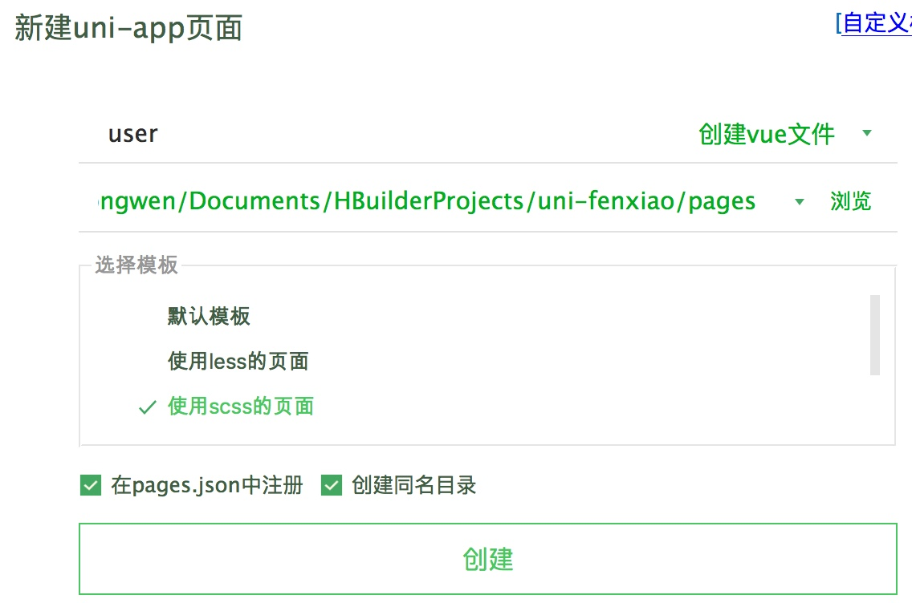
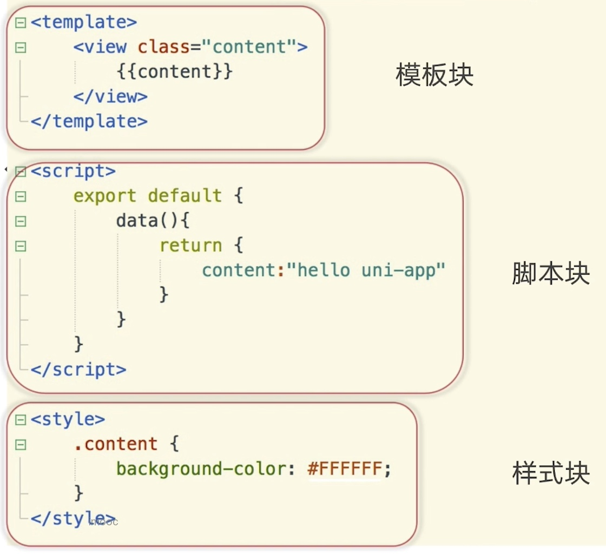
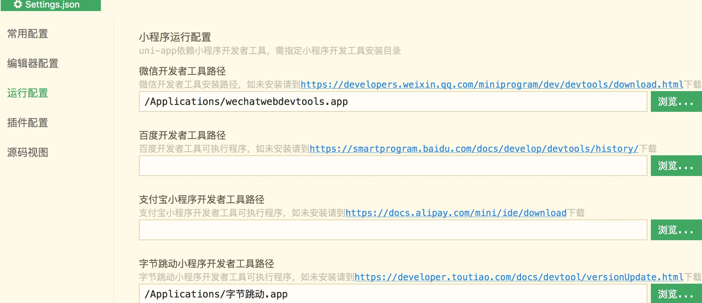
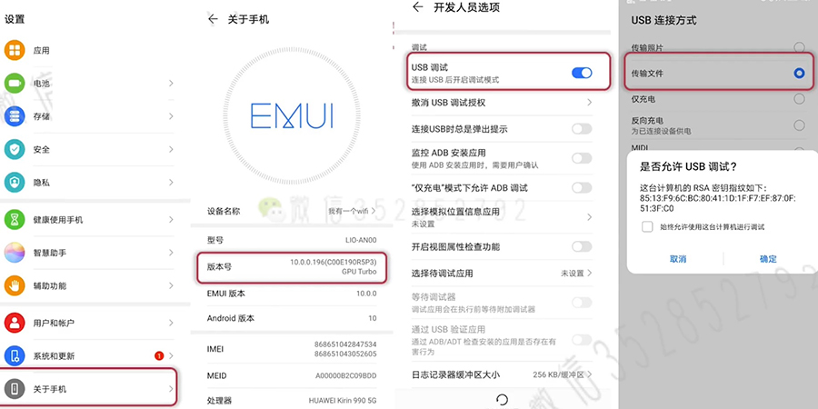

# uni-app项目配置


## uni目录结构

1. components 自定义组件的目录
2. pages 页面存放目录
3. unpackage 编译后的文件存放目录
4. utils 公用的工具类
5. **app.vue** 应用的生命周期
   1. 类似小程序的 app.js
   2. 全局的样式和方法调用
   3. getApp() & 用户登录判断 & 项目初始化
6. **main.js 应用入口**
   1. 和 vue的 main.js一样
   2. 全局组件注册 & 第三方库
7. manifest.json 
   1. uni-app的项目配置
8. pages.json 页面的配置
   1. `/pages/` 下所有的页面都应该在 pages.json里面注册
   2. https://uniapp.dcloud.io/collocation/pages?id=style

```tree
├── App.vue
├── components
├── main.js
├── manifest.json
├── pages
├── pages.json
├── server-api.md
├── sitemap.json
├── static
├── uni.scss
└── utils
```


## pages.json

1. https://uniapp.dcloud.io/collocation/pages?id=pages
2. pages 注册所有的页面
   1. style里面的配置会覆盖 globalStyle的配置
3. globalStyle 所有页面的公共配置
4. 


### pages页面路由

1. 使用 hbuildx 新建页面会自动在 pages.json里面注册




### tabBar选项卡

1. iconPath 必须是本地图片，不能是网络图片
   1. 大小 40kb
   2. 尺寸建议 81px * 81px
   3. home.png & home-active.png
2. tabBar 打开的页面会被缓存，不会被销毁
   1. 切换页面会被缓存，不会被重新渲染
   2. onLoad() 只会触发一次
   3. onTabItemTap 点击 tabBar触发

```jsx
onTabItemTap(ev) {
  conosle.log(ev) // {index: 1, text: '用户', pagePath: 'pages/user/user'}
}
```


```jsx
 <template>
  <view class="content" v-if="show">
    <view class="card"
      :class="className"
      @click="fnOpen"
    >{{title}}</view>
    <text>{{ show ? '握天人之契赞' : '洛水流年' }}</text>
  </view>
</template>

<script>
  export default {
    // data: {}, // 保留上次的数据，不会被初始化；不建议使用对象格式
    data () { // 每次都会初始化
      return () {
				title: 'user',
        className: 'active',
        show: true
      }
    },
    onLoad () { this.init() },
    methods: {
			fnOpen() {
        
      },
      init() {
        // vue语法风格
				this.title = '两朝三帝一曲赋' // this.setData({title: '两朝三帝一曲赋'})
      }
    }
  }
</script>

<style lang="scss" scoped>
  @import './index.scss';
  
  $width: 200px;
  
  .content {
		width: $width;
    height: $width;
  }
  
  
</style>
```


## scss

1. hbuildX - 工具，安装 scss编译


### vue单文件规范




## 运行平台配置

1. 微信小程序
2. ios模拟器
3. android 模拟器
4. chrome H5配置


### 小程序开发者工具

1. Mac - 偏好设置 - 运行配置




### ios真机调试

1. 安装 xcode
2. components 下选择ios版本
3. 运行 ios 模拟器


### android真机调试




### chrome浏览器