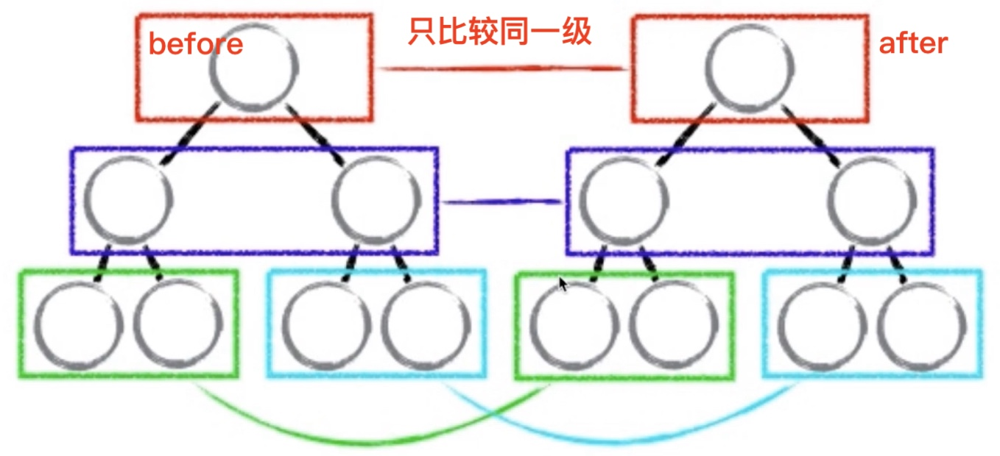

# vdom虚拟DOM

1. virtual dom，虚拟DOM，用 JS模拟 DOM结构
2. diff算法，vnode的核心
   1. 找出 DOM必须要更新的节点来更新，这个过程就是 diff算法
   2. 2个对象的 diff https://github.com/cujojs/jiff
   3. 2棵树的 diff vnode
   4. diff是对比的意思，广泛的概念：例如 linux diff，git diff
3. vdom缺点
   1. vnode操作不能终止，如何有效控制 DOM操作？
   2. 有一定的复杂度，减少计算次数比较难
   3. 用jquery可以控制DOM操作的运行时机
4. vdom 参考 https://github.com/snabbdom/snabbdom


### vdom是什么？为什么要用 vdom

1. DOM变化的对比，放在 js里面来做，提高重绘性能
   1. DOM操作耗费性能，避免DOM渲染才能提升性能
   2. vdom用 js模拟 DOM结构，计算出最小的改变
2. 真实的DOM属性

```jsx
const div = document.createElement('div')
let attrs = ''
for (let key in div) {
  attrs += ' | ' + key
}
console.log(attrs)

// 默认的 DOM属性
align | title | lang | translate | dir | hidden | accessKey | draggable | spellcheck | autocapitalize | contentEditable | isContentEditable | inputMode | offsetParent | offsetTop | offsetLeft | offsetWidth | offsetHeight | style | innerText | outerText | oncopy | oncut | onpaste | onabort | onblur | oncancel | oncanplay | oncanplaythrough | onchange | onclick | onclose | oncontextmenu | oncuechange | ondblclick | ondrag | ondragend | ondragenter | ondragleave | ondragover | ondragstart | ondrop | ondurationchange | onemptied | onended | onerror | onfocus | onformdata | oninput | oninvalid | onkeydown | onkeypress | onkeyup | onload | onloadeddata | onloadedmetadata | onloadstart | onmousedown | onmouseenter | onmouseleave | onmousemove | onmouseout | onmouseover | onmouseup | onmousewheel | onpause | onplay | onplaying | onprogress | onratechange | onreset | onresize | onscroll | onseeked | onseeking | onselect | onstalled | onsubmit | onsuspend | ontimeupdate | ontoggle | onvolumechange | onwaiting | onwheel | onauxclick | ongotpointercapture | onlostpointercapture | onpointerdown | onpointermove | onpointerup | onpointercancel | onpointerover | onpointerout | onpointerenter | onpointerleave | onselectstart | onselectionchange | onanimationend | onanimationiteration | onanimationstart | ontransitionend | dataset | nonce | autofocus | tabIndex | click | attachInternals | focus | blur | enterKeyHint | onpointerrawupdate | ontouchcancel | ontouchend | ontouchmove | ontouchstart | namespaceURI | prefix | localName | tagName | id | className | classList | slot | attributes | shadowRoot | part | assignedSlot | innerHTML | outerHTML | scrollTop | scrollLeft | scrollWidth | scrollHeight | clientTop | clientLeft | clientWidth | clientHeight | attributeStyleMap | onbeforecopy | onbeforecut | onbeforepaste | onsearch | elementTiming | previousElementSibling | nextElementSibling | children | firstElementChild | lastElementChild | childElementCount | onfullscreenchange | onfullscreenerror | onwebkitfullscreenchange | onwebkitfullscreenerror | hasAttributes | getAttributeNames | getAttribute | getAttributeNS | setAttribute | setAttributeNS | removeAttribute | removeAttributeNS | toggleAttribute | hasAttribute | hasAttributeNS | getAttributeNode | getAttributeNodeNS | setAttributeNode | setAttributeNodeNS | removeAttributeNode | attachShadow | closest | matches | webkitMatchesSelector | getElementsByTagName | getElementsByTagNameNS | getElementsByClassName | insertAdjacentElement | insertAdjacentText | setPointerCapture | releasePointerCapture | hasPointerCapture | insertAdjacentHTML | requestPointerLock | getClientRects | getBoundingClientRect | scrollIntoView | scroll | scrollTo | scrollBy | scrollIntoViewIfNeeded | animate | computedStyleMap | before | after | replaceWith | remove | prepend | append | querySelector | querySelectorAll | requestFullscreen | webkitRequestFullScreen | webkitRequestFullscreen | ELEMENT_NODE | ATTRIBUTE_NODE | TEXT_NODE | CDATA_SECTION_NODE | ENTITY_REFERENCE_NODE | ENTITY_NODE | PROCESSING_INSTRUCTION_NODE | COMMENT_NODE | DOCUMENT_NODE | DOCUMENT_TYPE_NODE | DOCUMENT_FRAGMENT_NODE | NOTATION_NODE | DOCUMENT_POSITION_DISCONNECTED | DOCUMENT_POSITION_PRECEDING | DOCUMENT_POSITION_FOLLOWING | DOCUMENT_POSITION_CONTAINS | DOCUMENT_POSITION_CONTAINED_BY | DOCUMENT_POSITION_IMPLEMENTATION_SPECIFIC | nodeType | nodeName | baseURI | isConnected | ownerDocument | parentNode | parentElement | childNodes | firstChild | lastChild | previousSibling | nextSibling | nodeValue | textContent | hasChildNodes | getRootNode | normalize | cloneNode | isEqualNode | isSameNode | compareDocumentPosition | contains | lookupPrefix | lookupNamespaceURI | isDefaultNamespace | insertBefore | appendChild | replaceChild | removeChild | addEventListener | removeEventListener | dispatchEvent
```


### vdom核心 API

1. `h()` & `patch()`
2. createElement & updateChildren

```jsx
h('tagName', {arrts属性}, [children很多子节点])
h('tagName', {arrts属性}, '文本节点')

patch(container, vnode) // 渲染真实DOM
patch(vnode, newVnode) // diff

function createElement(vnode={}) {
  const {tag, props={}, children=[]} = vnode
  if (!tag) return null
  
  const el = document.createElement(tag) // element 标签
  for (let key in attrs) { // attribute 属性
    if (attrs.hasOwnProperty(key)) {
      el.setAttribute(key, attrs[key])
    }
  }
  
  // children 子节点
  children.forEach(child => {
    el.appendChildren(createElement(child))
  })
  return el
}

function updateChildren (vnode={}, newVnode) {
  const { children = [] } = vnode
  const newChildren = newVnode.children || []
  
  children.forEach((child, index) => {
    const newChild = newChildren[index]
    if (newChild == null) return
    
    if (child.tag === newChild.tag) {
      updateChild(child, newChild) // tag一样，递归对比
    }
    else {
      replaceNode(child, newChild) // tag不一样，直接替换
    }
  })
}

function replaceNode(vnode, newVnode) {
  
}
```


### vnode描述一个 DOM结构

1. render函数

```jsx
export default {
  render: (h) => {
    return h(el, {
      
    }, [
      
    ])
  }
}
```


2. js模拟 DOM

```jsx
<div id="box" class="container">
  <p>vnode</p>
  <ul style="fontSize: 20px">
    <li>list</li>
  </ul>
</div>

{
  tag: 'div',
  props: {
		className: 'container',
    id: 'box'
  },
  children: [
    {
      tag: 'p',
      children: 'vnode'
    },
    {
      tag: 'ul',
      props: {
        style: 'fontSize: 20px'
      },
      children: [
        {
          tag: 'li',
          children: 'list'
        }
      ]
    }
  ]
}
```


对vue底层实现的理解

## 组件渲染和更新过程

1. 响应式数据 & 模板编译 & vdom
2. 初次渲染
   1. 解析 template模板为 render函数，vue-loader
   2. 触发响应式，监听 data属性 getter & setter
   3. 执行 render函数，生成 vnode，patch(elem, vnode)
3. 更新过程
   1. 修改 data，触发 setter，此前 getter中已被监听
   2. 重新执行 render函数，生成 newVnode
   3. patch(vnode, newVnode)
4. 异步渲染
   1. nextTick() 等 DOM渲染完成再回调
   2. 汇总data的修改，一次性更新视图
      1. 页面渲染时，会将 data的修改整合，多次 data的修改只会渲染一次


1. 响应式 data触发更新，数据驱动视图
   1. 监听 data的属性 getter & setter
2. 模板编译渲染 Component Render
   1. template模板编译成 render函数，render再到 vnode
   2. 触发响应式数据，set触发 Watcher


### diff的时间复杂度

1.  O(n^3)算法的不可用
    1. 第一：遍历 tree1，第二： 遍历 tree2，第三：排序，三次组合就是 n^3，n的三次方
    2. 1000个节点，要计算一亿次，算法不可用
2.  时间复杂度，在 O(n^3)基础上优化到 O(n)
    1. 只比较同一级，不跨级比较
    2. tag不相同，直接删除重建，不在深度比较
    3. tag & key，2个都相同，就认为是相同的节点，不再深度比较
3.  diff算法体现，key


## diff算法

1. patch函数
   1. patchVnode
      1. patch(elem, vnode) 
      2. path(vnode, newVnode)
   2. addVnoddes & removeVnodes
2. updateChildren，key的重要性
   1. 开始和开始作对比
   2. 结束和结束作对比
   3. 开始和结束作对比
   4. 结束和开始作对比
   5. 以上四个都没有匹配
3. vdom的核心概念
   1. h, vnode, patch, diff, key
   2. h -> vnode
   3. createElement -> vnode
   4. vdom存在的价值：数据驱动视图，控制DOM操作


1. 第一个参数不是vnode，就创建一个 空的vnode，关联这个DOM
2. 相同的 vnode，patch(oldVnode, newVnode)
   1. 对比 tag & key
3. 不同的 vnode，删除重建
4. 新旧都有 children


1. 同级vnode 对比


2. tag不同，直接删除重建，不再深度对比


3. updateChildren 更新数据


4. 使用 key属性

