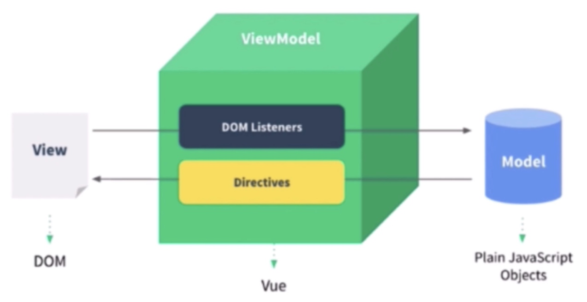

# Vue面试题

1. 组件化
2. 生命周期


## 面试的流程

1. 一面，基础知识，面试的流程和重点
2. 二面，框架的原理，项目设计思路，体现你的技术深度
   1. 基本原理
   2. 热门技术的深度
   3. 全面性，自由的发挥空间
3. 三面，框架的实际应用，设计能力 & 工作经验总结，提炼项目经验
   1. 组件结构
   2. 数据结构
4. 面试的逻辑
   1. 要能快速上手工作，公司不培养人，只用人，能干活的；考察框架的熟练度
   2. 多个人竞争时，选择有技术追求的；考察框架原理及实现
   3. 看人能不能独立承担项目；框架的设计能力
5. 


## vue组件化

1. php，jsp的组件化
   1. 传统组件化，只是静态渲染，更新还要依赖于操作DOM
   2. ejs，smarty
   3. 组件化不是创新，数据驱动视图是创新
2. 数据驱动视图，数据改变，视图自动刷新
   1. Vue MVVM
   2. React setState


### 对 mvvm的理解

1. **Model**，对应 data数据
2. **View**，对应DOM
3. **VM**，ViewModel
   1. Model改变能重新渲染View, Model通过指令渲染 DOM
   2. View能修改 data数据，DOM通过事件修改data




### 响应式数据原理

1. 组件 data数据一旦变化，立刻触发视图更新
2. `Object.defineProperty`监听 Object
3. `prototype[item].call(this, ...arguments)` 监听 Array
   1. 缺点：不能监听数组变化，重新定义数组的原型 prototype，重写 push, pop等方法
   2. proxy支持监听原生数组变化，proxy不支持 IE11
4. 复杂对象的深度监听 observer
   1. 嵌套层级很深的对象，observer 一次性递归深度监听；性能不好，对象嵌套层级不要太深
   2. 无法监听新增属性，删除属性，Vue.set & Vue.delete
   3. 性能不好，对象嵌套层级不要太深
   4. proxy
5. 组件渲染和更新的流程


```jsx
let data = {}
let name = 'lucy'

Object.defineProperty(data, 'name', {
  get () {
    console.log('get')
    return name
  },
  set (newValue) {
    console.log('newValue', newValue)
    name = newValue
  }
})

console.log('get name', data.name)
data.name = 'ok' // set

```


### 双向数据绑定 v-model的原理

1. input元素的 value = this.name，this.name就是绑定的变量
2. 绑定的input事件 this.name = $event.target.value
3. data 更新触发 re-render


### 如何自己实现 v-model

1. 用 :value，没有用 v-model
2. model.event 事件名和 emit() 事件要一致 

```jsx
<template>
  <input
    text="text"
    :value="value"
    @input="fnInput" />
</template>

<script>
  export default {
    model: {
    	prop: 'value', // 对应 props的 value
      event: 'change'
    },
    props: {
      value: {
      	type: String,
        default: ''
      }
    },
    methods: {
      fnInput (ev) {
        this.$emit('change', ev.target.value)
      }
    }
  }
</script>
```


### vue组件如何通信

1. 父子组件 props & this.$emit
2. 自定义事件 event.$on & event.$off & event.$emit
3. vuex


### 如何将组件所有的 props传递给子组件

1. v-bind

```jsx
<Child v-bind="$props">
  
export {
  computed: {
    $props () {
      return {}
    }
  }
}
```


## vue性能优化

1. 合理使用 v-show & v-if
2. 合理使用 computed
3. v-for循环时，添加key属性，避免和 v-if同时使用
4. 自定义事件，DOM事件及时销毁
5. 合理使用异步组件 & keep-alive
6. data 层级不要太深
7. 用 vue-loader在开发环境下模板编译，预编译
8. 图片懒加载
9. 使用 ssr


### mixin多个组件相同的业务逻辑

1. mixin
2. mixin的缺点


### 啥时候用异步组件

1. 加载大组件，例如编辑器，图表
2. 路由异步加载 import


### 啥时候用 keep-alive

1. 缓存组件，不需要重复渲染
2. 多个静态 tab页面的切换
3. 优化性能


### 啥时候使用 beforeDestory

1. 解绑自定义事件 event.$off
2. 清除定时器
3. 解绑自定义的 DOM事件，如 window.onscroll


### 什么时候用 slot

1. slot 作用域插槽

```jsx
// parent.vue
<Child :url="url">
  <template v-slot="prop">
  	{{prop.params.title}}
  </template>
</Child>

// child.vue
<template>
  <a :href="url">
    <slot :params="params">
    	{{params.subTitle}} // 默认显示的值
    </slot>
  </a>
</template>

<script>
  export default {
    props: {
      value: {
      	url: String,
        default: ''
      }
    },
    data () {
      return {
        params: {
          url: 'www.lulongwen.com',
          title: 'lulongwen',
          subTitle: '卢珑文的网站'
        }
      }
    }
  }
</script>
```


### v-show & v-if的区别

1. v-show 通过 css display 控制显示和隐藏
2. v-if条件渲染，组件真正的渲染和销毁，而不是显示和隐藏
3. 频繁切换显示状态用 v-show，否则用 v-if


### v-for中为啥要用 key

1. 必须要用 key，而且key不能是 random随机数和 index下标
2. diff算法中通过 tag 和 key来判断，是不是一个 sameNode节点相同
3. 减少渲染次数，提升渲染性能


### 为啥组件 data必须是个函数

1. export default 对象，编译之后是个 class类，在使用组件的时候，就是 new 这个类
2. 在实例化 data的时候，如果不是函数，每个实例的data都是一样的，存在数据共享，引起数据混乱
3. 23

```jsx
export default {
  data () {
    return {
      name: 'vue',
      list: [100, 200, 300]
    }
  },
  methods: {
    changeName () {
      this.name = 'webfront'
    }
  }
}
```


### computed & watch

1. 缓存，data不变，不会重新计算
2. 提高性能


## vue生命周期


### 描述Vue组件的生命周期，有父子组件的情况

1. 单组件的生命周期图
2. 父子组件的生命关系
   1. created
   2. mounted
   3. updated
   4. distroy销毁的关系


### ajax请求应该放在那个生命周期里面

1. mounted
2. js 是单线程的，ajax是异步获取数据的
3. 放在 mounted之前没有用，只会让逻辑更加混乱
   1. 只要js没有渲染完成，拿回的数据也没啥提前效果


### $nextTick

1. 异步渲染，合并data修改，提高渲染性能
2. 页面渲染时异步的，$nextTick在 DOM渲染更新完成后，触发回调
3. 页面渲染时，将 data的修改做整合，多次data修改只会渲染一次

```jsx
<p>{{name}}</p>

export default {
  data () {
    return {
      name: 'lucy', // 触发 getter
      age: 300, // 不会触发 getter，因为模板没用这个变量
      list: []
    }
  },
  methods: {
    addItem () {
      this.list.push(100)
      this.list.push(200)
      this.list.push(300)

      this.$nextTick(() => {
        const ul = this.$refs.ul
        console.log(ul.childNodes.length)
      })
    }
  }
}
```


