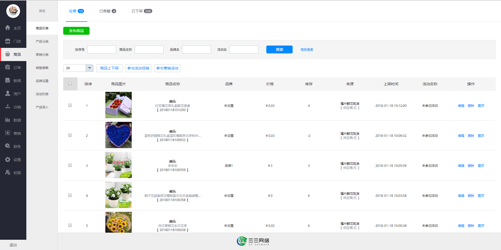

# 小程序代码


https://www.cnblogs.com/cqlb/p/9682505.html


https://www.jb51.net/article/176583.htm


https://blog.csdn.net/u012914436/article/details/99679320


阿里云小程序

https://ac.aliyun.com/promotion/application/miniapps


## 购物车

1. tabBar购物车添加数量图标 `cart.js`

```jsx
onShow () {
  let num = 15
  if (!num) {
    return wx.removeTabBarBadge({ // 移除tabbar右上角的文本
      index: 2
    })
  }
  wx.setTabBarBadge({ // tabbar右上角添加文本
    index: 2, // tabbar下标
    text: '6' // 显示的内容
  })
},
```


## App

1. 根实例

```jsx
const app = getApp()
```


### 分包

```jsx
app.json 分包
"subPackages": [
    {
      "root": "pages/activity",
      "name": "activity",
      "pages": [
        "goods_combination/index",
        "goods_combination_details/index",
        "goods_combination_status/index"
      ]
    }
  ],
```


## 小程序demo

https://gitee.com/ZhongBangKeJi/CRMEB_WechatApplet

首页 分类页、产品详情、个人中心、分销、秒杀、购物车、积分、优惠券、订单、余额

客户管理+电商营销系统


https://gitee.com/catshen/mall-applet?_from=gitee_search

电商前台界面


https://github.com/coolhwm/leshare-seller-wepy

https://github.com/coolhwm/leshare-shop-weapp 

原生小程序开发


https://gitee.com/sansanC/wechatApp?_from=gitee_search



