# 小程序云开发

>小程序云开发： 卢珑文
>
>Email: lulongwen@live.com
>
>微信：18915972355
>
>卢珑文的网站：www.lulongwen.com
>
>Github：www.github.com/lulongwen


小程序云开发

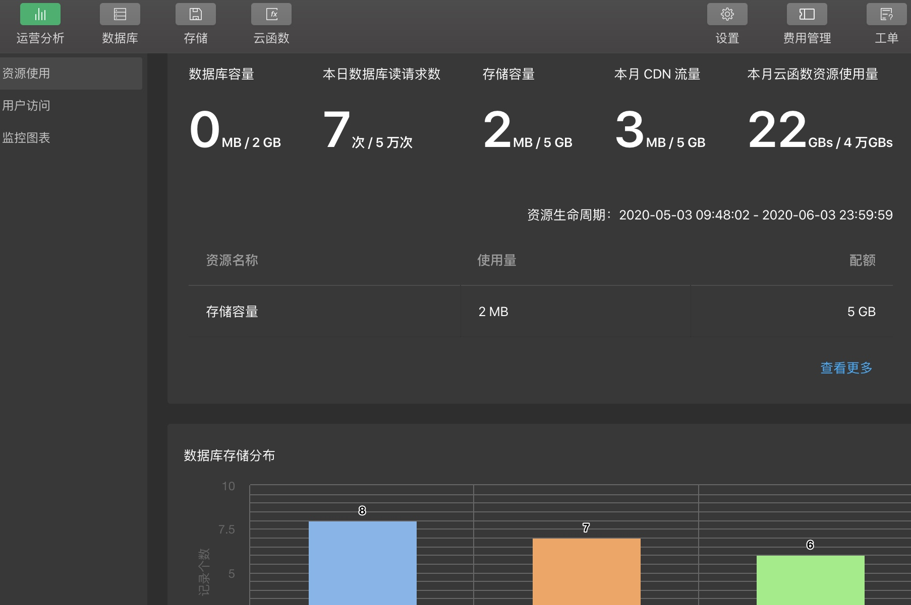

1. **云数据库**

   1. 数据写入和查询，通过 SDK在客户端对数据进行读写
   2. 通过控制台进行可视化的增删改查
   3. 可以创建2个不同的环境，分别作为开发、生产环境

2. **文件存储**

   1. 实现文件上传下载；在客户端和云函数汇总使用存储
   2. 图片的上传，下载，分享，控制台可视化管理

3. **云函数**

   1. 实现小程序无法完成的逻辑
      1. 获取 openid
      2. 获取小程序码
      3. 生成分享图
   2. 云端运行的 nodejs函数，编写函数代码部署到云端

4. 初始化项目
   1. 安装小程序开发者工具

   2. 安装 nodejs & npm，首先要 `npm init -y` 创建 `package.json`
      1. 安装npm模块，一定要构建npm `工具-构建 npm`，生成 miniprogram_npm 文件夹
      2. 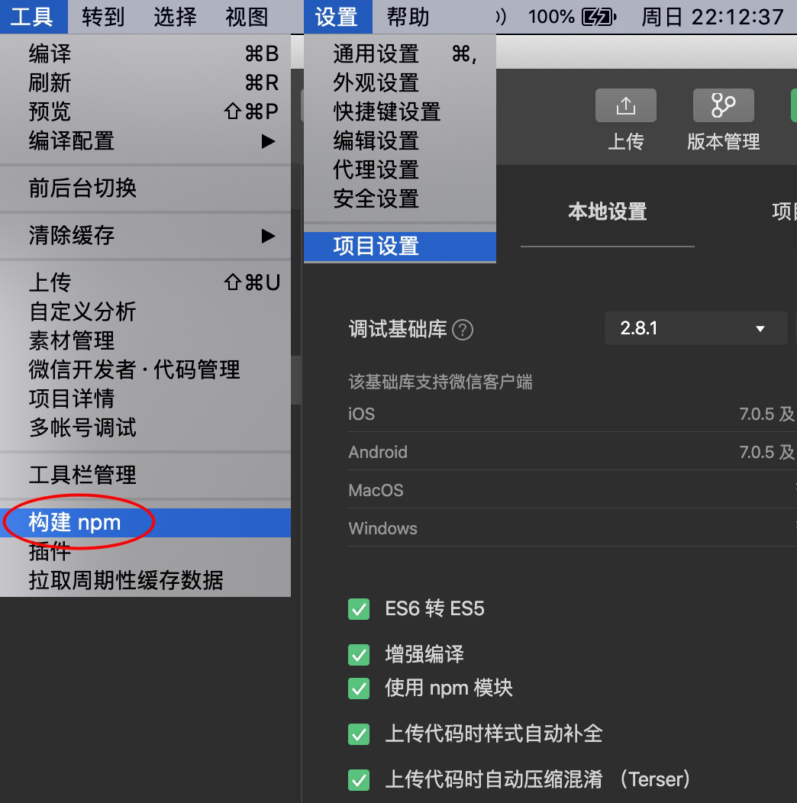
      
   3. 初始化云开发

   4. 安装Vant组件库
      1. `npm init -y`
      2. `npm i @vant/weapp -S --production`
      3. 点击工具 - 构建 npm
      4. 将 app.json 中的 `"style": "v2"` 去除，不关闭将造成部分组件样式混乱
      
   5. app.js `wx.cloud.init`

      ```jsx
      App({
        onLaunch () {
          wx.cloud.init({
            env: 'test-koa-mini', // 填入环境 ID
            traceUser: true // 小程序的访问用户
          })
        }
      })
      ```

      

   6. 云开发项目精简
      1. `app.json pages`只保留 index，其他的都删除 `"pages": ["pages/index/index"]`
      2. 删除 `style,  images, components, cloudfunctions`目录下的所有文件
      3. 删除 `pages/index` 目录下所有文件，重新新建 `Page`
      4. 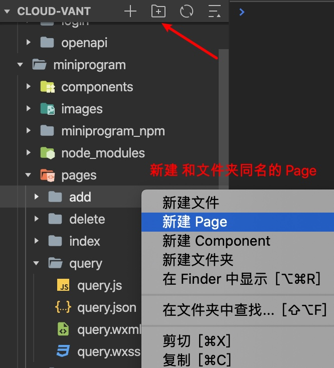


## 一 云开发API


```jsx
wx.cloud.init()  //完成云能力初始化

wx.cloud.uploadFile // 上传文件

wx.cloud.downloadFile // 下载

wx.cloud.deleteFile // 删除

wx.cloud.getTempFileURL // 获取临时链接
```


## 二 数据库开发

1. 数据库类型

   ```jsx
   String 字符串
   Number 数字
   Object 对象
   Array 数组
   Bool 布尔值
   Geo 地理位置坐标点
   Date 时间, db.serverDate() 服务端时间
   Null
   ```

2. 数据库权限

3. 数据库操作

   1. 初始化
   2. 读写
   3. 查询
   4. 删除


### 云数据库概念

1. 数据库
   1. **数据库 > 集合 > 文档 > 字段**

      1. 可以创建2个不同的环境，分别作为 dev，prod使用
   2. 默认使用当前环境对应的数据库，可以使用不同的数据库
      3. `DYNAMIC_CURRENT_ENV` 当前所在的环境

      ```jsx
      cloud.init({
        env: cloud.DYNAMIC_CURRENT_ENV
      })
      ```

      
   
2. 集合 table-name
   1. 多个记录的集合;对应 mysql中的表 table
   2. 创建集合：打开控制台，选择数据库，添加集合 - 创建一个集合

3. 文档 row
   1. 数据库中的一条记录
   2. 对应mysql中的行 row

4. 字段 col
   1. 特定记录的值
   2. 对应mysql中的列 col

5. 数据库，集合，文档，字段：返回的数据
   1. 操作数据库，返回 Object `object.xxx`
   2. 操作集合，返回 Array  `array[0]`
   3. 操作文档，返回 Object
   4. 操作字段，返回 String


#### 新建环境

1. 点击右上角设置，创建环境，支持2个环境，一个环境20个云函数
2. 创建环境后，设置权限
   1. 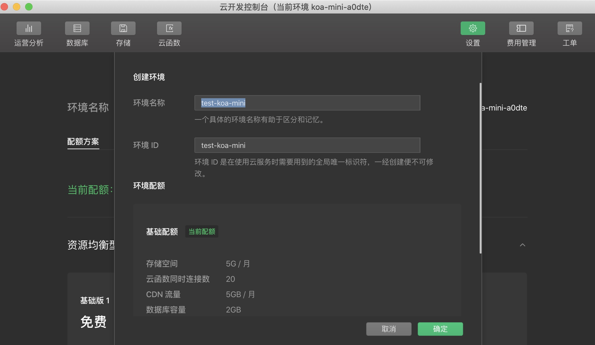
   2. 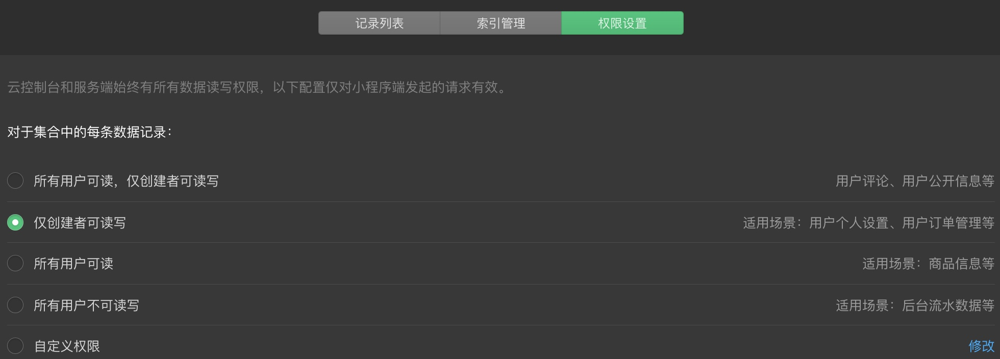


#### 新建集合

1. 新建集合就是建立数据库，点击加号，输入集合名称

2. 建立集合后，设置权限，不然访问报错

   1. 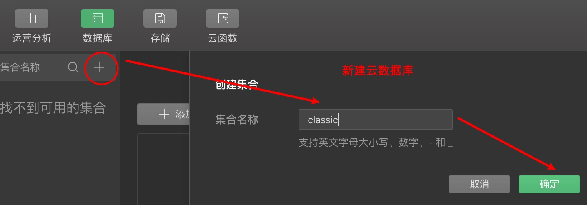
   2. 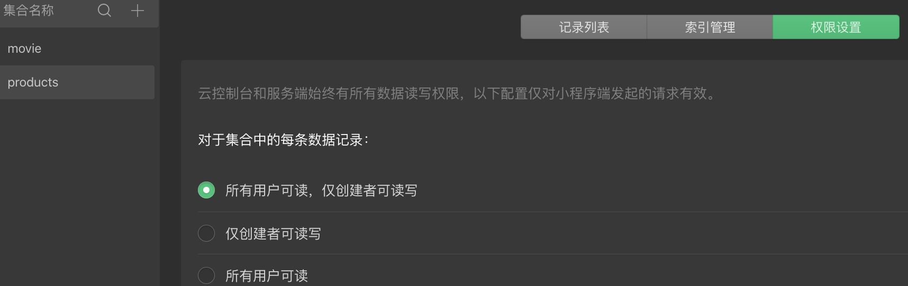

   


### 1 增加数据 insert

1. 添加新数据
2. 复制已有的数据
3. 导入已有数据，数据搬家


##### 数据导入

1. JSON 数据不是数组，而是类似 [JSON Lines](http://jsonlines.org/examples/)，即各个记录对象之间使用 `\n` 分隔，而非逗号
2. 导入的数据格式

```json
{
  "title": "《三国演义》",
  "content": "天下大势分久必合"
}
{
  "title": "《水浒英雄传》"
}
{
  "title": "《唐诗三百首》"
}
```

3. 导出的数据格式

```json
{"_id":"2b9232795eae26ac003ba9205e3bb8f5","created_at":"1994-09-04 00:00:00","content":"人生不能像做菜，把所有的料准备好才下锅","fav_nums":"166"}
{"_id":"FuswmPws9pc0NXlMKAAGPhmuj48B1SoXNN5MUpM0Pmzqausg","title":"《三国演义》"}
```


##### add添加数据

```jsx
const db = wx.colud.database()
db.collection('test').add({
  data:{
    title: '今天是个好天气'
  }
}).then(res => {
  // 返回的数据中包含新建的记录 id
	this.setData({})
})
```


### 2 删除数据 remove

1. 删除一条
2. 删除多条，批量删除

```jsx
const db = wx.colud.database()
const id = 'f10018335eae262300491226412657a4'

db.collection('test').doc(id).remove({ // 删除一条
  success: res => {
    console.log('remove', res.data)
  }
})
```


### 3 查询数据 get

1. 查询所有 all
2. 分页查询所有
3. 瀑布流持续加载
4. 下拉刷新
5. 触底自动加载数据
6. 分类查询排序
7. 复杂查询，多表（集合）查询
8. 数据的计数，字段的查询
9. 数组的操作
10. 掌握什么样的场景下应该用什么样的命令来处理数据

```jsx
const db = wx.colud.database()
const id = 'f10018335eae262300491226412657a4'
db.collection('test').doc(id).get({
  success: res => {
    console.log('select get', res.data)
  }
})
```


#### 下拉刷新

1. 开启的配置 `Page.json & Page.js`

2. 页面中配置项在当前页面会覆盖 `app.json` 的 `window` 中相同的配置项

```jsx
// app.json 或 Page.json 里面设置，推荐在 Page.json里面设置
{
  "window": {
    "enablePullDownRefresh": true
  }
}

// Page.js
onPullDownRefresh (res) {
  this.num++
}

this.setData({
  products: res.data
}, res => {
  wx.stopPullDownRefresh() // 主动关闭下拉刷新
  console.log('getall init', res) // res undefined
})
```


#### 触底加载

1.小程序默认展示 20条数据

```jsx
// app.json 或 Page.json 里面设置，推荐在 Page.json里面设置
{
  "window": {
    "onReachBottomDistance": 50 // 距页面底部距离触发, 单位px
  }
}

// Page.js
onReachBottom (res) {
  this.num++
}
```


#### 批量更新

1. 批量更新只能在云函数中进行
2. where 条件更新

```jsx

```


### 4 修改数据 update

1. 修改具体的字段
2. 数据自增
3. 数据累乘，批量更新


1. 只有指定的字段会得到更新，其他字段不受影响

```jsx
const db = wx.cloud.database({
  env: 'test-koa-mini'
})
const {id, value} = this.data
if (!value) {
  return this.showToast('标题不能为空')
}

const data = {
  title: value,
  updated_at: db.serverDate()
}

db.collection('movie').doc(id).update({ data })
  .then(res => {
  if (res.stats) {
    this.setData({ id: '', value: '' })
    this.showToast('更新成功')
  }
})
```


## 三 文件存储

1. 图片共享社区

   1. 用户拍照上传及存储
   2. 小程序转发聊天分享
   3. 生成当前页面的小程序码
   4. 生成朋友圈图片分享二维码
2. 技术点

   1. **云存储**
      1. 上传，下载，分享图片；用户图片存储
   2. **云数据库**
      1. 用户昵称登录信息，上传的图片；用户数据存储
      2. 云开发提供的用户认证；完成用户登录
   3. **云函数**
      1. 小程序端无法完成的业务逻辑
      2. 获取openid
      3. 生成分享图片链接
3. 产品需求
   1. 首页：显示一个简单的列表展示，展示用户昵称等
      1. 点击列表，进入到个人主页
      2. 提供上传图片，点击进入即可上传图片
   2. 个人主页：展示用户信息，及用户上传，分享图片等信息
      1. 点击图片进入到图片的主页
   3. 图片主页：展示图片，下载，分享
      1. 点击右上角的转发到朋友圈
      2. 点击按钮生成分享到朋友圈
   4. 上传图片界面：图片上传
      1. 单个图片和多张图片上传


#### 用户登录认证

1. 云开发对小程序微信登录进行了封装，提供了私有 API的身份校验
2. 用户认证解决：这个人是谁？和刚刚那个是一个人吗
3. 用户信息：这个人叫啥？这个人长得什么样子
4. 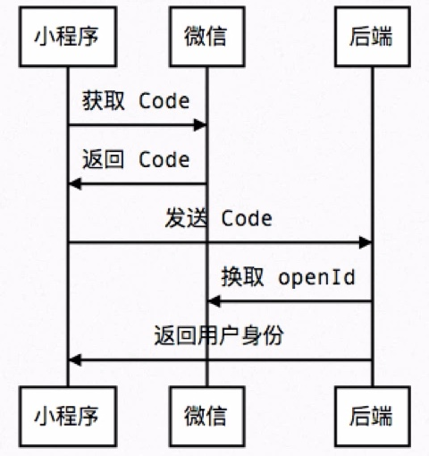


#### 获取用户信息

1. 必须用户主动点击按钮获取授权

2. 为什么云开发控制台看不到用户昵称

   1. 用户未授权，获取用户信息
   2. 云开发用户管理数据的缓存

3. 合理模式：云开发用户管理 + 自建 `userinfo`

   1. 控制台数据：总体预览
   2. 自建 userinfo，具体功能实现

4. `traceUser: true`记录用户

   ```jsx
   // 1 记录用户
   wx.cloud.init({
     env: 'test-koa-mini',
     traceUser: true 
   })
   
   // 2 button 点击获取用户信息
   button.getserInfo
   
   // 3 db.collection('userinfo') 保存到数据库
   ```

   

5. 获取用户信息流程

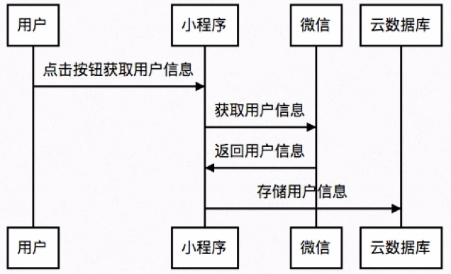


```jsx
app.globalData.fileID

wx.cloud.uploadFile 上传文件

wx.cloud.downloadFile 下载

wx.cloud.deleteFile 删除

wx.cloud.getTempFileURL 获取临时链接；根据 fileID获取，有效期24个小时


wx.cloud.uploadFile({
  cloudPath: '', // 临时文件路径
  filePath: '', // 临时文件路径
  success: res => {

  },
  fail: err => {}
})

wx.cloud.downloadFile({
  fileID: '', // 上传成功后返回的 fileID
  success: res => {
    console.log(res, res.tempFilePath)
  },
  fail: err => {}
})

wx.cloud.getTempFileURL({
  fileList: [fileID], // fileID
  success: res => {
    console.log(res, res.fileList[0].tempFileURL)
  },
  fail: err => {}
})

wx.cloud.deleteFile({
  fileList: [fileID], // cloudPath 231.png
  success: res => {
    console.log(res, res.fileList[0].tempFileURL)
  },
  fail: err => {}
})
```


#### 分享到

1. 删除 Page.js里面的 `onShareAppMessage` 点击右上角，就不会显示分享到
   1. 不是所有页面都能转发，比如：上传图片页面


#### 小程序码生成

1. fileID 调用接口；一物一码
2. `https://api.weixin.qq.com/cgi-bin/token?grant_type=client_credential&appid=APPID&secret=APPSECRET`
   1. 替换 appid & APPSECRET
   2. 根据这个接口获取 access_token
   3. 接口调用凭证 https://developers.weixin.qq.com/miniprogram/dev/api-backend/open-api/access-token/auth.getAccessToken.html
3. 获取 access_token后，在调用获取小程序码的接口
4. 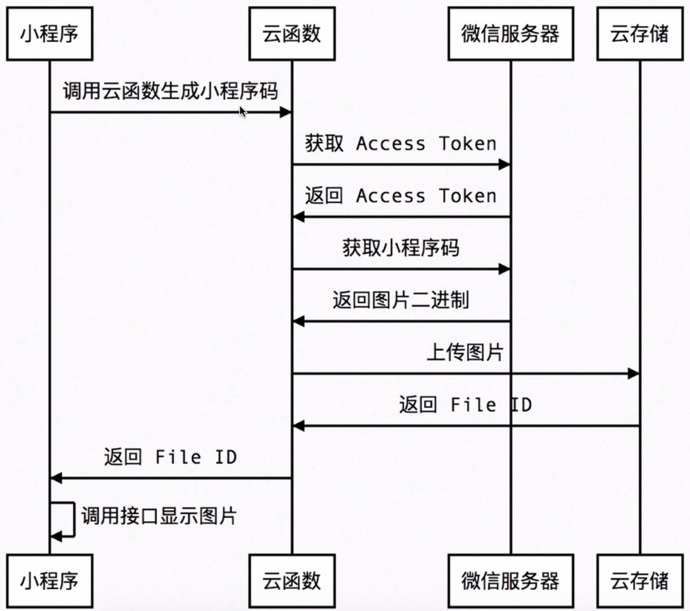


#### 文件上传

1. fileID 文件唯一标识符，即文件 ID，后续操作都基于 fileID 而不是 URL

2. 上传图片前，先要选择图片 `wx.chooseImage` 获取到 filePath

3. `wx.cloud.uploadFile({filePath, cloudPath})` 传入 filePath & cloudPath 获取到 fileID

4. 拿到 fileID 保存到数据库 `wx.cloud.database().collection('photo').add({data})`，成功返回 res._id

5. 上传的同名文件会覆盖

   ```jsx
   // 1 从本地选择图片
   wx.chooseImage({
     count: 1, // 图片数量，默认 9
     sizeType: ['original', 'compressed'], // 图片的尺寸
     sourceType: ['album', 'camera'], // 
     success (res) {
       // tempFilePath可以作为img标签的src属性显示图片
       const tempFilePaths = res.tempFilePaths
     }
   })
   
   wx.cloud.uploadFile
   
   wx.cloud.uploadFile
   
   wx.cloud.deleteFile
   ```

   

6. 


#### 文件下载

1. 获取文件的 fileID下载
2. 


#### 复制到剪切板

1. 临时链接有效时间 一天

```jsx
wx.setClipboardData() // 设置剪切板内容
wx.setClipboardData({
  data: res.fileList[0].tempFileURL
})
.then(res => {})
```


## 四 云函数

1. 云函数获取小程序用户信息
   1. 小程序新建云函数
2. 异步返回结果
   1. http请求API一定要要 then返回 `return await axios.post(url, {}).then(res => res.data)`
3. 云函数运行机制
   1. 运行环境
      1. 云端 linux环境，处理并发请求会创建多个云函数实例；每个云函数实例之间相互隔离
      2. 云函数实例创建，管理，销毁有平台自动完成；每个函数实例在 `/tmp` 目录下提供了 512mb的临时硬盘空间
      3. 函数执行完毕后销毁，持久化存储，用云储存
   2. 无状态函数，幂等的
      1. 一个云函数的执行不依赖上一次云函数执行的结果
      2. 云函数中运行的代码拥有：不受限的数据库和云文件读写权限
      3. 云函数之间可以相互调用，也触发了一次调用事件
      4. async & await 异步回调，自动扩容和缩容
   3. 事件模型：事件触发
      1. 新建或复用已有云函数实例来处理调用
4. 一个用户在一个环境下只有 20个云函数，无法满足复杂的业务场景和需求

```jsx
wx.cloud.callFunction({ // 基础的云函数
  name: 'add', // 云函数名称
  data: { // 参数 event.a 获取
    a: 100,
    b: 200
  }
}).then(res => res)

// /cloudfunctions/add/index.js
const cloud = require('wx-server-sdk')
cloud.init({
  env: 'test-koa'
})

// event data的参数; context 运行状态
export.main = async (event, context) {
  return awati event.a + event.b
  
  return await axios.post(url, {}).then(res => res.data) // http请求API一定要要 then返回
}
```


### npm 安装第三方依赖

1. 上传云函数时，可以选择
   1. 云端安装依赖，不上传 node_modules 文件夹
   2. 全量上传，上传 node_modules 文件夹
2. 云函数的优势：与微信登录鉴权无缝整合
   1. 小程序调用云函数，云函数传入的参数会被注入小程序端的用户 openid，微信完成鉴权

```bash
npm i wx-server-sdk@latest -S
	# cloud.getWXContext() 获取 appid & openid，获取用户登录状态

npm i tcb-admin-node@latest # 服务端用云函数访问 TCB服务
```


```jsx
wx.cloud.callFunction({
  name: 'add', // 云函数名称
  data: { // 传递给云函数的参数
    x: 10,
    y: 20
  },
  success: res => {},
  fail: err => {},
  complete: () => {}
})
```


### 云函数发送 http请求

1. 小程序中发送请求：有 5个可信域名限制；域名需要备案
2. 云函数发送 http请求不受以上限制
   1. http请求测试网站 http://httpbin.org
3. 云函数 axios 一定要 return await, then里面还要 return

```jsx
const cloud = require('wx-server-sdk')
cloud.init({
  env: 'test-koa-mini'
})
const axios = require('axios')

// 云函数入口函数
exports.main = async (event, context) => {
  let url = 'https://www.fastmock.site/mock/b113e80c768ad8d64759ae7d07109f6a/api'
  return await axios.get(url + '/table/list').then(res => res.data.result)
}
```

4. axios 请求数据
   1. 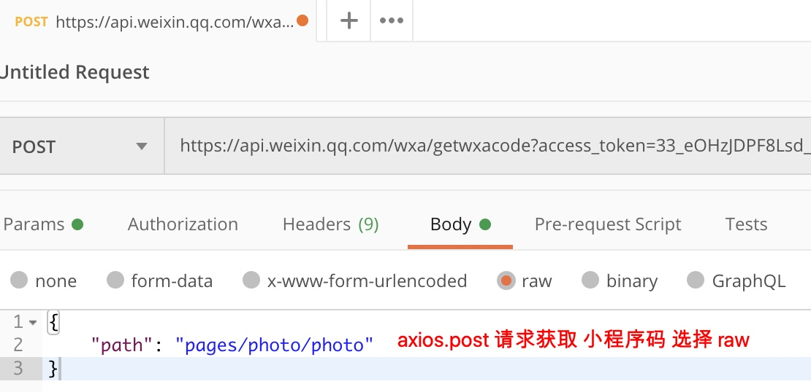


### 云函数调用云函数

1. 云函数调用云函数
2. 云函数调用本地函数

```jsx
// 本地调用云函数
wx.cloud.callFunction({
  name: 'http',
  data: {
    a: 100,
    b: 200
  }
})

// add云函数
const cloud = require('wx-server-sdk')
cloud.init()

export.main = async (event, context) => {
  return event.a + event.b
}

// http云函数调用云函数
const cloud = require('wx-server-sdk')
cloud.init()

export.main = async (event, context) => {
  const res = await cloud.callFunction({
    name: 'add',
    data: {
      a: event.a,
      b: event.b
    }
  })
  return res.result
}

// 云函数调用本地函数
function add (a, b) { // 定义本地函数
  return a + b
}

export.main = async (event, context) => {
  return add(event.a, event.b)
}
```


### 链接 mysql

1. 推荐云开发自带的数据库；好处：速度快，受到网络波动影响小
2. 使用 Sequelize链接mysql

```jsx
// Page.js
wx.cloud.callFunction({
  name: 'mysql'
})

// mysql云函数
npm i sequelize mysql2 -S

// cloud2mysql
const cloud = require('wx-server-sdk')
cloud.init()

const Sequelize = reuqire('sequelize')
const sequelize = new Sequelize('cloudsql', 'root', 'root', {
  host: 'sh-cdb-cloud.tencentdb.com',
  port: '63782',
  dialect: 'mysql',
  pool: {
    max: 5,
    min: 0,
    acquire: 30000,
    idle: 10000
  }
})

class User extends Model {}

export.main = async (event, context) => {
  return event.a + event.b
}
```


### TCBRouter

1. koa 洋葱模型的风格
2. `npm i tcb-router -S`
   1. https://www.npmjs.com/package/tcb-router

```jsx
// app.use可以在所有的路由上进行处理
app.use(async (ctx, next) => {
  ctx.data = {}
  await next() // 执行下一个中间件
})

// app.router可以在特定的路由上进行处理，参数：String & Array
app.router('user', async (ctx, next) => {
  ctx.data.name = '云开发'
  ctx.body = { code: 0, data: ctx.data }
})
```


#### 调用 tcb-router

1. tcb-router 实现一个云函数中包含多个子函数

```jsx
// cloud2mysql
const cloud = require('wx-server-sdk')
cloud.init()

const router = require('tcb-router')
exports.main = async (event, context) => {
  const app = new Router({event})
  
  // 中间件
  app.use(async (ctx, next) => {
    ctx.data = {} // 所有的路由上定义一个 data
    ctx.data.openid = event.userinfo.openid
    await next()
  })
  
  // 数组路由
  app.router(['user', 'list'], async (ctx, next) => {
    ctx.data.from = 'cloud functions'
    await next()
  })
  
  app.router('user', async (ctx, next) => {
    ctx.data.name = 'lucy lovely'
    ctx.data.role = 'admin'
    await next()
  }, async (ctx) => {
    ctx.data.nickname = '前端开发'
  })
  
  return app.serve()
}

// 调用名为 router 的云函数，路由名为 user
wx.cloud.callFunction({
  // 要调用的云函数名称
  name: "router",
  // 传递给云函数的参数
  data: {
    $url: "user", // 要调用的路由的路径，传入准确路径或者通配符*
  }
})
.then(res => {
  console.log('router', res)
})
```


### 云函数实现模板消息

1. 模板消息是：小程序通知用户的一种工具
2. 使用模板消息流程
   1. 添加模板消息-模板
   2. 获取小程序的 FormID
   3. 调用代码
3. 模板消息的限制
   1. 支付后，使用 prepay_id 可以推送三次模板消息
      1. 比如：支付，发货，退货的模板消息
   2. 每次的 Form表单提交可以获取到用户发布模板消息的 form_id
   3. form_id 只能推送一次模板消息；合理利用的模板消息


#### 模板消息用法

1. 微信公众平台手动配置获取模板 ID
2. 获取下发权限
3. 调用接口发布订阅消息

```jsx
// 1 复制模板 id EbTNXfMpehB0qPXlYyLYBmZOlmmDPJUd9fexIcNhEw0
// 2 消息订阅接口
wx.requestSubscribeMessage({
  // 订阅的消息模板的id的集合，一次调用最多可订阅3条消息
  tmplIds: ['EbTNXfMpehB0qPXlYyLYBmZOlmmDPJUd9fexIcNhEw0']
})

// 3 服务端消息发送
https://api.weixin.qq.com/cgi-bin/message/subscribe/send?access_token=ACCESS_TOKEN

```


### 内容安全检测

#### 文字安全检测

1. 避免被恶意上传反动言论，导致请喝茶
2. 87014：内容含有违法违规内容；0 ：正常内容
3. msgSecCheck & imgSecCheck & mediaSecCheck

```jsx
https://api.weixin.qq.com/wxa/msg_sec_check?access_token=ACCESS_TOKEN
post 
{ content: '' }
```


#### 图片鉴黄

1. 避免被恶意上传开放图片，导致请喝茶


## 五 云开发基础

1. html5，css3，flex布局
2. es5， es6，小程序事件机制
3. nodejs
4. mongoDB 云开发的数据库

```jsx
// app.js 初始化云能力
App({
  onLaunch () {
    wx.cloud.init({
      env: 'test-koa', // 默认环境
      traceUser: true // 记录用户
    })
  }
})

// project.cofnig.json - cloudfunctionRoot 指定存放云函数目录
{
	"miniprogramRoot": "miniprogram/",
	"cloudfunctionRoot": "cloudfunctions/"
}
```

5. 云开发目录
   1. 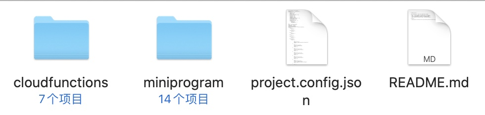


### 发布小程序

1. 订阅号，服务号，小程序每个都是独立的账号
2. 注册小程序
3. 小程序开发
   1. 开发工具，新建项目，选择云开发
   2. 设置-添加开发者
   3. 配置请求
   4. 帮助文档
4. 预览和发布
   1. 开发版
   2. 审核版本
   3. 上线版本


### 云开发流程

1. 邮箱注册小程序
2. 完善小程序资料，在设置里面获取 appid
3. 开发者工具创建云开发项目
4. 开通云开发 - 初始化 - 调用API -  上传发布
5. 调用API：操作数据库，存储，云函数


### 云开发的好处

1. 一站式的后端云服务，帮助开发者统一构件和管理资源
   1. 节约开发和运维成本，无需理解后端
   2. 免去了服务器搭建，域名注册，备案等流程，让开发者专注于业务实现
   3. 拥有更多的微信能力
2. 直接调用云 API；关注核心业务开发
3. TCB Tencent Cloud Base
   1. 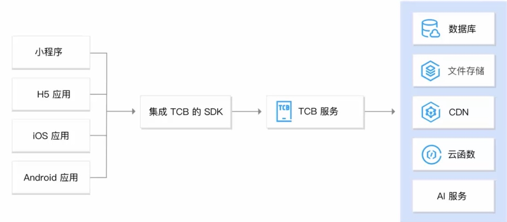
4. 云开发可以做什么？
5. 云开发有那些能力？
   1. 云函数
   2. 云数据库
   3. 云存储


### 独立小程序开发

1. 购买服务器和域名备案
2. 部署服务器环境
3. 配置 SSL证书，服务器信息
4. API接口调试，对开发者运维要求高
5. 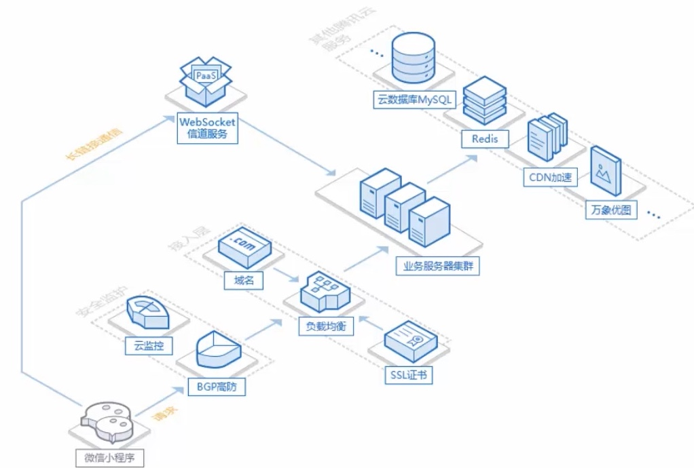


### H5和小程序开发

1. H5开发
   1. 运行在浏览器中
   2. 通过 nginx等服务器访问
   3. 有 DOM、BOM API；
   4. 可以用 vue等框架和UI库
2. 小程序开发
   1. 运行在 jsCore
   2. 依赖于微信 APP
   3. 小程序独有的 wxml， wxss，wxs等语法
   4. 可以用npm，有自己的组件规范


### 腾讯云开发

1. https://userbylong.coding.net


