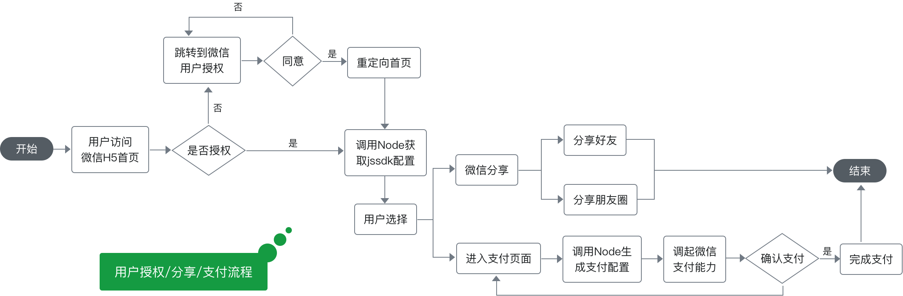

# 微信支付

微信 SDK的各种应用

1. 微信支付
2. 微信分享
3. 微信授权


## 1 微信支付

1. 不对个人开放的。只对企业用户开放
   1. https://pay.weixin.qq.com
   2. 要开通**微信认证** & 微信支付认证
2. 微信支付-手机号授权获取
   1. login，getopenid，payfor 云函数
   2. wx-js-sdk


### 申请微信支付

1. 输入网址 https://pay.weixin.qq.com
2. 扫码确认，填写商户资料，必须是公司，个体工商户；不支持个人申请
   1. 
   2. 填写公司或个体户信息
   3. 
3. 速度
4. 速度


#### 支付代码

```jsx
<button
  class="btn btn-pay"
  wx:if="{{userId}}"
  type="primary"
  bind:tap="recharge">支付</button>


```


### 微信支付流程

1. 微信支付
   1. 微信支付业务流程 https://pay.weixin.qq.com/wiki/doc/api/wxa/wxa_api.php?chapter=7_7&index=3
   2. 
2. 速度
3. sad


### H5 支付

1. nodejs SDK


## 2 微信分享

1. 什么场景下使用微信分享？
2. 微信分享带来什么收益？
3. 微信分享到不同的平台
4. h5接入微信分享


#### 分享代码

1. 给 `button` 组件设置属性 `open-type="share"`，可以在用户点击按钮后触发 [`Page.onShareAppMessage`](https://developers.weixin.qq.com/miniprogram/dev/reference/api/Page.html#onshareappmessageobject-object) 事件

```jsx
<button
  class="btn"
  type="primary"
  open-type="share">分享</button>

// Page.js
onShareAppMessage () {
    const {id} = this.data
    // 用户邀请一个新的用户进来
    return {
      title: '这里好多鱼',
      path: `pages/photo/photo?id=${id}&openid=123123`,
      imageUrl: 'https://img14.360buyimg.com/n7/jfs/t1/65779/22/645/233487/5cee57e1E31284434/951d784f01e4507a.jpg'
    }
}
```


### 什么场景下使用微信分享

1. 线下推广，线上传播，到店
2. 分享渠道：H5，小程序，APP
   1. 体验友好，只能分享给好友，不能分享到第三方应用
3. 分享方式
   1. 微信好友，朋友圈
   2. QQ好友，QQ空间，微博
4. 微信分享的好处
   1. 标题直接明了
   2. 内容清晰
   3. 醒目的Logo
   4. 统一的分享外观，用户体验好


### 微信分享带来的收益

1. 拉新，获取新客户
2. 留存
3. 提升用户的粘性
4. 品牌传播


## 3 微信授权

1. 微信授权流程


#### 登录代码

```jsx
<button
  type="primary"
  open-type="getUserInfo"
  bind:getuserinfo="getUserInfo">微信登录</button>
```


### userinfo

1. 保存用户前判断用户在 userinfo 表中存在吗


```jsx
const cloud = require('wx-server-sdk')
cloud.init({
  env: 'test-koa'
})

const db = cloud.database().collection('userinfo')

export.main = async (ev, ctx) => {
  const wxContext = cloud.getWxContext()
  const user = await db.where({
    openid: wx.Context.OPENID
  })
  .limit(1).get()
  
  if (!user.length) {
    const data = {...ev.userInfo, openid: wxContext.OPENID }
    return await db.add({ data })
  }
}


// Page.js
getUserInfo (ev) {
  const {userInfo} = ev.detail
  wx.cloud.callFunction({
    name: 'openid',
    data: { userInfo }
  })
  .then(res => {
    // 云函数的返回结果会包装在 res.result 里面
    console.log('res', res.result)
  })
}
```


## 4 微信客服

1. 打开客服

```jsx
<button
  open-type="contact"
  type="primary"
  >联系客服</button>
```


1. 客服消息通知界面

   1. 

   

2. 微信公众平台客服登录 https://mpkf.weixin.qq.com/

   1. 

3. 速度

4. 速度


## 5 模板消息

1. 设置模板消息
2. 复制模板消息ID
   1. 
3. 23


微信支付的重要性

1. 涉及的业务广泛，公司业务有强烈需求
2. 场景多，PC，H5，小程序，公众号
3. 前端开发成本
   1. SDK，签名，安全域名
   2. 支付目录，服务器，部署流程
   3. 前后端支付的闭环


全栈思考

1. 纯前端有受限性，不利于职业发展和个人成长
2. 独立应对更多技术栈，能完成一个产品
3. 对项目的架构，模块设计，开发规范，公共机制等多维度的掌握
4. 掌握 Vue，Nodejs，小程序云开发等技术栈
5. nginx， nodejs部署
6. 从架构设计到适配多端的H5自适应


公共机制

1. 项目目录结构
2. 工具函数
3. 开发规范
4. H5跨域代理
5. H5响应式
6. API封装
7. 路由封装
8. 支付模块封装


