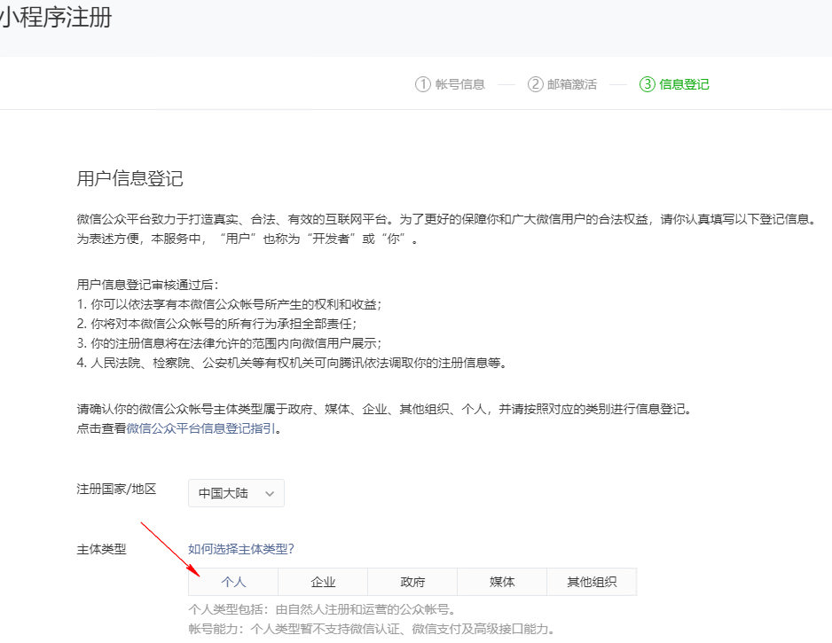

# 注册微信小程序

1. 通过公众号进行快速注册
2. 注册邮箱细节：
   1. 不能是微信公众平台，微信开发平台注册过的邮箱；一个邮箱只能注册一个账号
   2. 也不能是个人微信号去绑定的邮箱
3. 微信公众平台分类 https://mp.weixin.qq.com
   1. 服务号
   2. 订阅号
   3. 小程序介绍 https://mp.weixin.qq.com/cgi-bin/wx?token=&lang=zh_CN

## 注册小程序
1. 登录微信公众平台，注册小程序 https://mp.weixin.qq.com/wxopen/waregister?action=step1

2. 邮箱注册小程序

3. 邮箱激活小程序

## 小程序后台设置

1. 创建一个小程序
2. 填写小程序的名字
3. 设置小程序
4. 小程序模板消息
5. 开启消息推送

1. 创建小程序

2. 小程序模板消息

## 小程序开发工具

1. [安装开发工具](https://developers.weixin.qq.com/miniprogram/dev/#%E4%BD%A0%E7%9A%84%E7%AC%AC%E4%B8%80%E4%B8%AA%E5%B0%8F%E7%A8%8B%E5%BA%8F)

---

## 微信认证

1. 微信认证
   1. 公司，个体户认证，每年 300元
   2. 个人认证
2. 支付认证
   1. 必须是公司，个体户，组织
   2. 注册微信支付，关联商户
   3. 微信支付 https://pay.weixin.qq.com