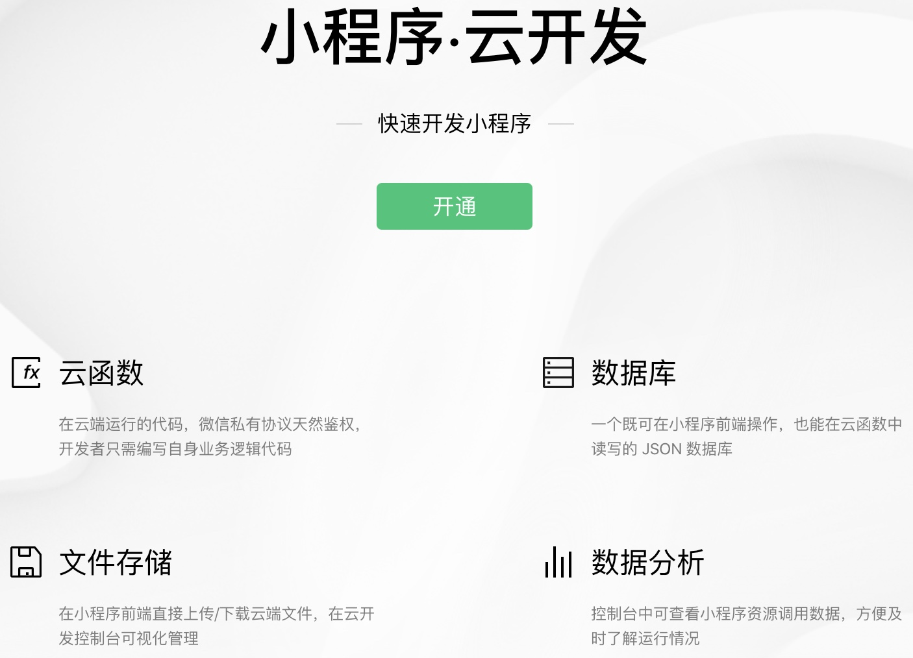

# 小程序上线部署

## 1 小程序后台要求

1. 购买域名和服务器
2. https 证书
3. pm2 + nginx 自己部署
4. 上线小程序需要的证书和资质
  - 小程序
	- 服务号
	- 订阅号
5. 发布小程序选择服务类目为**工具-办公**，否则审核会被驳回

## 2 云开发

1. 集成微信开发工具，上传部署
2. 调试环境 + 临时域名

### 小程序之间的跳转

1. 两个小程序都必须关联同一个公众号（服务号，或订阅号）
  - target miniProgram
	- app-id 小程序 id
  - 把业务逻辑封装到函数中

## 发布小程序
发布小程序选择服务类目为工具-办公
