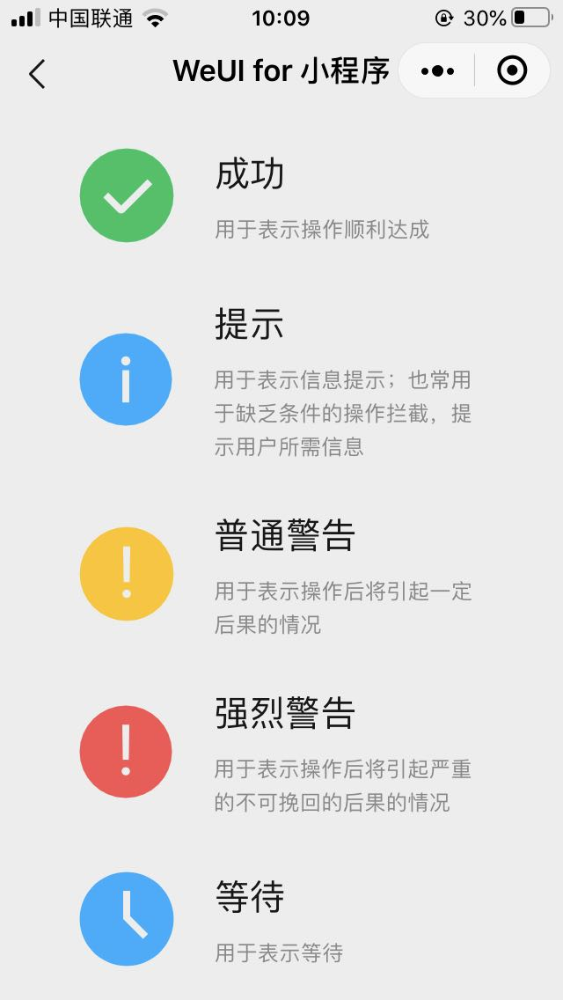

# 小程序自定义 icon


rpx responsive pixel 屏幕自适应单位

rpx吧屏幕分为 750个单位，每个就是 1/750

​	iphone6 1rpx = 。5px

​	size=60rpx = 30px


## 自定义 icon

1. 实现 icon图标的原理
   1. 精灵图片 & 背景图片
   2. css3绘制图标
   3. svg，缺点：真机显示 icon空白
   4. 字体图标 https://www.iconfont.cn/
2. 字体图标
   1. 微信不支持外部文件夹的权限，去下载一个自己选中的字体，ttf文件
   2. 将该ttf文件上传至 https://transfonter.org/，选中 Base64 encode 然后点击convert转换并下载压缩文件
   3. 复制base64代码 到页面的.wxss
   4. 文件放在服务器，通过url地址去请求，推荐的做法


### 如何把 weui组件库的 icon图标保存到本地


## 图片的缺点

1. 图片在文本里面不方便布局
2. 图片不能伸缩，放大之后发虚，有锯齿
3. 图片需要在本地或网络上存储；用起来不如图标，只用一个名称方便


## 小程序默认的 icon

1. type类型的范围 9个，默认单位 px
2. https://developers.weixin.qq.com/miniprogram/dev/component/icon.html

```jsx
<icon type="success" size="30px" color="green" />
<icon type="success" size="100rpx"/>
<icon style="background:grey;" type="success" size="100rpx"/>

// type范围 
success, success_no_circle, info, warn, waiting, cancel, download, search, clear
```




