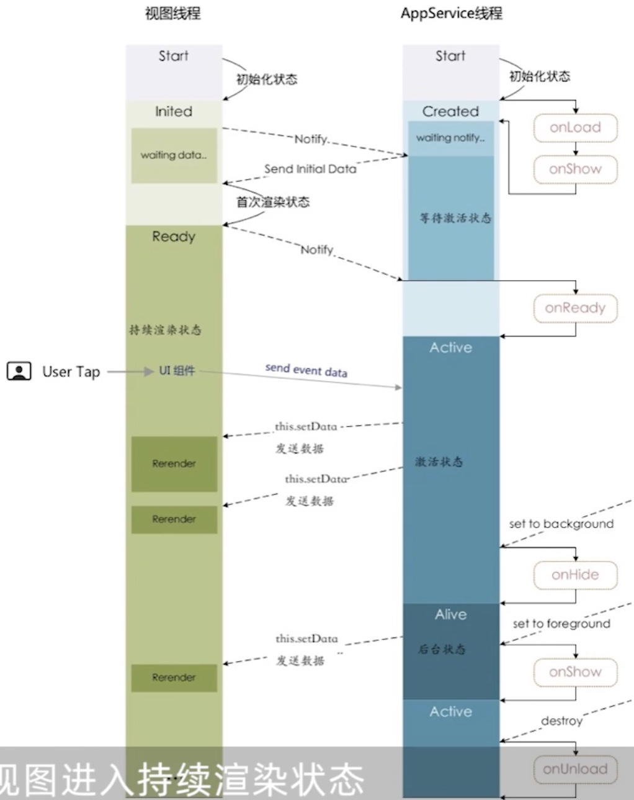

# 微信小程序原理

1.


## 小程序启动机制

1. 冷启动
   1. 首次打开小程序，从微信云端下载小程序代码包，并且运行
   2. 长时间没有运行，或被微信主动销毁后，再次打开，也是冷启动
      1. 这时，先从本地缓存读取代码包，同时从微信云端检测新版本，如果有更新就下载
2. 热启动
   1. 最近如果启动过，还在后台运行着；直接将小程序从后台状态切换到前台状态


### 热启动

1. 已经打开过小程序，一定时间内再次打开，不需要重新启动；将后台状态的小程序切换到前台


### 冷启动

1. 首次打开是冷启动
2. 被微信销毁关闭后，再次打开，需要重新加载运行
   1. 冷启动如果发现新版本，将会异步下载新版本的代码包；
   2. 并且同时用客户端的本地代码进行启动
   3. 新版本的小程序要等下一次的冷启动才会用上


### 小程序主动销毁的情况

1. 小程序进入后台，在后台维持运行；超过一定的时间，大概是5分钟；就会被微信主动销毁
2. 短时间内，大概5秒钟，连续2次以上收到系统内存警告；微信就会对小程序进行主动销毁
   1. 会收到提示：运行内存不足，请重新打开小程序
   2. 用 wx.onMemoryWarning 监听内存的警告事件，提前处理


### 如何用最新的版本

1. wx.getUpdateManager


### 小程序的状态

1. 前台状态
   1. 小程序界面展示
2. 后台状态
   1. 点击右上角关闭小程序
   2. 按下 home键离开微信；小程序没有完全终止运行，进入后台状态
   3. 从后台切换到前台，热启动机制，相当于浏览器打开的标签页没有被关闭，暂时的切换


## 微信小程序运行机制

1. 双线程运行机制：逻辑线程 & 视图线程
   1. 一个线程负责业务逻辑的处理，逻辑视图
   2. 一个线程负责视图渲染，视图线程
2. 2者通过微信底层的 weixin-js-bridge进行通信
   1. 包括事件和 setData数据交换
   2. setData改变视图的数据绑定，底层对应实行的是 `evaluatejavascript` js函数
   3. 当视图层的交互事件触发了，由视图层向逻辑层传递事件信息时，也是通过 `evaluatejavascript` js函数进行的
   4. 理解双线程运行机制，对优化小程序很有帮助
3. `evaluatejavascript` js函数**参数是文本**，每次调用都需要进行**原始类型到文本**，再到原始类型的转化
   1. 单通道的，不存在并发编程的特征，效果是很慢的
   2. 页面卡顿，就是 `evaluatejavascript` js函数忙不过来
   3. setData在频繁更新和大数据更新上有瓶颈，影响渲染效率，微信引入了 wxs
   4. 后台接受的初始化数据，在 onLoad之前就放到 data数据里面，用于视图的初始化渲染
   5. 后续的数据更新，如果与后台无关，就用 wxs直接在视图里完成，提高渲染效率


### view视图线程

1. 视图层，各类组件，渲染界面；类似于js的ui渲染和js渲染
2. 通过底层的 weixin-js-bridge进行通信


### 视图线程编译

1. wcc WXML编译器，将wxml文件编译为 js代码
2. wcsc WXSS编译器，将wxss文件编译为 js代码
3. 小程序的视图层在 Polymer框架基础之上，基于 WebComponent标准实现
4. 完成编译后，会在内存中创建一个虚拟DOM；
   1. 运行时在持续更新状态下的数据更新，都是基于虚拟DOM实现的视图渲染
   2. 虚拟DOM可以看作是在内存里构建了一个UI组件库，提高视图的渲染效率


### App Service 逻辑线程

1. 逻辑层，提供各种API来处理逻辑
2. 逻辑线程的四个状态
   1. 初始化
   2. 等待激活
   3. 激活
   4. 后台运行，界面进入后台；服务线程就进入后台运行状态，避免 setData更新视图
3. 小程序的页面生命周期
   1. onLoad 首次渲染执行一次
   2. onShow 每次界面切换都会执行
   3. onReady
   4. onHide
   5. onUnload 页面被销毁




### 视图的持续更新是怎么实现的

1. webView调用 evaluateJavascript执行 js代码，在回调函数里面得到js的返回内容
2. 视图层 & 逻辑层的数据传输，都是通过底层的 weixinjs-bridge，通过原生的  evaluateJavascript实现
3. setData的底层也是通过 evaluateJavascript方法实现
   1. setData更新的数据，首先会将这个数据转化为字符串，接着将这个字符串与代码拼接成一个js脚本
   2. 最后把拼接的内容传给 evaluateJavascript原生方法，然后去执行
   3. 从数据到视图层的更新，不是实时进行的
4. 使用 setData会遇到的问题？
   1. 2个线程之间通过前置的 setData驱动数据交换，还要通过 weixinjs-bridge进行中转，导致效率低下
   2. 页面卡顿是因为视图线程一直在努力渲染中，逻辑层发来的请求被阻塞了
   3. 阻塞达到 200ms以上，视图渲染就会卡顿
   4. 卡顿和更新的数据量也有关系；当用 **setData更新大列表数据或更新一个 size很大的图片**时，也容易产生卡顿
   5. IOS上，小程序页面有多个 WKWebview组成，内存紧张时，一部分WKwebview会被系统回收，已经打开的页面会退出历史记录，这些页面是无法回退的

```jsx
// hybrid Native执行 js代码
webView.evaluateJavascript("javascript:方法名()",
	new ValueCallback<String> () {
		@override
    public void onReceiveValue(String value) { ... }
  }                 
)
```


### wxs语法

1. 小程序的双线程架构在数据更新上有瓶颈，所以打造了一个 wxs视图脚本
   1. wxs是 weixin script的缩写，小程序脚本语言
   2. wxs和js不一样，基本上都是 es2015的js语法，不支持es6语法
   3. wxs可以提高视图数据的更新效率
2. wxs直接运行在视图线程之内，避免了跨线程的通信开销
3. wxs缺点
   1. wxs运行环境和其他js代码是隔离的；不能调用js的函数，不能调用小程序提供的 wx-开头的API
   2. 视图模板不能直接调用 wxs里面的函数，例如：不能在页面中直接调用 bar函数，必须通过 tools模块调用
   3. wxs在 ios上比 js快2 - 20倍

```jsx
<view>
  <text>{{tools.foo}} {{tools.bar('ok')}}</text>
</view>

<wxs module="tools">
	var foo = 'hello wxs'
  var bar = function(d) {
    return 'hi' + d
  }
  
  module.exports = {
    foo: foo,
    bar: bar
  }
</wxs>
```


