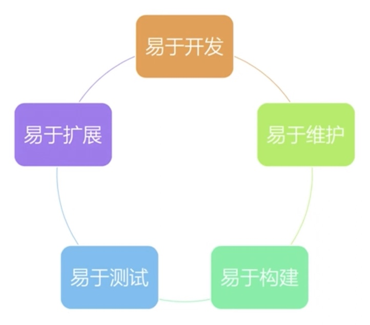

# react理想架构

1. 易于开发
   1. 开发工具是否完善
   2. 生态圈是否繁荣
   3. 社区是否活跃，遇到问题快速解决的能力和速度
2. 易于维护
   1. 代码是否容易理解；不能依赖于个人能力，代码风格一致性
   2. 文档是否健全
3. 易于构建
   1. 通用的技术和架构；不需要做太多的定制化
   2. 构建工具的选择
   3. webpack，工具基于一定的架构
4. 易于扩展
   1. 增加新功能是否容易
   2. 新功能是否会显著增加系统的复杂度
5. 易于测试
   1. 尽量纯函数
   2. 副作用少
   3. 功能的分成是否清晰

## 拆分复杂度

### 按领域模型 feature，组织代码，降低耦合度

1. 项目初期：规模小，模块关系清晰
2. 项目逐渐复杂：添加了更多组件和元素
3. 项目收尾：文件结构，模块依赖错综复杂

### 按照业务逻辑拆分成，高内聚，低耦合的模块

1. 大型钱都你应用需要拆分复杂度
2. react技术栈实现可扩展的架构

root的 router加载器，root的 reducers加载 reducer

关注如何拆分 feature

## feature组织代码

1. component，action，reducer

### 数据和组件结构

1. 按 feature管理 components, action, reducer
   1. 用 root loader 加载 feature下各个资源
   2. 做到高内聚，低耦合
2. 组件和样式文件同一级
3. redux单独文件件
4. 单元测试保持同样目录结构，放在 tests文件夹

### react-router路由配置

1. 每份 feature都有自己的专属路由配置
2. 顶层路由使用 json配置更易维护和理解
3. 如何解析 json配置到 react-router

