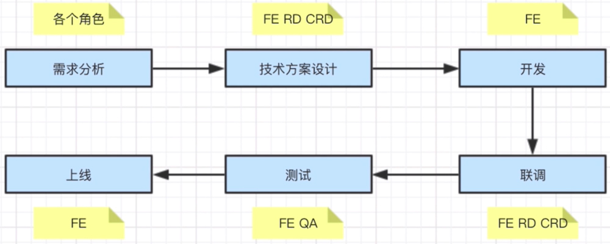
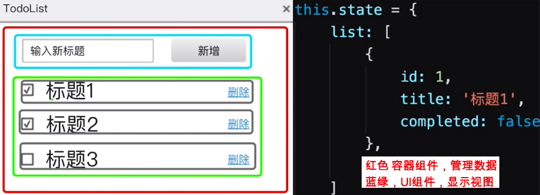
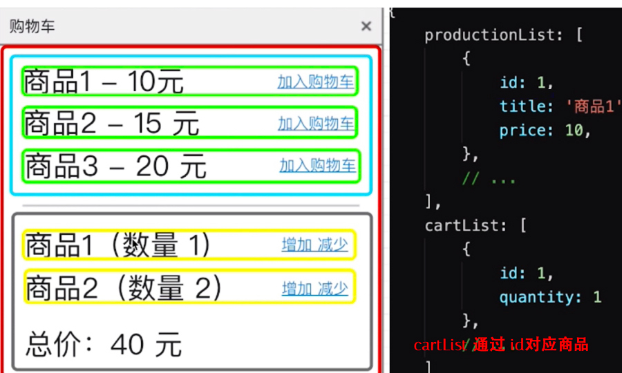

# 项目设计

1. 状态设计
   1. 数据结构设计，数据驱动视图
   2. 状态管理：React -> state & Vue -> data
   3. 视图： 组件结构和组件拆分
2. 组件设计，组件拆分，组件分层
3. 组件通信
4. 需要能独立负责项目的人，考察架构设计能力
   1. 框架（Vue & React）掌握的高级特性是必要基础
   2. 前端代码架构
      1. Model 封装数据管理
      2. Views 页面
      3. Service 请求后端接口
   3. 后端代码架构
      1. Controller
      2. Service
      3. Data Access


### 架构设计

偏向于项目的完成

针对业务需求，搭建一套适合业务的框架


### 工程化

工程化

基础设施

公共机制

1. 首页分发入口
2. less插件，基础插件安装
3. 项目主页结构开发
4. 菜单组件
5. header组件
6. footer组件


## 如何避免出现性能问题

1. 性能永远是第一需求，时刻考虑性能问题
2. 了解常见的性能问题场景
    1. 键盘的输入，页面卡顿
   2. 鼠标的移动
   3. 页面的缩放

3. 时刻注意代码的潜在性能问题
   1. 第三方封装组件的限制
   2. 更新 & 页面离开销毁
   3. 网络性能优化，自动化按需加载
4. 注重可重构的代码
   1. 组件拆分的粒度是否足够细，组件越细优化空间越大
   2. 代码的耦合性
   3. 切换到页面，才加载对应的代码，webpack 自动化按需加载，reselect缓存数据流
5. 了解如何使用工具定位性能问题
   1. chrome devtools 定位性能瓶颈
   2. react/vue devtools 找到多余的渲染，找没用的代码 


## 项目工程化

1. 项目架构设计

2. 目录结构定义
3. 制定项目开发规范：比如 ESlint 规范
4. 模块化，组件化
5. 前后端接口规范
6. 性能优化
7. 自动化部署
	1. 压缩
	2. 合并
	3. 打包
	4. 懒加载


## 研发流程

1. 需求分析，构想
   1. 了解背景，质疑需求是否合理；需求是否闭环
   2. 项目分多人，多角色参与；项目分多阶段
   3. 项目需要计划和执行
   4. 是否需要其他支持
2. 技术方案设计
3. 开发
   1. 落地实施，保证代码质量
4. 联调
   1. 和 RD后端 & CRD技术联调
   2. UE测试视觉效果 & PM确定产品功能
5. 测试
   1. 提测发邮件，抄送开发者
   2. 测试问题要详细，有问题及时沟通
6. 上线 & 回滚
   1. 上线如果有问题，及时回滚；先止损，再排查问题
   2. 通知项目组
7. 项目总结
   1. 参与过实际的项目，不是个人项目
   2. 确定你能真正解决项目的问题，能独立承担起一个项目，作为项目负责人
   3. 项目中所有的角色，各个阶段中的常见问题；及时识别风险
   4. 沟通
      1. 多人协作，沟通时最重要的
      2. 每日站会沟通，汇报

1. 想的全流程
2. 各个阶段中的常见问题


### 项目角色

1. PM 产品经理
2. UE 视觉设计
3. FE 前端开发
4. RD 后端开发
5. CRD 移动端开发
6. QA 测试


完整的项目流程




### 技术选型

1. 语言
2. 框架
3. 环境
4. 工具
5. 生态圈


### 如何做好技术方案设计

1. 技术选型；语言 & 框架 & 环境
2. 第一版一定要简单，求简，不要过度设计！开发难度如何？
3. 找准设计重点，评审沟通
4. 产出文档和规范约束；会议结论


### 如何保证代码质量

1. 排期反馈，流出富裕时间，项目周期的 1/4时间
2. 符合开发规范，写出开发文档
3. mock API & 单元测试 & Code Review


## 项目规范


### PM产品经理，想在项目开发过程中增加需求，该怎么办？

1. 不能拒绝，走需求变更流程；不要镀金和范围蔓延
2. 发起项目组合 leader的评审，重新评估需求排序
3. 发邮件，抄送项目组


### 项目即将延期，该怎么办？


### 你将如何保证项目质量？


## 框架设计

1. 组件结构设计
2. state数据结构


### 基于 react设计一个 todolist

1. 组件结构设计；组件拆分，组合 & 组件通信
   1. 从功能上拆分层次，组件分层
   2. 尽量让**组件原子化**，让每个组件只完成一个功能
   3. **容器组件**，只管理数据
   4. **UI组件**，只显示视图
2. state数据结构设计，redux
   1. 用数据描述所有的内容，是内容不是功能
   2. 数据要结构化
      1. 易于程序查找：遍历，查找
      2. Object & Array
   3. 数据要可扩展，以便增加新的功能
   4. 区分功能和内容

```jsx
<TodoList> // 容器组件，只管理数据
  <Input /> // UI组件，只负责输入，将数据结果给父组件
  <List> // 只负责显示列表，从父组件获取数据
    <ListItem /> // 显示单条的数据，删除，切换完成状态；原子性
    <ListItem />
  </List>
</TodoList>
```


3. 用数据描述所有的内容，list的数据就是描述的内容
   1. 有复选框，标题，删除等内容




### 基于 vue设计一个购物车

1. 组件设计
   1. 从功能上拆分组件
   2. 尽量让组件原子化，一个组件只负责一个功能
   3. 容器组件，只管理数据
   4. UI组件，只显示视图
2. state数据结构，vuex


cartList 通过 id对应商品

```jsx
<App> // 容器组件，只管理数据
  <GoodsList> // 商品列表
    <GoodsItem />
    <GoodsItem />
  </GoodsList>
  <CartList> // 购物车列表和总价
    <ListItem />
  </CartList>
</App>
```




