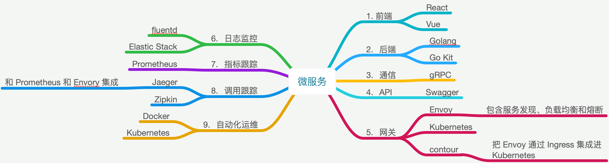

# Microservices微服务

1. 分布式系统中比较流行的架构模型，SOA架构的演化
2. 微服务解决的问题：
   1. 如何快速地开发和部署我们的服务
   2. 适用于快速开发和成长的公司
3. 微服务的每个服务与其数据库都是独立的，可以无依赖地进行部署
   1. 学习微服务是迈向卓越的架构师的必经之路
   2. 不要寄希望于微服务架构能够解决所有的问题

## 微服务架构

1. 前端
   1. React & Vue
2. 后端
   1. Golang，每个服务的代码简单了，也就可以用任何语言了，推荐 Go 语言
   2. Go Kit 微服务工具集
3. 通信
   1. gRPC，比 restFul快 20倍
4. API
   1. Swagger，API 应该都通过 Swagger 来完成
5. 网关
   1. Envoy，包含服务发现、负载均衡和熔断等特性
   2. Kubernetes
   3. contour，把 Envoy 通过 Ingress 集成进 Kubernetes https://github.com/projectcontour/contour
6. 日志监控
   1. fluentd https://www.fluentd.org/
   2. ELK，Elastic Stack https://www.elastic.co/cn/webinars/introduction-elk-stack
7. 指标跟踪
   1. Prometheus https://prometheus.io/
8. 调用跟踪
   1. Jaeger http://jaeger.readthedocs.io/en/latest/
      1. 可以和 Prometheus 和 Envory 集成
   2. Zipkin https://zipkin.io/
9. 自动化运维
   1. Docker https://www.docker.com/
   2. Kubernetes https://kubernetes.io/

### java 微服务

1. IBM微服务红皮书 https://www.redbooks.ibm.com/redbooks/pdfs/sg248357.pdf
   1. Spring Boot 和 Dropwizard 来架建 Java 的微服务
   2. 标准的架构模型
      1. 服务注册、服务发现、API 网关
      2. 服务通讯、数据处理、应用安全
      3. 测试、部署、运维等

## 微服务设计模式

1. 

### 微服务参考资料

1. awesome-microservices https://github.com/mfornos/awesome-microservices/
2. 微服务架构的设计模式和最佳实践 
   1. https://microservices.io/
   2. 微服务架构的一些已知的反模式和陷阱 https://www.oreilly.com/ideas/microservices-antipatterns-and-pitfalls
   3. 微服务最佳实践 https://www.vinaysahni.com/best-practices-for-building-a-microservice-architecture
3. Martin Fowler微服务架构的文档 
   1. https://martinfowler.com/articles/microservices.html
   2. https://www.youtube.com/watch?v=wgdBVIX9ifA
4. 对微服务的理解
   1. AWS https://aws.amazon.com/cn/microservices/
   2. 微软 https://docs.microsoft.com/en-us/azure/architecture/guide/architecture-styles/microservices
   3. Pivotal https://pivotal.io/microservices
5. 微服务书籍 https://book.douban.com/subject/26772677
   1. 介绍了微服务的建模、集成、测试、部署和监控
   2. 拆分单块大型应用，通过持续集成部署微服务
   3. 把服务集成到已有系统中
6. Microservices vs. Service-Oriented Architecture
   1. Mark Richards
   2. https://www.nginx.com/resources/library/microservices-vs-soa/

