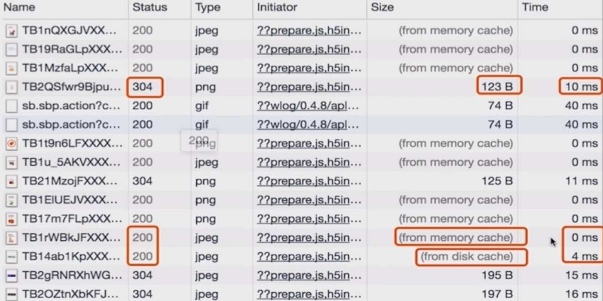
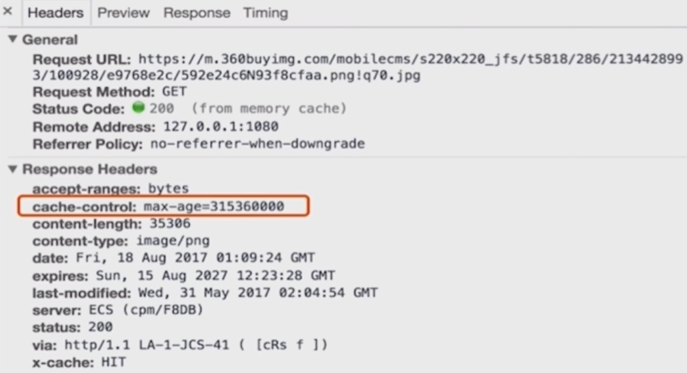
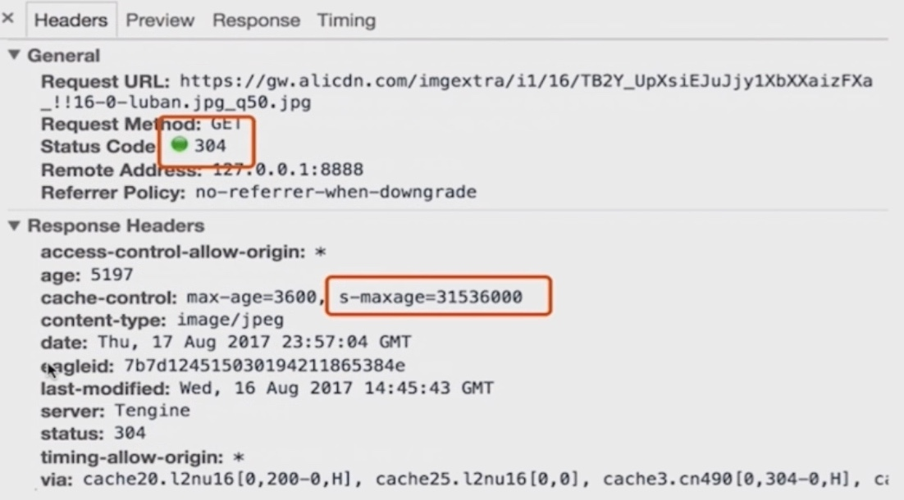
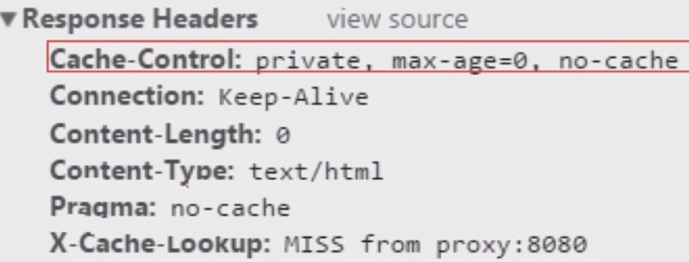
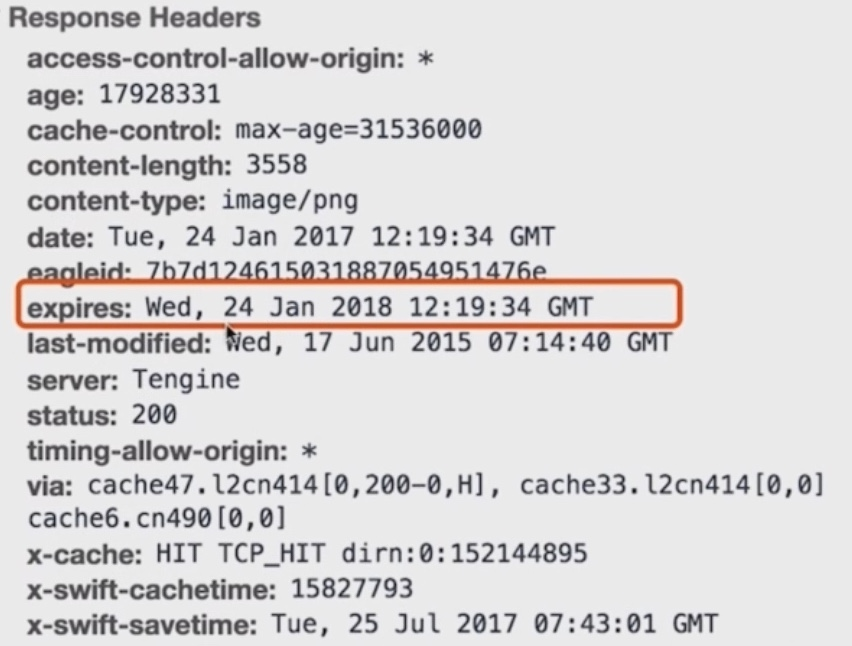
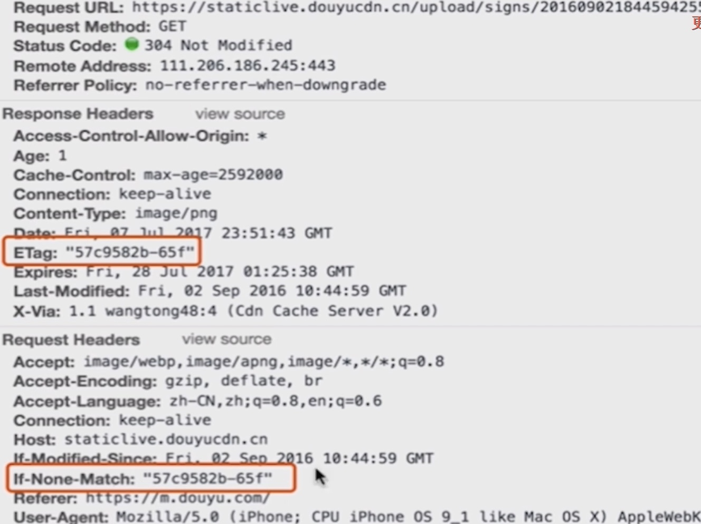

#  前端性能优化

1. 构建
   1. 静态资源的合并和压缩
   2. 图片的编码原理和类型选择
2. 浏览器渲染机制
   1. 懒加载预加载
   2. 浏览器存储
   3. 缓存机制
   4. PWA
3. 网络优化
   1. performance
   2. layers
4. SSR服务端优化
5. 优化点背后的原理与真实业务场景结合，能写出省电的代码


BS架构优化

CS架构优化


## 服务端性能优化

1. 构件层模板编译，runtime-compiler
2. 数据无关的 prerender
3. vue-ssr 服务端渲染，服务端生成 html页面


## html加载渲染过程

1. 先请求到 html，html有个字节流转化为字符流，浏览器端拿到的是字符流
2. 通过浏览器端从上到下的词法分析后，将语法分析成相应的 token，将 token添加到 DOM树中
   1. DOM是 htmlPrese词法分析过程中，逐渐生成的
3. 页面渲染是 DOM & css tree合并后生成的 render tree，然后布局和重绘


### html渲染的特点

1. 顺序执行，并发加载
   1. 单个域名并发加载的限制；并发上限
   2. 3 - 4个 cdn域名
2. 是否阻塞
   1. css是否阻塞 js加载和执行 link & @import
   2. js是否阻塞 js加载和执行
3. 依赖关系
   1. async放弃依赖关系，script异步加载
   2. defer
   3. spa js懒加载
4. 引入方式


### css阻塞

1. css head中阻塞页面渲染
   1. css通过 link在head中引入
2. css阻塞 js的执行
3. css不阻塞外部脚本的加载，会阻塞后续 js的执行


### js阻塞

1. 直接引入的 js阻塞页面渲染
   1. 没有 defer & async属性
2. js不会阻塞资源的加载
   1. 预先扫描和预资源加载
3. js 顺序执行，阻塞后续 js逻辑的执行


dns通过缓存减少dns查询

网络请求过程走最近的网络

缓存相同的静态资源

减少http请求，减少http请求大小

服务端渲染


## 浏览器优化

1. 浏览器重绘与回流机制
2. 图层合成


### css性能会让 js变慢

1. 一个线程解析 js
2. 一个线程 ui渲染，2个线程是互斥的；ui渲染时，JS是没有执行的
3. 频繁的触发重绘和回流，会导致UI频繁渲染，最终导致 js变慢
   1. 优化 css的写法，减少UI线程的渲染次数


### reflow回流

1. 页面**布局和几何属性**改变时，就要回流
2. render-tree中的元素**尺寸，布局，隐藏**等改变而需要重新构建，就是回流 reflow
   1. 盒子模型相关属性
   2. 定位属性 & 浮动
   3. 改变节点内部文字结构，内容改变触发布局
   4. 添加或删除可见的 DOM元素
   5. 浏览器窗口大小发生改变，resize


#### 盒子模型相关属性

```jsx
width, height, padding, margin, display
border, border-width, min-height, min-width
```

#### 定位-浮动属性

```jsx
position, float
top, left, right, bottom, clear
```

#### 改变节点内部文字结构

```jsx
text-align, font-weight, font-weight, font-family, font-size
overflow, overflow-y,
line-height, vertival-ailgn, white-space
```


### repaint重绘

1. render-tree中的一些元素更新属性，这些属性只是影响元素的外观，风格，不会影响布局，就叫重绘
   1. 例如 background-color， background-shadow
2. 重绘不一定触发回流
3. **回流一定引起重绘**，重新绘制的过程

```jsx
// 只触发重绘
color, border-style, border-radius, visibility, text-decoration
background, background-image, background-position, background-repeat, background-size
outline, outline-color, outline-style, outline-width
box-shadow

// 新建图层
will-change: transform
transform: translateZ(0)
```


### 新建 DOM的过程

1. 获取 DOM后分割为多个图层
2. 对每个图层的节点计算样式结果，recalculate style 样式重计算
3. 为每个节点生成图形和位置，layout 回流和重布局
4. 将每个节点绘制填充到图层位图中，paint setup，paint重绘
5. 图层作为纹理上传到 GPU，类似于 photoshop的图层
6. 符合多个图层到页面上合成，生成最终屏幕图像，composite layers 图层重组


### performance


## 回流和重绘的优化点

1. **避免使用触发重绘，回流的 css属性**
   1. 用重绘的属性代替回流的属性，尽量少的回流的属性
2. 将重绘，回流的影响范围限制在单独的图层内
   1. 将频繁重绘，回流的 DOM元素单独作为一个独立图层
   2. 那么这个DOM元素的重绘和回流的影响，只会在这个图层中
3. performance & layers
   1. 图层 layers 不能被滥用，因为图层消耗性能


1. 用 translate 代替 top改变，transform不会触发reflow
2. 用 opacity代替 visibility
   1. opacity 重绘和回流，解决加上 transform
   2. `opacity: 1; transform: translateZ(0)`
3. 不要一条一条的修改DOM样式，预先定义好 class，修改 DOM的 className
4. 把 DOM离线后修改，比如：
   1. 先把 DOM给 `display：none`，有一次 feflow回流
   2. 然后修改100次，再把 DOM `display：block`显示出来
5. 不要把 DOM的属性值放在一个循环里，当成循环的变量
   1. `offsetWidth & offsetHeight`
6. 不要使用 tabl布局，很小的改动会造成整个 table的重新布局 reflow
7. 动画实现的速度选择 `duration` 动画的平滑度
8. 动画新建图层
   1. video & canvas会新建图层
9. 启用 GPU硬件加速 
   1. `will-change: transform; transform: translateZ(0)` 有代价，会新建图层
   2. `transform: translate3d(0,0,0)`

```jsx
const clientHeight = document.body.clientHeight
for (let i=0; i<arr.length; i++) {
  // let clientHeight = document.body.clientHeight // 不要把获取dom放在 for循环中
  temp.push(clientHeight + i)
}

// translate 代替 top
recaculate style 84us -> layout 49us -> update layer tree 88us -> 
  paint 25us -> composite layer 120us // top

// 使用 translate没有 layout的过程
recaculate style 110us -> updat layer tree 90us ->
  paint 30us -> composite layers 110us
  
// opacity 代替 visibility
recaculate style 86us -> update layer tree 98us -> 
  paint 27us -> composite layer 140us // visibility

// opacity没有 paint的过程，因为 paint过程是生成图层
// 但opacity 是直接改变图层的 alpha通道，所以不涉及图层的重绘
recaculate style 76us -> updat layer tree 58us -> composite layers 100us
```


### 如何将DOM变成一个新的独立图层

chrome 创建图层的条件

1. 3d或透视变换 css属性
   1. `perspective`
   2. `transform`
2. 使用加速视频解码的 `video`节点，**播放过程中页面重绘**
3. 拥有 3d（webGL）上下文，或加速的 2d上下文的 `canvas`节点 
4. 混合插件，如 flash
5. 对 opacity做 css动画或使用一个动画 webkit变换的元素
6. 拥有加速 css过滤器的元素
   1. transition3d
7. 元素有一个包含复合层的后代节点
   1. 一个元素有一个子元素，该子元素在自己的的层里
8. 元素有一个 z-index较低，且包含一个复合层的兄弟元素
   1. 该元素在复合层上渲染
   2. **gif图**也会频繁触发页面的重绘


## 懒加载

1. 懒加载和预加载的原理


### 懒加载原理

1. 图片进入可视区之后请求图片资源，延迟加载
2. 好处：减少无效的资源加载
   1. 并发加载的资源过多会阻塞js的加载，影响网站的正常使用
3. 场景：电商等图片很多，页面很长的业务场景
4. 原理：
   1. src 默认是个占位符，或 `src=''`，data-src是真实的 url
   2. 当图片进入可视区域内，就去请求图片资源；
      1. 需要提前设置好图片的高度 height；否则默认高度都是 0，都在可视区域内
   3. 需要监听 scroll事件，在scroll事件的回调中，判断需要懒加载的图片是否进入可视区

```jsx

  
//
const viewHeight = document.documentElement.clientHeight // 可视区高度
  
function lazyload () {
	const el = document.querySelectorAll('img[data-lazyload]')
  el.forEach((item, i) => {
    
  })
}

lazyload() // 初始化需要调用，然后滚动再调用
document.addEventListener('scroll', lazyload)
```


### 预加载

1. 图片等静态资源在使用之前的**提前请求**
2. 资源用到时，从缓存中加载，提升用户体验
3. 页面展示的依赖关系维护
   1. 页面显示所必须要的资源；渲染时，资源已加载完成
4. 案例
   1. 九宫格，抽奖选中状态，从缓存中读取
   2. H5移动端活动页
5. 原理：
   1. img 设置 `display:none`
   2. preloadjs缺点：有跨域限制；好处：可以监控加载进度

```jsx
.hide { display: none }

  
// 1 preload
const image = new Image()
image.src = 'url'


  
// 2 XMLHttpRequest 对象异步请求，缺点：跨域限制
const xhr = new XMLHttpRequest()
xhr.open('get', 'https://www.lulongwen.com/1.jpg', true)
xhr.send()
 
xhr.onreadystatechange = callback
xhr.onprogress = fnProgress
function callback () {
  if (xhr.readyState === 4 && xhr.status === 200) {
    return xhr.responseText
  }
  console.log('request on error', xhr.status)
}

fnProgress (ev=window.event) {
  if (ev.lengthComputalbe) {
    console.log(ev.loaded, ev.total + 'bytes')
  }
}


// 3 preload.js
const queue = new createjs.LoadQueue(flase)
queue.on('complete', loadImage, this)
queue.loadManifest([
	{id: 'myImage', src:'https://www.lulongwen.com/images/1.jpg'},
  {id: 'myImage2', src:'https://www.lulongwen.com/images/2.jpg'}
])
  
function loadImage() {
	const image = queue.getResult('myImage')
  document.body.appendChild(image)
}
```


## 浏览器存储

1. localStorage & sessionStorage
2. cookie
3. indexDB
4. pwa
5. service worker


### cookie

1. 用于浏览器端和服务器端的交互
2. 客户端自身数据的存储
   1. cookie存储能力已被 localStorage代替
3. cookie设置的初衷
   1. 因为 http是无状态的，需要 cookie去维持客户端状态
4. cookie的限制
   1. 大小 4kb
   2. 需要设置过期时间 expire
   3. httponly 只读
5. cookie在相关域名下，cdn流量的损耗
   1. 域名下的所有请求和响应都会带上 cookie
   2. 解决：cdn域名和主栈的域名要分开；cdn域名不要携带 cookie


```jsx
生成 cookie
document.cookie = ''
```


### localStorage

1. 大小 5M左右，专门用于浏览器存储
2. 尽在客户端使用，不和服务器进行通信
3. 浏览器本地缓存方案，接口封装较好
   1. 提升某个网页的首屏渲染速度
   2. icon & 精灵图转 base64保存在 localStorage


### sessionStorage

1. 会话级别的浏览器存储，其他和localStorage一样
2. 关闭当前标签页，清空 sessionStorage存储的数据
3. 应用场景：对表单信息的维护


### indexDB

1. 低级API，存储大量结构化数据
   1. 使用索引实现对数据的高性能搜索
2. 为应用创建离线版本


### pwa

1. progressive web apps 渐进式的 web app 新模型
2. 通过一系列新的特性，配合优秀的UI交互设计，渐进增强的 web app用户体验
3. 是一系列的技术组合
4. pwa的特点
   1. 可靠，在没有网络的情况下，也能提供基本的页面访问，不会出现“未连接到互联网”的页面
   2. 快速，网页渲染及网络数据访问有较好的优化
   3. 融入 Engaging，应用可以被添加到手机桌面；和普通 app一样有全屏，推送等特性


#### lighthouse

1. Lighthouse是Google开源的自动化工具，主要用于改进网络应用（移动端）的质量，测试项包括
   1. 页面性能
   2. PWA
   3. 可访问性（无障碍）
   4. 最佳实践、SEO
2. Lighthouse会对各个测试项的结果打分，并给出优化建议，这些打分标准和优化建议可以视为Google的网页最佳实践
3. chrome应用商店，搜索安装插件


### service worker

1. service worker 特性
   1. 拦截和处理网络请求
   2. 推送消息，背景后台同步；在后台运行的同时，能和页面通信
   3. Geofencing 地理围栏定位
2. chrome检测 service worker
   1. chrome://inspect/#service-workers
   2. chrome://serviceworker-internals


#### cache

1. Cache Storage
2. Application Cache


## 缓存优化

1. cache-control 强制缓存策略
2. last-modified & etag，浏览器端的协商缓存流程
3. 304，`未改变`说明无需再次传输请求的内容；使用缓存的内容




### 1 强制缓存

1. cache-control
2. expires
3. ctrl+ F5刷新，不论何值，都会重新访问服务器


#### cache-control

1. 是否使用缓存，不用缓存，no-store
2. 用缓存，并且每次请求是否重新验证，是：no-cache
3. 是否允许被代理服务器缓存，是：public，否：private
4. max-age & Etag header头

```jsx
max-age=20000 // 有效时间内不再发送请求，优先级高于 expires；http1.1; expires http1

s-maxage 只能指定 public的缓存，cdn缓存

private 当前用户访问的缓存，客户端浏览器访问缓存，代理服务器缓存

public cdn缓存就是 public，所有用户都可以访问

no-cache 都会发请求到服务端，通过 last-modified进一步判断当前浏览器端的缓存有没有过期

no-store 不使用缓存

must-revalidate
```


max-age，单位：秒




s-maxage




no-cache




#### expires 缓存过期时间

1. expires 用来指定资源到期的时间，时间是服务器的时间
2. 告诉浏览器在过期时间前浏览器可以直接从浏览器缓存中读取数据，无需再次请求
3. max-age优先级高于 expires




### 2 协商缓存

1. 通过 http-header传输，基于客户端和服务端协商缓存机制

2. Last-Modified/If-Modified-Since

3. Tag/If-None-Match

   

#### Last-Modified/If-Modified-Since

1. 要和 cache-control一起使用，Etag优先级高于 Last-Modified
2. last-modified缺点
   1. 某些服务端不能获取精确的修改时间
   2. 文件修改时间改变了，但文件内容却没有改变，用 etag解决

```jsx
last-modified // response header

if-modified-since // request header
```


#### Etag/If-None-Match

1. 文件内容的 hash值，比 last-modified更精确
2. 需要和 cache-control共同使用

```jsx
etag response header

If-None-Match request header
```





### 分级缓存策略

1. 200状态，from cache
   1. 由expires & cache-control控制，
   2. expires(http1.0)绝对时间
   3. cache-control（http1.1）相对时间
   4. 2个都存在时，cache-control覆盖 expires，只要没有失效，浏览器只访问自己的缓存
2. 304状态
   1. last-modified & etag控制
   2. 当下一层失效或用户点击 refresh，F5时，浏览器会发送请求给服务器；
   3. 如果服务器没有变化，返回304给浏览器
3. 200状态
   1. 本地没有缓存，或下一层失效时，或用户点击了 ctrl+ F5，浏览器直接去服务器下载最新数据