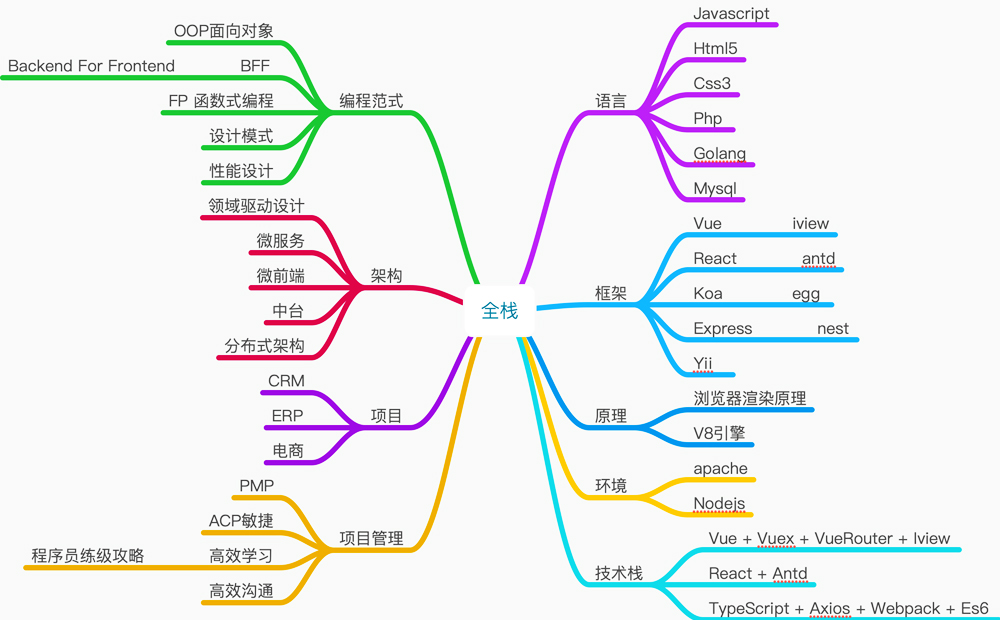

# 全栈工程师

1. 语言
2. 框架
3. 环境
4. 整合技术做项目
6. 前端的未来
   1. 不要把自己局限于前端，做一个解决问题的人，能解决问题就有未来
   2. **领域驱动设计：**强化领域建模和系统设计能力，力争懂业务、成为领域专家
   3. **软件架构设计**：为系统、框架、类库注入灵魂，让代码有生命力
   4. 图形技术，在应用、引擎两层都有广阔的场景
   5. AI
7. 关注的技术
   1. ESbuild 极快的 JavaScript bundler，用 Go 语言编写
   2. Deno 安全的 JavaScript & TypeScript 运行时
   3. Figma https://www.figma.com/

### 热爱编程

1. 看书
   1. 看完一本书要写个总结笔记 & 思维导图
2. 写博客
   1. 写博客的经历 & 感悟
   2. 自己的独立博客
3. 做开源项目
   1. GitHub start是硬通货
   2. 写好注释，官网和文档
4. 从技术广度和深度来扩充知识体系
   1. **信息是免费的，但容易消化的知识可以存在附加值**
   2. 教学过程变得富有娱乐性
   3. 卖的不是信息不对称，快乐学会
5. 新旧技术推陈出新，与其到处摸一把，不如深入抓住原理

## 用户思维做产品

1. 需求调研
2. 产品原型
3. UI设计
4. 前端开发
5. 后端开发
6. 云开发
7. CI，CD
8. 上线运维

## 前端语言和框架

1. Es6
   1. Vue
   2. React
2. Html5
3. Css3
4. Webpack

## 后端语言和框架

1. Nodejs
   3. Koa
   2. Express
   3. Eggjs
2. PHP
   1. Yii
3. mysql
   1. Sequelize
   2. mysqli
4. Go

## 微服务

1. 微前端 https://micro-frontends.org/
2. 最完善的微前端解决方案 https://qiankun.umijs.org/zh/

### 微前端的核心

1. 技术栈无关
   1. 主框架不限制接入应用的技术栈，微应用具备完全自主权
2. 独立开发，独立部署
   1. 微应用仓库独立，前后端可独立开发，部署完成后主框架自动完成同步更新
3. 增量升级
   1. 渐进式重构
4. 独立运行时
   1. 每个微应用之间状态隔离，运行时状态不共享

## 开发的瓶颈

1. 框架方面 React 已经是事实上的主流
2. 打包工具 Webpack 也是一家独大
   1. 虽然被人诟病，但是社区生态起来了，想改变就很难
3. 语言方面 TypeScript 必然是主流
   1.  Ts的设计初衷是 JavaScript 的超集，由于本身要编译成 JS，这一点本质上限制了 TypeScript 的方向
   2. Ts 瓶颈:来自社区及 TC39，给 Ts添加一个新特性会非常谨慎
      1. 怕与 TC39 ES proposal 冲突
      2. 要考编译到不同版本 JavaScript 的兼容性问题
4. TC39 是 JavaScript 发展委员会
   1. TC39 的成员是涉及 JavaScript 和浏览器供应商的公司
   2. 包括 Mozilla，Google，Facebook，Apple，Microsoft，Intel，PayPal，SalesForce等
   3. 每个标准版本提案都必须经过几个阶段
      1. stage-1：前期设想
      2. stage-2：正式提案（装饰器所在的阶段）
      3. stage-3：实现候选
      4. Stage-4：完成测试
      5. 各个浏览器 JS 引擎实现；TypeScript 实现

### 前端框架的瓶颈

1. React 的本质只是一个 UI Library，并不是框架 Framework
   1. React 本身并不解决 SPA 应用中数据流的问题
   2. hooks 方案更像是拆了东墙补西墙，因为 Class 臃肿，function 更简单
      1. 如果你把一个函数里面写上几百行的代码，各种 hooks 用到飞起的时候，你才会回过头来反思如何组织代码。
      2. 如果 Class 能以一种更好/更易于理解的方式去抽象那为什么不用呢？
   3. react没解决状态管理的问题
2. **框架要解决的问题是系统层面**的不是某个抽象层面的
3. 很多 JavaScript 类库都没有高效地解决一个问题 **架构**
   1. React/Vue/Express/Koa 这些都是相对独立的点，没有一个东西能把他们连接起来形成一个面
   2. 形成一种框架级别的体系。这就是架构的问题
4. 

### 后端的瓶颈

1. Node.JS 的第三方库太多了
2. 不要用 Express/Koa.js 去写大型的后端应用
   1. 没办法深入下去了。因为当你用 Express 写完一个页面后就面临着各种技术上的盲点，会让你无所适从。
3. JavaScript 体系看似前后端通吃，客户端、 服务端甚至桌面端皆有
4. 最大的问题在于：**没有一个东西能给他们建立起关系并发展成为一种体系**

#### 构建工具的瓶颈

1. 前端构建工具问题的本质还是在于 Node.JS 的包管理工具的设计
   1. Node gyp，node-sass， fsevent 的痛
   2. 一个简单的 npm install 命令会导致安装成千上万个 npm 包被安装到你的机器上
2. 每种编程语言对应的包管理工具都要解决依赖问题
3. Go/Rust 这种把源代码编译打包成，单个可执行文件的方式才是好的解决方式。

## web安全

1. CSRF/XSS