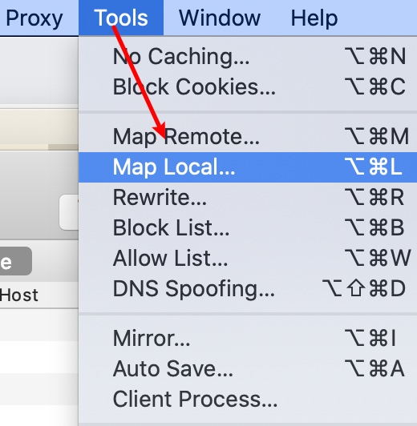
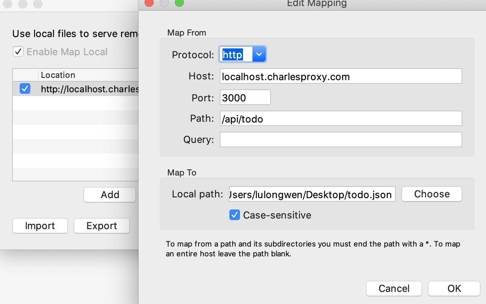

# charles

1. Charles原理：把自身变为一个中间代理服务器，便于抓包

## charles mac

1. 勾选 Proxy - MacOS Proxy，弹窗提示安装依赖，不勾选无法抓取本地请求
   1. 不要设置 vpn代理

### map local

1. http://localhost.charlesproxy.com 代替 localhost
2. htdocs 设置 `127.0.0.1 localhost.charlesproxy.com`
3. Tools - Map Local 设置代理

localhost.charlesproxy.com

