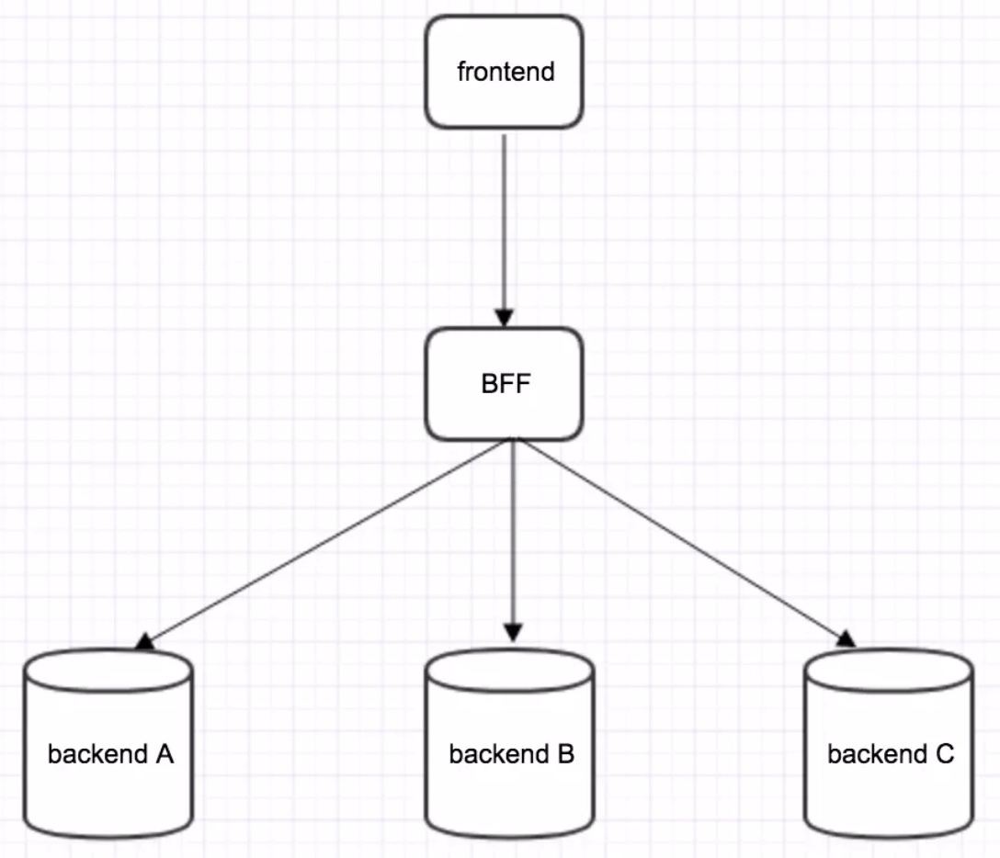

# BFF是什么

1. Backend For Frontend 服务于前端的后端

2. 服务器设计 API 时会考虑前端的使用，并在服务端直接进行业务逻辑的处理

3. BFF 又称为用户体验适配器

4. BFF是逻辑分层，不是一种技术

   

## BFF解决了那些问题

1. 请求多个服务器获取数据，BFF作为中间件，在这个中间件上我们将做一些业务逻辑处理

2. 后端发生的变化都可以在 BFF 层做一些响应的修改

   

## BFF应用场景

1. 多端应用
2. 聚合数据返回前端
   1. 屏蔽了复杂的服务调用链，让前端可以聚焦在所需要的数据
   2. 不用关注底层提供这些数据的服务
3. 访问控制
   1. 将所有服务中的权限控制集中在 BFF 层
4. 应用缓存
   1. 缓存的临时数据，放在 BFF 层
5. 第三方入口
   1. 业务中需要与第三交互时，将该交互放在 BFF 层

## Nodejs BFF中间层的好处

1. 前后端分离
   1. 传统后端加入了node这一层的好处，1：前端接管了view层，2：后端渲染也开始全部由前端掌控
2. 前端接口层：数据库字段的 toJSON序列化，数据转化
3. 性能
   1. 异步IO，service层的复用和缓存
   2. 解耦：后端数据改变，不需要修改前端页面，用 BFF处理对应的业务逻辑
4. 服务器代理
5. 缓存
6. 限流
7. 日志
8. 监控
9. 路由鉴权
   1. 前端掌握页面路由的权限和逻辑
   2. 有一个中间层去鉴权
10. 服务端渲染，SEO优化