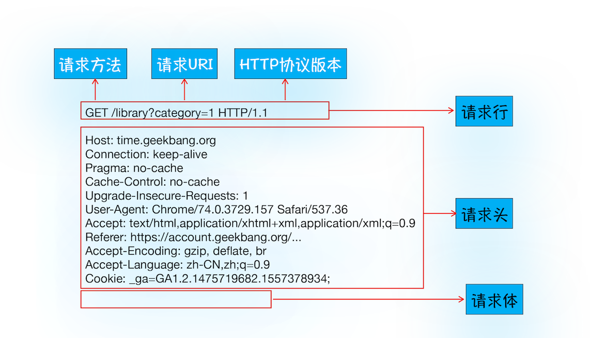

# 浏览器架构设计

1. chrome架构：只打开一个页面，为啥有4个进程？
2. TCP协议：如何保证页面文件能完整的送到浏览器？
3. http请求流程：为什么站点第二次打开速度很快？
4. 导航流程：从输入URL到页面显示，中间发生了什么？
5. 渲染流程：html & css & js文件是如何变成页面的？


## 一 为啥打开一个页面chrome有4个进程?

1. 因为打开1个页面至少需要
   1. 1个网络进程
   2. 1个浏览器进程
   3. 1个GPU进程
   4. 1个渲染进程，共4个
   5. 如果打开的页面有运行插件的话，还需要再加上1个插件进程
2. 最初的浏览器都是单进程的，不稳定、不流畅，不安全；
   1. Chrome创造性地引入了多进程架构，并解决了这些问题；
   2. Chrome试图应用到更多业务场景，如移动设备、VR、视频等，选择了面向服务架构（SOA）
3. 多进程的缺点
   1. 消耗更多的内存
   2. 复杂的体系架构
   3. 解决：SOA 面向服务架构 Services Oriented Architecture


### chrome任务管理器

1. 展示运行中Chrome使用的进程信息的
2. chrome右上角，选项，更多工具，点击：任务管理器，打开chrome的任务管理器
   1. Chrome启动了4个进程


### 并行处理

1. 并行处理就是**同一时刻处理多个任务**，比如计算下面这三个表达式的值，并显示出结果
   1. 单线程分四步，按照顺序分别执行四个任务
   2. 多线程两步走，1：用三个线程同时执行前三个任务；2：再执行第四个显示任务
2. 并行处理能提高性能

```jsx
var A = 1+2
var B = 20/5
var C = 7*8
```


线程是依附于进程的，而进程中**使用多线程**并行处理能提升运算效率


### 进程

1. 一个进程就是一个程序运行的实例
   1. 启动一个程序的时候，操作系统回味该程序创建一块内存；
   2. 用来存放代码，运行中的数据和一个执行任务的主线程
   3. 这样一个运行环境叫做**进程**
2. 线程之间共享进程中的数据，进程 > 线程
3. 进程中的任意一个线程出错，都会整个进程的崩溃
4. 当一个进程关闭后，操作系统会回收进程所占用的内存
   1. 内存泄漏：浏览器开着，内存占用会越来越多
5. 进程之间相互隔离
   1. 每一个进程只能访问自己占有的数据
   2. 一个进程如果崩溃了，不会影响到其他进程
   3. 进程之间需要进行数据的通信，IPC进程之间的通信
      1. Inter-Process Communication，进程间通信


#### 单进程

1. 浏览器的**所有功能模块都运行在同一个进程里**；包含了网络、插件、JavaScript运行环境、渲染引擎和页面等
2. 单进程的缺点
   1. 不稳定，例如 js插件的崩溃，复杂的 js代码有可能引起渲染引擎模块的崩溃
   2. 不流畅，同一时刻只能有一个模块可以执行
      1. 死循环会独占整个线程，其他模块没有机会执行，浏览器失去响应，变卡顿
      2. 页面的内存泄漏，使用时间越长，内存占用越高，浏览器会变得越慢
   3. 不安全
      1. C/C++编写的插件可以获取到操作系统的任意资源
      2. xss攻击


#### 多进程浏览器

1. 页面运行在单独的**渲染进程**中
2. 插件也是运行在单独的插件进程之中，进程之间是通过**IPC机制进行通信**
3. 进程是相互隔离的，一个页面会插件的崩溃不会影响到其他页面或插件
   1. 关闭一个页面时，整个渲染进程也会被关闭，该进程所占用的内存都会被系统回收，解决内存泄漏
4. 沙箱环境
   1. 给进程上了一把锁，沙箱里面的程序可以运行，不能在硬盘上写入任何数据，也不能读取任何数据


#### chrome进程架构

1. 1个浏览器（Browser）主进程
   1. 负责界面显示、用户交互
   2. 子进程管理，同时提供存储等功能
2. 1个 GPU 进程
   1. 初衷：实现3D CSS的效果
   2. 演化：Chrome的UI界面都选择采用GPU来绘制
   3. 多进程架构上也引入了GPU进程
3. 1个网络（NetWork）进程
   1. 负责页面的网络资源加载
4. 多个渲染进程
   1. 将 HTML、CSS 和 JavaScript 转换为用户可以与之交互的网页
   2. 排版引擎Blink和 JavaScript引擎V8都是运行在该进程中
   3. Chrome会为每个Tab标签创建一个渲染进程
   4. **渲染进程都是运行在沙箱模式**下
5. 多个插件进程
   1. 负责插件的运行
   2. 通过插件进程来隔离，保证插件进程崩溃不会对浏览器和页面造成影响


### 线程

1. 多线程可以并行处理任务，线程是有进程来启动和管理的
2. **线程是依附于进程的，而进程中使用多线程并行处理能提升运算效率**


### SOA 面向服务架构 

1. Services Oriented Architecture 原来的各种模块会被重构成独立的服务 Service
2. 每个服务（Service）都可以在独立的进程中运行
3. 访问服务（Service）必须使用定义好的接口，通过IPC来通信


Chrome最终要把UI、数据库、文件、设备、网络等模块重构为基础服务，类似操作系统底层服务


#### 弹性架构

1. 在强大性能设备上会以多进程的方式运行基础服务
2. 在资源受限的设备上，将很多服务整合到一个进程中，从而节省内存占用


## 二 TCP保证页面文件完整的送到浏览器

1. IP，把数据包送到目的主机
2. UDP，把数据包送到具体的应用程序
3. TCP，保证了数据完整地传输
   1. 建立连接，三次握手
   2. 传输数据
   3. 断开连接，四次挥手
4. 了解 TCP协议，是为了全方位了解 http的功能和局限性
   1. HTTP协议是基于TCP协议的
   2. 为什么要推出http2 & quic协议 -> http3


### 数据包

1. First Paint，**指从页面加载到首次开始绘制的时长**，网络加载速度影响 FP
2. 互联网，实际上是一套理念和协议组成的体系架构；协议是一套众所周知的规则和标准
   1. 互联网中的数据是通过**数据包**来传输的，数据包在传输过程中容易丢失或出错；
   2. 网络中，一个文件通常会被**拆分为很多数据包**来进行传输；
   3. 如果发送的数据很大，那么该数据就会被拆分为很多小数据包来传输
   4. 丢包的原因：网络问题，线路故障，路由错误等底层的问题


### IP

1. Internet Protocol 网际协议，数据包传输要符合 IP协议
2. IP，把数据包发送到目的主机
3. 计算机的地址就称为IP地址，访问任何网站实际上只是你的计算机**向另外一台计算机请求信息**
   1. 互联网在线设备的唯一地址就是 IP，类似于家庭地址
   2. IP是非常底层的协议


#### IP头数据

1. IP头是IP数据包开头的信息
2. 包含IP版本、源IP地址、目标IP地址、生存时间等
3. 数据包从主机A请求主机B，数据要附加主机B的地址信息，才能在传输过程中正确寻址
4. https://baike.baidu.com/item/TCP/33012?fromtitle=传输控制协议


### UDP

1. User Datagram Protocol，用户数据包协议
2. 端口号是重要的信息，端口号是个数字；
   1. 通过端口号UDP就能把指定的数据包发送给指定的程序了
   2. 每个想访问网络的程序都要绑定一个端口号
3. IP通过**IP地址信息把数据包发送给指定的电脑**
4. **UDP通过端口号**把数据包分发给正确的程序
   1. 端口号会被装进UDP头里面
   2. UDP头再和原始数据包合并组成新的UDP数据包
   3. UDP头中除了目的端口，还有源端口号等信息
5. UDP传输速度非常快，不保证数据的可靠性；UDP关注速度，缺点：
   1. 丢包：错误的数据包，UDP不提供重发机制，只是丢弃当前的包
   2. 无法把数据包还原成完整的文件，因为数据包经过不同的路由，并在不同的时间到达接收端


### TCP

1. Transmission Control Protocol，传输控制协议
2. 一种面向连接的、可靠的、基于字节流的传输层通信协议
3. TCP特点
   1. 对于数据包丢失的情况，TCP提供重传机制
   2. TCP引入了数据包排序机制，用来保证把乱序的数据包组合成一个完整的文件
   3. TCP头的信息提供了**用于排序的序列号**，保证了大数据传输的完整性


#### TCP生命周期

1. 建立链接
2. 传输数据
3. 断开链接


#### 建立链接

1. 三次握手：建立一个TCP连接时，客户端和服务器总共要**发送三个数据包**以确认连接的建立
2. 三次握手，建立客户端和服务器之间的连接
   1. **面向连接**指：在数据通信开始之前先做好两端之间的准备工作


#### 传输数据

1. 接收端对每个数据包进行确认操作；接收到数据包之后，需要发送确认数据包，给发送端
   1. 当发送端发送了一个数据包之后，在规定时间内没有接收到接收端反馈的确认消息；
   2. 就判断为数据包丢失，并触发发送端的重发机制
2. 收到数据包后，接收端会按照TCP头中的序号为其排序，从而保证组成完整的数据。


#### 断开链接

1. 四次挥手，来保证双方都能断开连接
2. TCP因为“三次握手”和“数据包校验机制”，把传输过程中的数据包的数量提高了一倍，牺牲了传输速度


### 如何理解HTTP和TCP的关系

1. HTTP协议和TCP协议都是TCP/IP协议簇的子集
2. HTTP协议属于应用层，TCP协议属于传输层；HTTP协议位于TCP协议的上层
   1. http架构在tcp之上，主要用在web服务器和浏览器上，http比tcp更加面向开发者
3. 请求方要发送的数据包，在应用层加上HTTP头以后会交给传输层的TCP协议处理
4. 应答方接收到的数据包，在传输层拆掉TCP头以后交给应用层的HTTP协议处理
5. 建立 TCP 连接后会顺序收发数据，请求方和应答方都必须依据 HTTP 规范构建和解析HTTP报文
   1. tcp是个梯子，http就是利用梯子来搬运货物


## 三 HTTP请求流程

1. TCP协议保证了数据传输的完整性，TCP链接流程
   1. 建立链接 & 传输数据 & 断开链接
2. http协议：一种允许**浏览器向服务器获取资源**的协议
   1. 通常由浏览器发起请求，用来获取不同类型的文件
   2. 建立在TCP连接基础之上
   3. http协议是应用层协议
3. 请求流程的体现
   1. 第一次访问一个站点时，打开速度很慢；再次访问这个站点时，速度就很快了
   2. 登录过一个网站之后，再访问该站点，就已经处于登录状态了
4. http请求流程
   1. 构建请求、查找缓存
   2. 准备IP和端口、等待TCP队列、建立TCP连接
   3. 发起HTTP请求、服务器处理请求
   4. 服务器返回请求和断开连接


### 为什么网站第二次打开速度很快

1. 主要原因是第一次加载页面过程中，缓存了一些耗时的数据
2. 哪些数据会被缓存：**DNS缓存**和**页面资源缓存**
   1. DNS缓存是在浏览器本地把对应的IP和域名关联起来
3. 静态资源缓存
   1. **响应头中的Cache-Control字段来设置是否缓存该资源**，Max-age控制缓存时长
   2. 缓存过期，根据If-None-Match的值来判断请求的资源是否有更新
      1. 没有更新，返回304状态码
      2. 有更新，直接返回最新资源给浏览器
      3. http缓存参考：https://developer.mozilla.org/zh-CN/docs/Web/HTTP/Caching_FAQ
   3. memory cache 比 disk cache 快
   4. service worker的cache


```jsx
Cache-Control:Max-age=2000

If-None-Match:"4f80f-13c-3a1xb1ok"
```


### 如何保持登录状态

1. 响应头的Set-Cookie
2. 发起请求之前，浏览器会读取Cookie数据，并把数据写进请求头里的Cookie字段里
3. 服务器收到HTTP请求头数据之后，查找请求头里面的“Cookie”字段信息
   1. 查询后台，并判断该用户是已登录状态


### 浏览器发起 http请求

1. 构建请求
2. 查找缓存
3. 准备IP地址和端口
4. 等待 TCP队列
5. 建立 TCP链接
6. 发送 http请求


#### 1 构建请求

1. 浏览器构建**请求行**信息
2. 构建好后，浏览器准备发起网络请求

```jsx
GET /index.html HTTP1.1 // 请求行
```


#### 2 查找缓存

1. 发起网络请求之前，会先在浏览器缓存中查询是否有要请求的文件
   1. 浏览器缓存是一种在本地保存资源副本，以供下次请求时直接使用
2. 查找缓存
   1. 有缓存，会拦截请求，返回该资源的副本，并且结束请求
   2. 缓存查找失败，就会进入网络请求过程
   3. 缓存的好处
      1. 缓解服务器端压力，提升性能，获取资源的耗时更短了
      2. 对于网站来说，缓存是实现快速资源加载的重要组成部分


#### 3 准备IP地址和端口

1. http & TCP的关系
   1. http协议：应用层协议，封装请求的文本信息，用 TCP协议发到网络上
   2. TCP/IP：传输层协议，浏览器通过 TCP与服务器建立链接
   3. http内容是通过 TCP传输数据实现的
      1. http请求的第一步：和服务器建立 TCP链接：**请求DNS返回域名对应的 IP**
      2. 建立TCP连接的第一步就是：需要准备IP地址和端口号
         1. 用URL地址来获取IP和端口信息
         2. DNS，域名和IP地址做一一映射关系
      3. 发送 http请求：发送请求行，请求头，请求体
      4. 服务器响应：回复请求行，请求头，body正文


##### DNS

1. Domain Name System 域名系统
2. 域名和IP地址做一一映射关系
3. **浏览器会请求DNS返回域名对应的IP**，浏览器还有 DNS数据缓存服务
   1. 某个域名已经解析过了，那么浏览器会缓存解析的结果
   2. 下次查询时直接使用，这样也会减少一次网络请求


#### 4 等待 TCP队列

1. Chrome机制：同一个域名，同时最多只能建立6个TCP连接
   1. 同一个域名下，同时有10个请求发生，其中4个请求会进入排队等待状态，直至进行中的请求完成
   2. 请求数量少于6，会直接进入下一步，建立TCP连接


#### 5 建立 TCP链接

1. 浏览器通过TCP与服务器建立连接


#### 6 发送 http请求

1. 浏览器是如何发送请求信息给服务器的


##### 请求行

1. 请求方法
2. 请求 URI，**Uniform Resource Identifier**
3. http协议版本
4. 请求行：告诉服务器浏览器需要什么资源
   1. 比如直接在浏览器地址栏键入域名
   2. get,  post, delete


##### 请求头

1. 包含了浏览器所使用的操作系统、浏览器内核等信息
2. 以及当前请求的域名信息、浏览器端的Cookie信息


##### 请求体

1. 主要就是传递的参数




### 服务端处理 http请求

1. 返回请求
2. 断开链接
3. 重定向


#### 7 返回请求

1. `curl -i www.lulongwen.com`
   1. `-i` 返回响应行、响应头和响应体的数据
   2. `-I`只需要获取响应头和响应行数据，不需要获取响应体的数据


##### 响应行

1. 包括协议版本和状态码
2. 服务器通过请求行的**状态码**来告诉浏览器它的处理结果
   1. 状态码类型：200，302，404，500


##### 响应头

1. 包含了服务器自身的一些信息，比如服务器生成返回数据的时间
2. 返回的数据类型，JSON、HTML、流媒体等类型
3. 以及服务器要在客户端保存的Cookie等信息


##### 响应体

1. HTML的实际内容


#### 8 断开链接

1. 头信息中加入了`Connection:Keep-Alive `
   1.  TCP连接在发送后将仍然保持打开状态，浏览器就可以继续通过同一个TCP连接发送请
   2. 初始化一个持久连接，就可以复用该连接，请求其他资源，而不需要重新再建立新的TCP连接
2. **保持TCP连接可以省去下次请求时需要建立连接的时间，提升资源加载速度**


#### 9 重定向

1. URL不一样会有重定向，
2. `-I`表示只需要获取响应头和响应行数据，而不需要获取响应体的数据
3. 重定向的网址包含在响应头的：Location字段中
   1. 响应行返回的状态码是301，永久重定向
   2. 浏览器获取Location字段中的地址，并使用该地址重新导航，这就是一个完整重定向的执行流程


### 一个页面的网络加载时间过久，如何分析卡在哪个阶段的

1. 首先最可能的出问题的地方，网络传输丢包比较严重，需要不断重传；
2. 然后通过ping curl看看对应的时延高不高；
3. 然后通过wireshake看看具体哪里出了问题；
4. 假如别人访问很快，自己电脑很慢，就要看看自己客户端是否有问题了
5. 如果网络很慢就要更长时间传输，其中服务器处理阶段需要查询数据库也是比较长


## 四 从输入URL到页面显示，中间发生了什么

1. 用户输入url并回车
   1. 判断输入的是关键词，还是URL
   2. 关键词搜索内容，使用浏览器默认搜索引擎，合成新的带搜索关键字的URL
   3. URL，把内容加上协议，合成完整的URL
2. URL请求过程
   1. 浏览器进程检查url，组装协议，构成完整的url
   2. 浏览器进程通过进程间通信（IPC）把url请求发送给网络进程，网络进程发起URL请求
   3. 网络进程接收到url请求后，查找DNS & 资源缓存，有缓存，直接返回资源给浏览器进程
   4. 没缓存，网络进程向web服务器发起http网络请求，流程如下
      1. 第一步还是要 DNS解析，获取服务器ip地址和端口；如果是 https还要建立 TLS链接
      2. 利用ip地址和服务器建立tcp连接
      3. 构建请求头信息，和该域名相关的Cookie等数据附加到请求头，发送请求头信息
      4. 服务器根据请求信息生成响应数据并发给网络进程，响应行，响应头，响应体等信息
      5. 网络进程接收响应头和响应信息，并解析响应内容
   5. 网络进程解析响应流程
      1. 检查状态码，如果是301/302，则需要重定向，从Location中读取重定向地址，再发起新的 http请求
      2. 如果是200，正常，继续向下处理请求
      3. 重定向尽量少用，之前的响应体头销毁重新开始
   6. 响应数据类型处理
      1. 检查响应类型Content-Type，返回的响应体数据是什么类型
      2. application/octet-stream字节流类型，将该请求提交给下载管理器，该导航流程结束，不再进行后续的渲染
      3. text/html，通知浏览器进程准备渲染进程准备进行渲染。
3. 准备渲染进程
   1. 打开一个新页面就会创建一个新的渲染进程
   2. 浏览器进程检查当前url和之前打开的协议和根域名是否相同，**相同的协议和根域名**
   3. 相同：同一站点，复用原来的进程；不同，开启新的渲染进程
4. 提交文档，渲染更新界面
   1. 浏览器主进程向渲染进程发起“提交文档”的消息，（文档：响应体数据）渲染进程接收到消息和网络进程建立传输数据的“管道”
   2. 渲染进程接收完数据后，向浏览器主进程发送“确认提交”消息
   3. 浏览器进程接收到确认消息后，更新浏览器界面状态：包括安全、地址栏url、前进后退的历史状态、更新web页面
   4. 也就是在浏览器的地址栏里面输入了一个地址后，之前的页面没有立马消失，而是要加载一会儿才会更新页面
5. 渲染阶段
   1. 渲染进程开始页面解析和子资源加载
   2. 页面生成完成，渲染进程会发送一个消息给浏览器进程，浏览器接收到消息后，会停止标签图标上的加载动画，显示 favicon


### 浏览器导航流程

浏览器打开一个页面需要至少打开四个进程；

用户发出URL请求页面到页面开始解析的过程，叫做导航


1. 浏览器进程：负责用户交互、子进程管理和文件储存等功能
2. 网络进程：面向渲染进程和浏览器进程等提供网络下载功能
3. 渲染进程：把HTML、JavaScript、CSS、图片等资源解析为可以显示和交互的页面
   1. 渲染进程里面的代码是不被信任的
   2. 为了保证系统的安全，Chrome会让渲染进程运行在安全沙箱里


### 什么情况下多个页面会同时运行在一个渲染进程中

1. 每个标签页对应一个渲染进程
2. process-per-site-instance，**相同的协议和根域名**
3. **如果从一个页面打开了另一个新页面，新页面和当前页面属于同一站点的话，那么新页面会复用父页面的渲染进程**
4. 新页面和当前页面不属于同一站点，会用一个新的渲染进程


#### 同一站点 same-site

1. 协议相同，根域名相同，例如 https:// & lulongwen.com
2. 根域名**  longwen.com
3. **协议**，https:// 或者http://，还包含了该根域名下的所有子域名和不同的端口，比如

```jsx
https://time.lulongwen.com
https://www.lulongwen.com
https://www.lulongwen.com:80
```


### 浏览器发展的主要动力是什么？

1. 互联网的发展需要；人们需要的不再是只是简单展示个页面的浏览器，需要有复杂的交互；
2. 浏览器应该能做更多的事情，这对浏览器的稳定性、以及性能都有了新的要求。所以出来一个性能符合要求的浏览器；
3. 硬件和网络的发展，技术的演化要能满足业务的需求，就像 es6，7，8，9，10。


