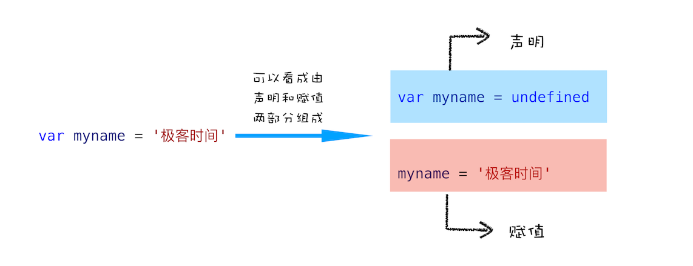
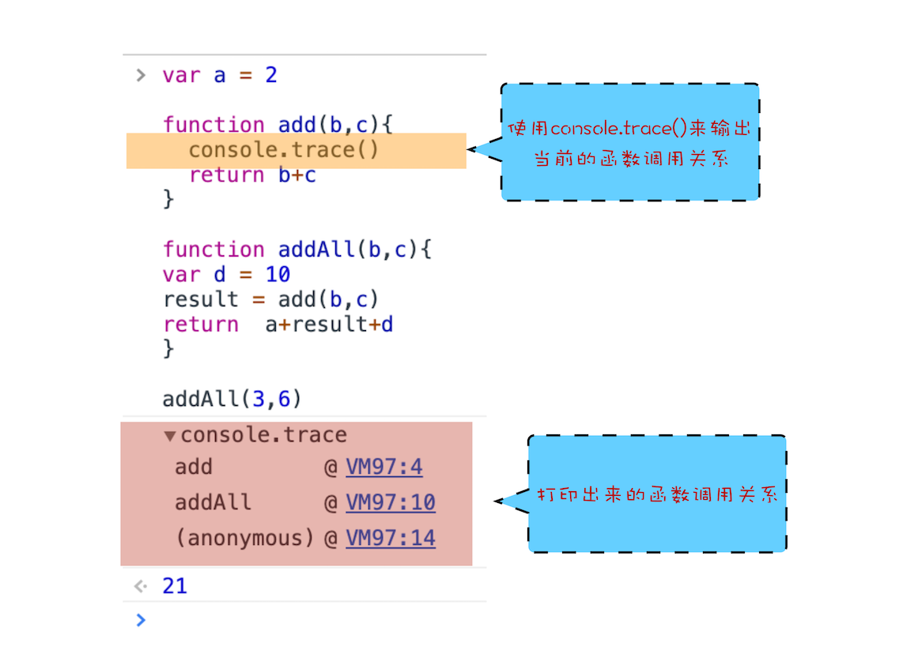

# 浏览器中js的执行机制

1. 变量提升：js代码是按顺序执行的吗？
2. 调用栈：为什么 js代码会出现栈溢出？
3. 块级作用域：var缺陷？为什么要引入 let & const
4. 作用域链和闭包：代码中出现相同的变量，js引擎如何选择？
5. this：从js执行上线文的角度讲清楚 this


## 一 变量提升：js代码是按顺序执行的吗？

1. js的执行机制：先编译，后执行
2. 编译阶段，变量和函数会被存放到**变量环境**中，赋值 undefined；
   1. 变量和函数的预解析，变量提升；
   2. 编译阶段有同名变量或函数，后面会覆盖前面的
   3. 编译创建：执行上下文 & 调用栈
3. 执行阶段，js引擎从变量环境中查找自定义的变量和函数
4. 执行上下文
   1. 变量提升、作用域和闭包等
5. 调用栈


### hoisting变量提升

1. js代码执行过程中，js引擎把**变量和函数的声明**提升到代码的开头，变量和函数的**预解析**
2. 变量和函数被提升后，会给变量设置默认值，undefined
   1. 实际上变量和函数在代码里的位置是不会改变的；是在编译阶段被js引擎放入内存中
   2. js代码执行之前，先要编译，**编译完成后，才进入执行**阶段
3. js代码编译后，生成执行上下文 Execution context 和可执行代码
   1. 执行上下文是js执行一段代码的运行时环境
   2. 执行上下文存在一个**变量环境对象 Variable Environment**，保存了变量提升的内容
   3. 可执行代码，按照顺序一行一行地执行
   4. 编译阶段包含：词法分析、语法解析、代码优化、代码生成等
      1. 编译阶段，如果有同名的变量或函数，后面的会覆盖前面的

```jsx
VariableEnvironment:
     myname -> undefined, 
     showName ->function : {console.log(myname)
```


#### js变量声明和赋值

```jsx
var name = 'lucy' // 是由两行代码组成的
	var name // 变量声明
  name = 'lucy' // 变量赋值
```



#### 函数的声明赋值

1. 


## 二 调用栈：为什么 js代码会出现栈溢出？

1. 调用栈就是用来**管理函数调用关系**的一种数据结构
   1. 函数调用
   2. 栈结构
2. 调用栈
   1. 每调用一个函数，JavaScript引擎会为其创建**执行上下文**，并把该执行上下文压入调用栈，然后JavaScript引擎开始执行函数代码
   2. 如果在一个函数A中调用了另外一个函数B，那么JavaScript引擎会为B函数创建执行上下文，并将B函数的执行上下文压入栈顶。
   3. 当前函数执行完毕后，JavaScript引擎会将该函数的执行上下文弹出栈。
3. 当分配的调用栈空间被占满时，会引发“堆栈溢出”问题。
4. 闭包执行结束后，执行上下文依然会从调用栈中弹出来，但是相关内容不会销毁的


### 函数调用

1. 函数调用就是运行一个函数，具体使用方式是使用函数名称跟着一对小括号 `fn()`


### 执行上下文

1. js执行全局代码；会编译全局代码并创建全局执行上下文
   1. 在整个页面的生存周期内，全局执行上下文只有一份
2. 调用一个函数；函数体内的代码会被编译，并创建函数执行上下文
   1. 函数执行结束之后，创建的函数执行上下文会被销毁
   2. 闭包除外
3. 使用 eval函数；eval的代码也会被编译，并创建执行上下文


### 栈

1. 栈，先进后出，Later-In-First-Out
2. 在栈中，新元素都靠近栈顶，旧元素都靠近栈底
3. 新添加的元素都保存在栈的一端，称作栈顶，另一端叫做栈底，举例：
   1. 一条单车道的单行线，一端被堵住了，而另一端入口处没有任何提示信息，堵住之后就只能后进去的车子先出来
   2. 堵住的单行线就可以被看作是一个**栈容器**
   3. 车子开进单行线的操作叫做**入栈**，车子倒出去的操作叫做**出栈**
   4. 反复的入栈、栈满、出栈、空栈和再次入栈，一直循环


### js的调用栈

1. js引擎利用栈的结构来管理执行上下文
2. 执行上下文创建好后，JavaScript引擎会将**执行上下文压入栈**中
3. 用来管理执行上下文的栈称为**执行上下文栈**，又称**调用栈**
   1. 调用栈是js引擎追踪函数执行的机制
   2. 有多个函数被调用时，通过调用栈能够追踪到那个函数正在被执行，及各个函数之间的调用关系
4. `console.trace()`输出当前的函数调用栈



5. 浏览器中查看调用栈
   1. 栈的最底部是anonymous，也就是全局的函数入口
   2. 中间是addAll函数
   3. 顶部是add函数，清晰地反映了函数的调用关系
   4. 在分析复杂结构代码，或者检查Bug时，调用栈都是非常有用的


### 栈溢出 stack overflow

1. 调用栈是一种用来管理执行上下文的数据结构，符合先进后出的规则
2. 调用栈有大小，当**入栈的执行上下文**超过一定数目，js引擎就报错，这种错误叫**栈溢出**
   1. 写递归代码容易出现栈溢出；递归的特点：无限循环
   2. Maximum call stack size exceeded，超过了最大栈调用大小
   3. 递归会一直创建新的函数执行上下文，并反复将其压入栈中；
   4. 但栈是有容量限制的，超过最大数量后就会出现栈溢出的错误
3. 解决栈溢出
   1. 用定时器，把当前任务拆分为很多小任务
   2. 递归，一定要给出退出条件
   3. 把递归改成循环，或迭代
4. **为什么会出现递归栈溢出？**
   1. 当JavaScript引擎开始执行代码时，它首先调用函数fn，并创建执行上下文，压入栈中；
   2. 但是，这个函数是**递归的，并且没有任何终止条件**，所以会一直创建新的函数执行上下文；
   3. 并反复将其压入栈中，但栈是有容量限制的；
   4. 超过最大数量后就会出现栈溢出的错误


## 块级作用域：var缺陷？为什么要引入 let & const


## 作用域链和闭包：代码中出现相同的变量，js引擎如何选择？


## this：从js执行上线文的角度讲清楚 this


